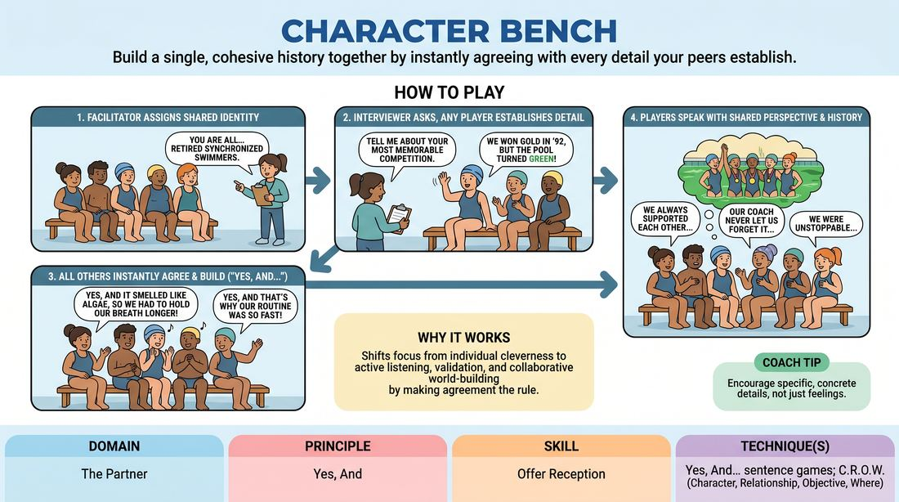

# Unified Identity Bench

{ .game-hero }

> Build a single, cohesive history together by instantly agreeing with every detail your peers establish.

## Overview
A group of players sits on a bench sharing a single collective background, such as coworkers, survivors, or old classmates. As the facilitator interviews them, players must instantly accept and build upon the details established by whoever speaks first. The goal is to create a rich, unified history through absolute agreement and collaborative world-building.

## What It Trains
- **Domain:** D2 — The Partner
- **Principle(s):** Yes, And; Make Your Partner a Genius; Base Reality First; Group Mind
- **Skill(s):** Active Listening; Offer Reception; World-Building; Support Work
- **Technique(s):** Yes, And… sentence games; C.R.O.W. (Character, Relationship, Objective, Where)
- **Focus:** skill_drill

**Objective:** To develop deep offer reception and radical agreement ('Yes, And') by forcing players to treat their peers' spontaneous details as absolute, shared truth, eliminating competitive joke-making in favor of group cohesion.

## Setup
Arrange 5 to 6 chairs in a straight row facing the rest of the group (who act as the active audience/facilitator). The players sit side-by-side. The facilitator prepares to act as an interviewer.

## How to Play
1. Seat five to six players on the bench and assign them a shared group identity (e.g., 'you all work at a failing lighthouse' or 'you are retired synchronized swimmers').
2. The facilitator acts as an interviewer, asking open-ended questions about the group's history, daily lives, or shared experiences.
3. When a question is asked, any player on the bench can answer first, establishing a new, concrete detail about their shared reality.
4. Once that first detail is spoken, all other players must instantly adopt it as absolute truth and refer to it in their subsequent responses.
5. When the interviewer asks follow-up questions, other players must build on the established facts ('Yes, And') rather than introducing contradictory information or trying to stand out with an unrelated joke.
6. Players should speak with a shared perspective, using 'we' or referencing each other's specific contributions to show they share the exact same history.
7. Continue the interview for 3 to 5 minutes, allowing the world to become highly detailed, then rotate a new group of players onto the bench.

## Facilitation Notes
- Side-coach players to avoid 'blocking' or 'wimping'—if someone says 'We only eat cabbage,' the next player shouldn't say 'Actually, I hate cabbage.' They should say, 'Yes, and my hands still smell like sauerkraut.'
- Watch out for 'joke-seeking' where a player tries to be funny by contradicting the established reality. Remind them that the humor comes from the absurd commitment to a shared truth, not from breaking the reality.
- Encourage physical agreement: nodding, shared sighs, or physical reactions that show the group is of one mind.
- If the group gets stuck, ask a highly specific question to force a new detail, such as 'Who is the one who always forgets to lock the back door?'

## Variations
- Emotional Alignment: In addition to sharing facts, the players must also share the same emotional state or reaction to the interviewer's questions.
- The Hot Seat: Instead of a group identity, one player is the main character and the others play their inner thoughts or different facets of their personality, all agreeing on their history.
- Pass the Sentence: Players must answer the interviewer's questions by speaking one word or one sentence at a time, passing the thought down the line to build a single cohesive answer.

## Debrief
- How did it feel to have your spontaneous details immediately accepted and expanded upon by the rest of the bench?
- What tempted you to contradict or 'joke-block' a teammate, and how did you overcome that urge?
- How does absolute agreement make world-building easier than trying to invent everything yourself?

## Safety & Inclusion
Ensure the assigned group identities are inclusive and do not rely on harmful stereotypes. If a player feels uncomfortable with a suggested identity, they can request a quick re-roll of the prompt without explanation.

## Why It Works
By removing the pressure to be individually clever, this game shifts the focus to active listening and support. When players realize they don't have to invent the whole story—only validate and add one small brick to the foundation their partner laid—the cognitive load drops, and a rich, believable base reality emerges naturally.
