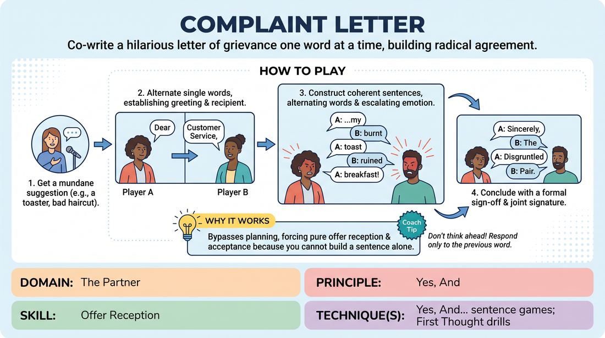

# The Complaint Letter

{ .game-hero }

> Co-write a hilarious letter of grievance one word at a time, building radical agreement.

## Overview
Two players collaborate to write a formal letter of complaint and its subsequent reply, alternating exactly one word at a time. The exercise forces players to abandon individual control, listen deeply to their partner's immediate offer, and commit to a shared emotional point of view.

## What It Trains
- **Domain:** D2 — The Partner
- **Principle(s):** Yes, And; Commit 100%; The First Thought Is a Gift
- **Skill(s):** Offer Reception; Active Listening; Unfiltered Spontaneity
- **Technique(s):** Yes, And… sentence games; First Thought drills
- **Focus:** connection

**Objective:** Develops deep offer reception, active listening, and unfiltered spontaneity by relinquishing narrative control and practicing absolute 'Yes, And' at the word level.

## Setup
Two players stand facing each other in the center of the space. The facilitator or audience provides a suggestion of a mundane object, service, or situation to complain about.

## How to Play
1. Get a suggestion of a mundane item or service to complain about, such as a toaster or a haircut.
2. Player A begins the letter by speaking a single word, typically establishing a formal greeting like 'Dear'.
3. Player B immediately follows with the next word, establishing the recipient of the complaint.
4. Players alternate word-by-word to construct grammatically coherent sentences that express a growing sense of grievance and anger.
5. Players must match each other's physical and vocal energy, speaking as a single, unified complaining entity.
6. Conclude the letter with a formal sign-off and a joint signature, alternating words until the name is complete.

## Facilitation Notes
- Side-coach: 'Don't plan ahead! Receive the word you were just given as a gift.'
- Side-coach: 'Match the emotional intensity. If your partner sounds frustrated, let that frustration live in your next word.'
- Pitfall: Players trying to force a pre-planned joke or complex grammatical structure. Fix: Remind them to choose the most obvious, simple next word rather than trying to be clever.
- Pitfall: Long pauses between words as players think. Fix: Encourage a steady, rhythmic tempo. It is better to make a grammatical mistake quickly than to pause to find the perfect word.

## Variations
- The Response Letter: The same pair immediately writes the customer service response, defending the product or offering an absurd solution.
- Physicalized Complaint: Players must physically mirror each other's posture and gestures as they speak their words, embodying a single physical character.
- The Apology Note: Instead of a complaint, players write a deeply remorseful apology letter for an absurd transgression.

## Debrief
- How did it feel to have absolutely no control over where the sentence was going?
- What happened when you tried to plan your next word before your partner spoke?
- How did matching your partner's vocal energy or physical posture help the flow of the letter?

## Safety & Inclusion
Ensure players are mindful of standing comfortably. If playing with physical mirroring, adapt to the physical comfort and mobility levels of both participants.

## Why It Works
By restricting players to a single word, the game bypasses the analytical brain's tendency to plan and write ahead. Players must practice pure offer reception because they cannot build a sentence alone; they are forced to accept whatever word is delivered and immediately build upon it with the next logical grammatical step.
