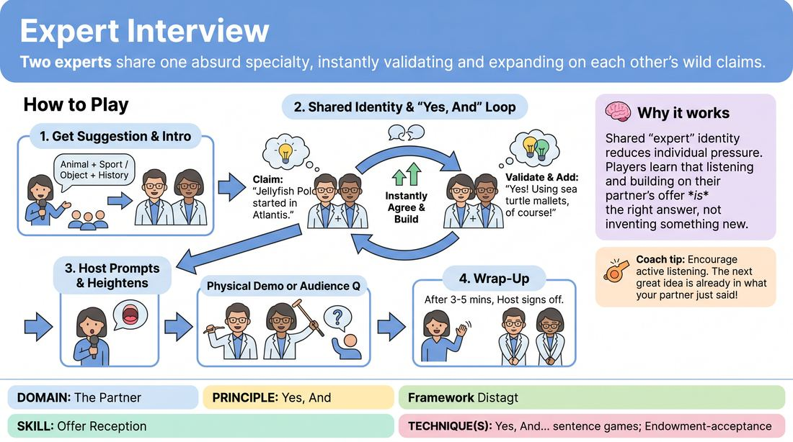

# Co-Expert Panel

{ .game-hero }

> Two experts share one absurd specialty, instantly validating and expanding on each other's wild claims.

## Overview
A high-energy talk-show style game where one host interviews two co-experts on a highly specific, absurd topic suggested by the audience. The two experts must operate as a single, harmonious unit, instantly accepting and building upon each other's fictional facts. It is a masterclass in radical agreement, active listening, and collaborative world-building.

## What It Trains
- **Domain:** D2 — The Partner
- **Principle(s):** Yes, And; Make Your Partner a Genius; Base Reality First; The Audience Is the Final Scene Partner
- **Skill(s):** Offer Reception; Active Gifting; World-Building; Justification; Stage Presence & Clarity
- **Technique(s):** Yes, And… sentence games; Endowment-acceptance; Endowment-gifting drills; C.R.O.W. (Character, Relationship, Objective, Where); Justify the absurd; Make the choice readable
- **Focus:** comedy_game

**Objective:** To practice deep offer reception and immediate justification by having two players share a single, unified expertise, ensuring they never contradict each other and always treat their partner's wild claims as absolute truth.

## Setup
Three chairs are set up on stage facing the audience: one for the host on one side, and two next to each other for the co-experts. The remaining workshop participants act as the live studio audience.

## How to Play
1. Select three players to take the stage: one host and two co-experts, while the rest of the group acts as the audience.
2. Ask the audience for a mash-up suggestion to define the experts' field of study, such as combining an animal with a sport or a household object with a historical era.
3. The host begins the scene by introducing the talk show, welcoming the audience, and introducing the two co-experts by name and their bizarre shared specialty.
4. The host asks open-ended questions to prompt the experts, such as asking how they got started, details about their latest book, or what the future holds for their field.
5. The co-experts must answer by constantly 'yes-and-ing' each other, treating every made-up fact their partner states as absolute, established truth.
6. When one expert makes a claim, the other must immediately validate it and add a new detail, avoiding any hesitation, correction, or contradiction.
7. The host can heighten the comedy by asking the experts to physically demonstrate a concept or take a challenging question directly from the audience.
8. The game concludes after about three to five minutes when the host wraps up the interview with a warm thank-you to the guests and a sign-off to the audience.

## Facilitation Notes
- Side-coach the experts to avoid 'no-butting' or correcting each other. If one expert says 'We train hamsters to skydive,' the other must say 'Yes, and the hamsters wear tiny silk parachutes!' rather than correcting them.
- Encourage the host to ask questions that gift details rather than just asking 'What is your job?' For example: 'I read in your book that you recently had a breakthrough in Switzerland. Tell us about that.'
- If the experts get stuck, prompt them to look at each other and nod in agreement before speaking, which helps establish physical and mental alignment.
- Pitfall: The experts talk over each other. Fix: Remind them to take turns, letting one partner finish a complete thought before the other builds on it.

## Variations
- The Shared Mind: The two experts must speak in one-word-at-a-time format to answer the host's questions, forcing absolute synchronization.
- The Disagreeable Host: The host plays a skeptical or hostile interviewer, forcing the experts to band together even more tightly to defend their absurd science.
- Physical Demonstration: The host asks the experts to step out of their chairs and physically demonstrate a complex procedure or ritual from their field, incorporating physical 'yes-and' work.

## Debrief
- How did it feel as an expert to have your partner instantly validate and expand on your random ideas?
- What strategies did the host use to help the experts look brilliant and keep the momentum going?
- How does immediate agreement ('Yes, And') prevent the scene from stalling when dealing with an absurd premise?

## Safety & Inclusion
Ensure physical demonstrations are optional and adaptable to all mobility levels. Remind players that 'yes-and' applies to the reality of the scene, but personal boundaries and physical safety must always be respected.

## Why It Works
By forcing two players to share a single identity of 'expert,' the game removes the pressure of individual invention. Players quickly realize that they don't need to have the perfect answer; they just need to listen to their partner's offer and treat it as gospel. This builds trust, eliminates self-censorship, and demonstrates how collaborative justification can make any absurd premise feel grounded and hilarious.
