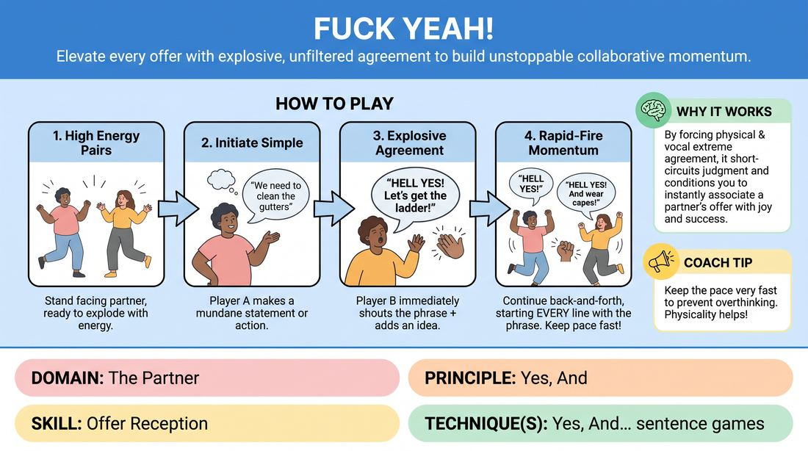

# Hell Yes!

{ .game-hero }

> Elevate every offer with explosive, unfiltered agreement to build unstoppable collaborative momentum.

## Overview
A high-energy, rapid-fire pairing exercise where players initiate a scene and must begin every single line with an enthusiastic, high-volume agreement phrase. It forces players to bypass their internal editors, embrace their partner's ideas instantly, and build a shared reality with absolute commitment.

## What It Trains
- **Domain:** D2 — The Partner
- **Principle(s):** Yes, And; Commit 100%
- **Skill(s):** Offer Reception; Unfiltered Spontaneity
- **Technique(s):** Yes, And… sentence games
- **Focus:** skill_drill

**Objective:** To develop immediate offer reception and unfiltered spontaneity by replacing hesitation with enthusiastic, full-bodied agreement.

## At a Glance
| Aspect | Detail |
|---|---|
| Players | 2+ (ideal 2) |
| Time | ~5 min |
| Complexity | 2/5 |
| Skill level | novice |
| Energy | high |
| Physicality | low |
| Modality | in_person |
| Space | minimal |
| Props | none |
| Audience | not required |

## Setup
Players stand in pairs facing each other. No props or special staging required; can be played simultaneously in a circle or scattered across the room.

## How to Play
1. Divide the group into pairs and have them stand facing each other with high energy.
2. Player A initiates the scene with a simple, mundane statement or action (e.g., 'We need to clean the gutters').
3. Player B must immediately respond by shouting 'Hell yes!' (or an agreed-upon high-energy equivalent) and then adding a line that builds on the offer.
4. Player A must immediately reply with 'Hell yes!' and add another building detail.
5. Continue this rapid-fire back-and-forth, with every single line starting with the enthusiastic phrase.
6. Keep the pace fast, encouraging physical celebration (high fives, fist pumps) alongside the verbal agreement.
7. Run the scene for about 1 to 2 minutes before switching partners or starting a new scenario.

## Facilitation Notes
- Side-coaching cue: 'Don't think, just scream "Hell yes!" and let your mouth finish the sentence!'
- Pitfall: Players saying 'Hell yes, but...' or agreeing verbally but immediately changing the subject. Fix: Remind them that 'Hell yes' means you love the exact idea your partner just said and want to make it even bigger.
- Side-coaching cue: 'Match and raise their physical energy! If they pump their fist, you jump!'
- Pitfall: Dropping the energy after the initial phrase. Fix: Encourage players to maintain the high-status, celebratory tone throughout their entire line, not just the opening words.

## Variations
- Family-Friendly Version: Use 'Heck yeah!' or 'Awesome!' for younger or corporate audiences.
- Physical Yes: Instead of a verbal phrase, players must execute a high-energy physical celebration (like a chest bump or double high-five) before speaking.
- Yes, And... Plus: Players must explicitly state why they are excited about the offer in their addition (e.g., 'Hell yes! And that means we get to use the giant ladder!').

## Debrief
- How did it feel to have your partner react to your mundane ideas with absolute ecstasy?
- Did the high-energy agreement make it easier or harder to think of what to say next? Why?
- How does this level of enthusiasm change the stakes and relationship in a scene?

## Safety & Inclusion
While not highly sensitive, ensure players are comfortable with high-volume vocalizations. Offer a lower-volume, high-intensity alternative (like an intense, whispered 'Yes!') for players with sensory sensitivities or vocal strain.

## Why It Works
By forcing a physical and vocal expression of extreme agreement, the game short-circuits the brain's natural tendency to judge, hesitate, or block. It physically conditions the player to associate their partner's offers with joy and success, building deep trust and rapid narrative momentum.
