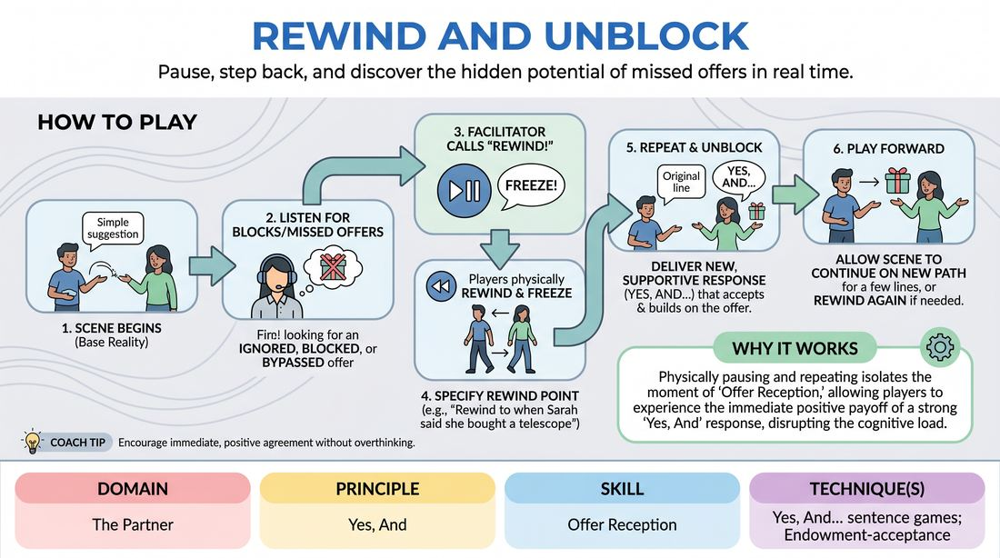

# Rewind and Rebuild

{ .game-hero }

> Pause, step back, and discover the hidden potential of missed offers in real time.

## Overview
A guided scene-work drill where a facilitator temporarily pauses the action to rewind players to a specific line or choice. By repeating the moment with a new focus, players learn to recognize overlooked offers and practice immediate, supportive agreement.

## What It Trains
- **Domain:** D2 — The Partner
- **Principle(s):** Yes, And; Make Your Partner a Genius; Base Reality First
- **Skill(s):** Offer Reception; Active Listening; Justification
- **Technique(s):** Yes, And… sentence games; Endowment-acceptance; Justify the absurd
- **Focus:** skill_drill

**Objective:** To develop deep offer reception, active listening, and justification by physically and verbally rewinding a scene to explore alternative, highly supportive 'Yes, And' choices.

## Setup
An open performance space. Two players stand in the playing area, while the rest of the group sits as active observers. The facilitator stands nearby, ready to side-coach.

## How to Play
1. Ask two players to step into the performance space and obtain a simple, non-high-stakes suggestion to establish a base reality.
2. Instruct the players to begin a standard, slow-paced scene, focusing on establishing clear, grounded offers.
3. As the facilitator, listen closely for moments where an offer is ignored, blocked, or bypassed, or where a player misses an opportunity to build on their partner's premise.
4. Call out 'Rewind!' clearly to pause the scene, instructing the players to physically freeze.
5. Specify the exact line or physical action to rewind to (e.g., 'Let's rewind to when Sarah said she bought a new telescope').
6. Have the players physically 'rewind' like a tape (moving backward quickly) and repeat the setup line.
7. Direct the receiving player to deliver a new response that fully accepts, validates, and builds upon ('Yes, Ands') that specific offer.
8. Allow the scene to play forward from that new trajectory for a few lines before either calling another rewind or letting the scene reach a natural conclusion.

## Facilitation Notes
- Frame the 'Rewind' call as a positive tool for exploration, not a penalty for making a mistake. Keep your tone light, playful, and curious.
- Look for subtle offers, not just verbal ones. Rewind to a physical shrug, a sigh, or a piece of object work that was ignored.
- Encourage the player who is responding to make their partner look like a genius by treating the rewound offer as the most important thing in the world.
- Pitfall: Players get frustrated or defensive when paused. Fix: Remind the group that we are looking for 'hidden gold' in the scene rather than correcting errors.

## Variations
- Audience Rewind: Allow the observing players to call 'Rewind' when they spot a missed offer, suggesting a line to return to.
- Multiple Paths: Rewind to the same line three times in a row, challenging the player to find three completely different ways to 'Yes, And' the exact same offer.
- Self-Rewind: Advanced players can call 'Rewind' on themselves when they realize they just blocked or ignored an offer, correcting their own choice in real time.

## Debrief
- How did it feel to have the scene paused and rewound? Did it change your perspective on what constitutes an 'offer'?
- What did you notice about the direction of the scene after we rewound and fully accepted a previously ignored detail?
- How can we bring this level of hyper-awareness to missed offers into our regular, un-rewound scenes?

## Safety & Inclusion
Ensure players understand that rewinding is a collaborative tool, not a critique of their acting. If a player feels overwhelmed by frequent interruptions, the facilitator can reduce the frequency of rewinds or check in with a supportive thumbs-up.

## Why It Works
By physically pausing and repeating a moment, the game disrupts the cognitive load of improvising. It isolates the exact moment of 'Offer Reception' and allows players to experience the immediate positive payoff of a strong 'Yes, And' response, reinforcing active listening and justification in a low-stakes, iterative environment.
