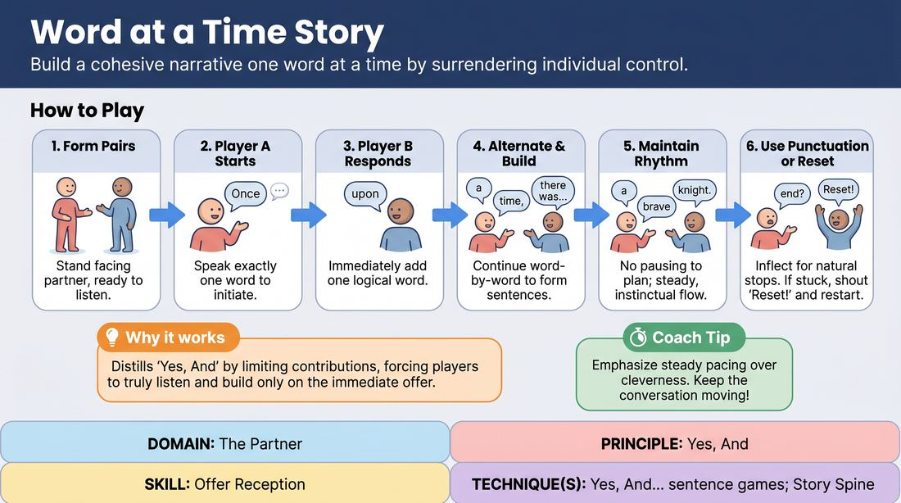

# One-Word-at-a-Time Story

{ .game-hero }

> Build a cohesive narrative one word at a time by surrendering individual control.

## Overview
Two or more players collaborate to construct a single, grammatically correct story, alternating word-by-word. Because no single player can control the narrative direction, participants must listen intently and accept whatever word is offered, immediately building upon it. The result is a shared narrative engine that highlights the power of collective creation over individual cleverness.

## What It Trains
- **Domain:** D2 — The Partner
- **Principle(s):** Yes, And; Make Your Partner a Genius; Serve the Story; Group Mind
- **Skill(s):** Active Listening; Offer Reception; Narrative Architecture; Peripheral Awareness
- **Technique(s):** Yes, And… sentence games; Story Spine
- **Focus:** mixed

**Objective:** Develops deep offer reception and active listening. Players learn to let go of pre-planned ideas, accept their partner's immediate contribution as a gift, and practice grammatical and narrative agility under pressure.

## At a Glance
| Aspect | Detail |
|---|---|
| Players | 2+ (ideal 2-15) |
| Time | ~5 min |
| Complexity | 2/5 |
| Skill level | novice |
| Energy | medium |
| Physicality | low |
| Modality | in_person |
| Space | minimal |
| Props | none |
| Audience | not required |

## Setup
Players stand in pairs facing each other, or in a circle if playing with a larger group. No props or special staging are required; a clear, quiet space is ideal to ensure players can hear each other clearly.

## How to Play
1. Divide the group into pairs and have partners stand facing each other with relaxed, open body language.
2. Instruct Player A to initiate the story by speaking exactly one word (e.g., 'Once').
3. Player B immediately responds with a single word that logically and grammatically follows the first (e.g., 'upon').
4. Players continue alternating, speaking only one word at a time, to construct complete sentences and build a cohesive narrative arc.
5. Emphasize that players must not pause to plan ahead; the rhythm should be steady, conversational, and instinctual.
6. Encourage players to use natural punctuation by inflecting their voice at the end of a sentence, allowing the next word to start a new sentence naturally.
7. If a story becomes completely stuck, nonsensical, or loses momentum, both players should raise their hands, shout 'Reset!', and immediately begin a brand-new story.

## Facilitation Notes
- Side-coaching cue: 'Be obvious, not clever.' Remind players that trying to be funny or shocking usually derails the grammar and flow. The humor comes naturally from the shared struggle.
- Pitfall: Grammatical hijacking. One player tries to force a pre-planned plot by throwing in words that do not fit the current sentence structure. Fix: Coach them to focus purely on the immediate word before theirs and make the most grammatically boring choice possible.
- Side-coaching cue: 'Listen to the whole sentence, not just your next word.' Ensure players are tracking the narrative arc, not just reacting to the single word immediately preceding theirs.
- Pitfall: Hesitation and overthinking. Players pause for several seconds to find the 'perfect' word. Fix: Encourage a steady, rhythmic pulse. It is better to say a simple, grammatically safe word quickly than a clever word slowly.

## Variations
- Group Circle: Run the game with the entire group standing in a circle, passing the story clockwise word-by-word.
- Physicalized Storytelling: Have the pairs move around the space or use physical gestures that match the action of the story as they speak it.
- The Oracle: Three players stand shoulder-to-shoulder and answer questions from the audience one word at a time, speaking as a single, omniscient entity.

## Debrief
- How did it feel to have absolutely no control over where the story went?
- What happened to the flow of the story when you tried to be clever versus when you chose the most obvious next word?
- How did you signal to your partner that a sentence was ending, and how did you receive those signals?

## Safety & Inclusion
Ensure players are mindful of physical proximity when standing face-to-face. If playing in a circle or moving around, accommodate players with limited mobility by keeping the physical pace relaxed and ensuring everyone has a clear line of sight to hear and see their partners.

## Why It Works
This game acts as a pure distillation of the 'Yes, And' principle. By limiting each contribution to a single word, it strip-mines the player's ability to plan ahead or write the scene solo. Players are forced to treat their partner's word as an absolute truth and immediately build upon it, demonstrating that narrative emerges naturally when we prioritize our partner's input over our own agenda.
