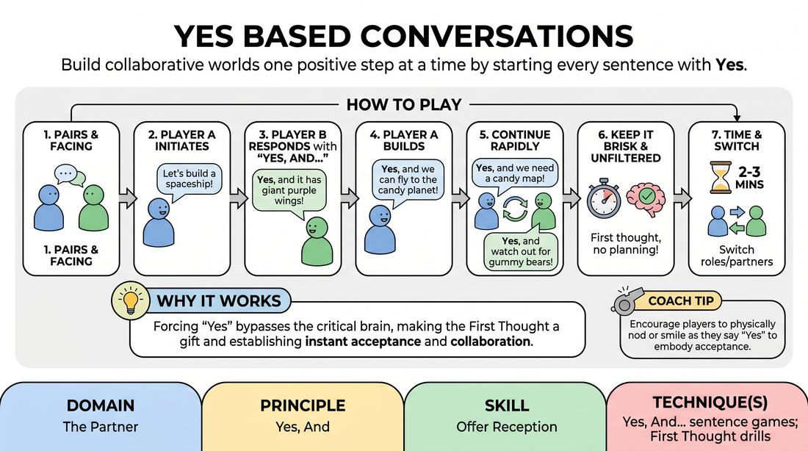

# Affirmative Exchanges

{ .game-hero }

> Build collaborative worlds one positive step at a time by starting every sentence with Yes.

## Overview
A rapid-fire pairing exercise where players build a shared scenario by explicitly agreeing to and expanding upon their partner's statements. Every single line must begin with the word Yes, followed by a new detail that builds on the previous offer. It strips away negotiation and conflict, training players to accept ideas instantly.

## What It Trains
- **Domain:** D2 — The Partner
- **Principle(s):** Yes, And; The First Thought Is a Gift; Base Reality First
- **Skill(s):** Offer Reception; Active Listening; Unfiltered Spontaneity; World-Building
- **Technique(s):** Yes, And… sentence games; First Thought drills; C.R.O.W. (Character, Relationship, Objective, Where)
- **Focus:** skill_drill

**Objective:** To develop immediate offer reception, active listening, and unfiltered spontaneity by practicing the foundational Yes, And technique in its purest linguistic form.

## Setup
Players stand or sit in pairs facing each other. No props or special staging required; minimal space is needed.

## How to Play
1. Divide the group into pairs and have them stand or sit facing each other.
2. Player A initiates the conversation with a simple, active proposal or statement of reality.
3. Player B must immediately respond by saying Yes, validating Player A's statement, and then adding a new, related detail.
4. Player A responds in kind, starting with Yes, validating Player B's addition, and contributing another detail.
5. Continue this rapid back-and-forth exchange, ensuring every single line begins with the word Yes or Yes, and...
6. Keep the pace brisk, encouraging players to say the first thing that comes to mind without filtering or planning ahead.
7. Run the exercise for two to three minutes, then have partners switch roles or swap partners for a second round.

## Facilitation Notes
- Coaching cue: Don't think, just say Yes first! This forces the brain to accept the reality before analyzing it.
- Pitfall: Players saying Yes, but... or Yes, however... which blocks the momentum. Fix: Remind them that Yes must be followed by an addition, not a contradiction or a pivot.
- Coaching cue: Keep your additions small. This prevents one player from hijacking the narrative with a massive plot twist.
- Pitfall: Pausing too long to find the perfect addition. Fix: Encourage them to use the very first thought that pops into their head, even if it seems mundane.

## Variations
- Physicalized Agreement: As players agree to each detail, they must physically act out or mime the actions and environment they are describing in real-time.
- Instant Teleportation: When a player introduces a new location or action, both players instantly snap into that new physical reality as if it has already happened.
- Emotional Yes-And: Players must match and amplify the emotional state of their partner's previous line while saying Yes.

## Debrief
- How did it feel to have every single one of your ideas instantly accepted and built upon?
- Did you notice any moments where you wanted to say no or redirect the conversation? What triggered that impulse?
- How does starting with Yes change your mental preparation compared to a normal conversation?

## Safety & Inclusion
Ensure players respect personal boundaries when physicalizing actions, and establish that Yes applies to the fictional reality, not to physical touch or personal discomfort.

## Why It Works
By forcing the literal word Yes at the start of every turn, the game bypasses the analytical, critical mind that seeks to control or edit. It establishes a low-stakes environment where the First Thought is treated as a gift, instantly building a robust base reality through mutual support.
