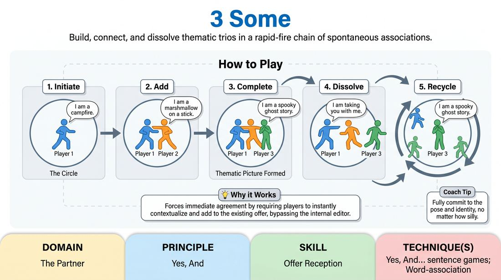

# Three-Part Tableau

{ .game-hero }

> Build, connect, and dissolve thematic trios in a rapid-fire chain of spontaneous associations.

## Overview
A fast-paced, circle-based warm-up where players step into the center to build a three-part thematic picture using 'I am' statements. Once the trio is complete, the initiator departs and sweeps another player away, leaving a single player to anchor the next round of associations. It is a high-energy exercise in rapid offer reception and immediate agreement.

## What It Trains
- **Domain:** D2 — The Partner
- **Principle(s):** The First Thought Is a Gift; Yes, And; Group Mind
- **Skill(s):** Unfiltered Spontaneity; Offer Reception; Thematic Synthesis
- **Technique(s):** Word-association; Yes, And… sentence games
- **Focus:** connection

**Objective:** To develop instant offer reception, thematic synthesis, and the 'Yes, And' mindset by building on a partner's premise without hesitation.

## At a Glance
| Aspect | Detail |
|---|---|
| Players | 3+ (ideal 6-15) |
| Time | ~5 min |
| Complexity | 1/5 |
| Skill level | novice |
| Energy | medium |
| Physicality | low |
| Modality | in_person |
| Space | minimal |
| Props | none |
| Audience | not required |

## Setup
Players stand in a circle with an open space in the center. No props or special materials are required.

## How to Play
1. Begin with all players standing in a circle.
2. One player steps spontaneously into the center of the circle, strikes a simple physical pose, and declares an identity using an 'I am' statement (e.g., 'I am a campfire').
3. A second player quickly steps in, assumes a complementary pose, and adds a related identity (e.g., 'I am a marshmallow on a stick').
4. A third player steps in to complete the picture with a third related identity (e.g., 'I am a spooky ghost story').
5. Once the three-part tableau is established, the first player (the initiator) chooses one of the other two players and says, 'I am taking you with me.'
6. The initiator and the chosen player exit the center and return to the outer circle.
7. The remaining player stays in the center, strikes their original pose, and loudly restates their identity (e.g., 'I am a spooky ghost story').
8. Two new players from the circle must immediately step in to build a brand-new three-part picture based on this remaining element, repeating the cycle.

## Facilitation Notes
- Keep the tempo high. Side-coach with cues like 'First thought, best thought!' or 'Don't think, just step in!' to prevent players from planning their offers.
- Encourage physical poses. Grounding the verbal offer in a physical shape helps players make stronger, more committed choices.
- Watch out for the 'cleverness trap' where players hesitate while trying to think of a funny or perfect third item. Remind them that the most obvious choice is always the best choice.
- Ensure the remaining player restates their identity clearly and loudly so the next two players have a solid foundation to build upon.

## Variations
- Abstract Associations: Instead of physical objects, players must use emotions, abstract concepts, or sensory descriptions (e.g., 'I am jealousy,' 'I am a secret,' 'I am a whisper').
- Sound and Motion: Instead of static poses, players must add a repetitive physical movement and a distinct sound effect to their 'I am' statement.
- Scale Shift: The three elements must represent three vastly different physical scales (e.g., 'I am a galaxy,' 'I am a telescope,' 'I am an eyelash').

## Debrief
- How did it feel to step into the center without a fully formed plan?
- What made a three-part tableau feel cohesive versus disconnected?
- How does accepting the very first obvious association help the group build momentum?
- How did physicalizing your offer change how quickly you came up with your statement?

## Safety & Inclusion
When a player 'takes' another player back to the circle, they should use a clear verbal invitation or a non-contact gesture (like an extended hand or a sweep of the arm) to respect physical boundaries and personal comfort levels.

## Why It Works
This game forces immediate agreement and addition by requiring players to instantly contextualize the existing offer. Because the cycle repeats rapidly, players cannot overthink their choices, which bypasses the internal editor and fosters a state of flow and group mind.
