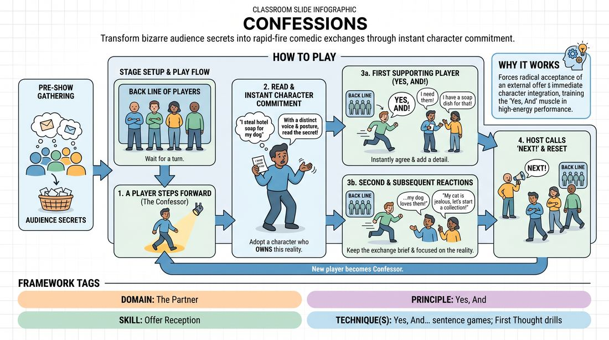

# The Confessional

{ .game-hero }

> Transform bizarre audience secrets into rapid-fire comedic exchanges through instant character commitment.

## Overview
In this high-energy performance game, players take turns stepping forward to deliver an anonymous, written 'confession' sourced directly from the audience. The active player must instantly embody a character who owns this secret, while their castmates rapidly step forward from the back line to offer supportive, witty, or surprising 'Yes, And' reactions. The result is a fast-paced montage of quick-fire comedic interactions centered around a single absurd truth.

## What It Trains
- **Domain:** D2 — The Partner
- **Principle(s):** Yes, And; The First Thought Is a Gift; The Audience Is the Final Scene Partner
- **Skill(s):** Offer Reception; Unfiltered Spontaneity; Stage Presence & Clarity
- **Technique(s):** Yes, And… sentence games; First Thought drills
- **Focus:** comedy_game

**Objective:** Develops rapid offer reception, immediate character commitment, and spontaneous verbal support under performance pressure.

## At a Glance
| Aspect | Detail |
|---|---|
| Players | 3+ (ideal 4-8) |
| Time | ~10 min |
| Complexity | 2/5 |
| Skill level | advanced_beginner |
| Energy | medium |
| Physicality | low |
| Modality | in_person |
| Space | minimal |
| Props | Slips of paper and pens (optional, for audience suggestions) |
| Audience | required |

## Setup
Players stand in a horizontal line at the back of the stage. The facilitator or host stands to the side with a collection of slips of paper containing anonymous confessions gathered from the audience before the show. The performance space in front of the line is kept clear.

## How to Play
1. Gather a collection of quirky, anonymous confessions or secrets from the audience on slips of paper prior to starting the game.
2. Instruct the players to form a line at the back of the stage, facing the audience.
3. Have one player step forward to the center of the stage to act as the primary 'Confessor' for the round.
4. The host hands the Confessor one of the audience's written confessions.
5. The Confessor reads the confession aloud to the audience, immediately adopting a distinct character voice, physical posture, and emotional attitude that justifies why they are making this admission.
6. As soon as the confession is delivered, any player from the back line must instantly step forward as a supporting character to offer a quick, supportive 'Yes, And' response that validates and expands on the confession.
7. The Confessor and the supporting player engage in a very brief, rapid-fire exchange of one or two lines, keeping the focus on the confession's reality.
8. Other players from the back line may step forward one at a time to offer their own unique reactions, creating a series of quick, distinct comedic beats with the Confessor.
9. Once the comedic energy of the confession peaks, the host calls 'Next!', the current Confessor returns to the back line, and a new player steps forward to receive a fresh confession.

## Facilitation Notes
- Coaching cue: 'Commit to the emotion of the secret immediately! Don't just read the slip—let it change how your character feels.'
- Coaching cue: 'Supporting players, step forward before you even know what you are going to say. Trust your first instinct to support your partner.'
- Pitfall: Players standing in the back line overthink their jokes, leading to long pauses. Fix: Encourage immediate physical movement; stepping forward physically forces the brain to commit to a verbal offer.
- Pitfall: The Confessor drops their character voice or physical posture after reading the slip. Fix: Remind the Confessor to maintain their established physical and emotional state throughout all the subsequent interactions.

## Variations
- The Interrogation: Instead of supportive replies, the back-line players step forward as aggressive investigators demanding absurd details about the confession, which the Confessor must instantly justify.
- Emotional Shift: The host calls out different emotions (e.g., 'guilt', 'extreme pride', 'paranoia') during the scene, forcing the Confessor to shift their attitude toward their secret mid-interaction.
- Virtual Adaptation: In a digital space, the host private-messages the confession to the active player, who speaks directly to the camera. Other players turn their cameras on and off to enter and exit the scene with their quick-fire responses.

## Debrief
- How did adopting a strong physical or emotional character right away help you handle the unexpected confession?
- What strategies did the supporting players use to make the Confessor's secret feel incredibly important?
- How does treating the audience's written words as an absolute, unshakeable truth elevate the comedy of the scene?

## Safety & Inclusion
The host should pre-screen the audience confessions before the game begins to filter out any genuinely harmful, triggering, or highly offensive topics, ensuring the secrets remain lighthearted, absurd, or mildly embarrassing.

## Why It Works
This game forces players to practice radical acceptance of an external offer and immediately integrate it into a character choice. By requiring the back line to instantly support the confession, it trains the 'Yes, And' muscle in a high-energy, low-stakes environment where speed and commitment trump overthinking.
