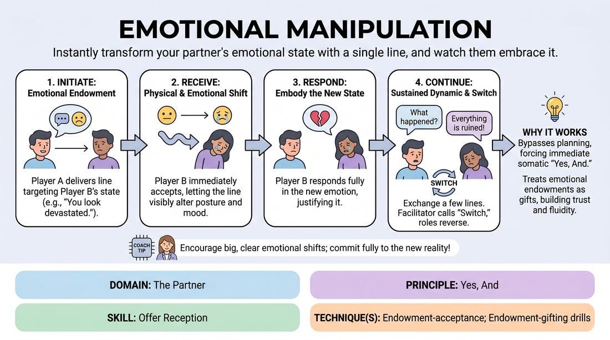

# Emotional Endowment

{ .game-hero }

> Instantly transform your partner's emotional state with a single line, and watch them embrace it.

## Overview
A two-player scene-work exercise where players practice receiving and instantly embodying emotional offers. One player delivers a line designed to shift their partner's emotional state, and the partner immediately accepts and amplifies that new feeling. It builds deep trust, rapid emotional fluidity, and the ability to say 'yes' to how your character is defined by others.

## What It Trains
- **Domain:** D2 — The Partner
- **Principle(s):** Yes, And; Consent & Boundaries; Vulnerability
- **Skill(s):** Offer Reception; Emotional Fluidity; Active Gifting; Boundary Navigation
- **Technique(s):** Endowment-acceptance; Endowment-gifting drills; The Emotional Dial (1→10)
- **Focus:** connection

**Objective:** To develop the skill of endowment-acceptance by training players to immediately receive, internalize, and physically/vocally express emotional states gifted to them by their scene partner.

## At a Glance
| Aspect | Detail |
|---|---|
| Players | 2+ (ideal 2 (or class in pairs)) |
| Time | ~10 min |
| Complexity | 2/5 |
| Skill level | competent |
| Energy | medium |
| Physicality | low |
| Modality | in_person |
| Space | minimal |
| Props | none |
| Audience | not required |

## Setup
Players stand or sit in pairs facing each other. No props or special staging are required. The facilitator should briefly discuss the distinction between the player's personal feelings and the character's emotional state before beginning.

## How to Play
1. Divide the group into pairs and designate Player A and Player B for the first round.
2. Instruct Player A to initiate a scene with a single, clear line of dialogue that directly targets and attempts to alter Player B's emotional state (e.g., 'You look absolutely radiant today' or 'I noticed you didn't get invited to the meeting either').
3. Player B must immediately accept this emotional 'gift' without hesitation, letting the line visibly and audibly transform their character's posture, facial expression, and vocal tone.
4. Player B responds to the initiation while fully embodying this new emotional state, justifying why they feel this way.
5. The pair continues the scene for three to four lines of dialogue each, maintaining the established emotional dynamic and exploring how it affects their relationship.
6. After a brief exchange, the facilitator calls 'Switch,' and the roles reverse so Player B initiates the emotional shift for Player A.
7. Encourage players to explore a wide spectrum of emotions, ranging from high-status joy and pride to low-status insecurity, grief, or excitement.

## Facilitation Notes
- Side-coaching cue: 'Show us the shift in your body first!' Encourage physicalizing the emotion before speaking the response.
- Pitfall: Denying the endowment. If Player A says 'You look terrified,' and Player B responds 'No I'm not, I'm fine,' the scene stalls. Fix: Remind players that 'Yes, And' means accepting the partner's definition of your character as absolute truth.
- Side-coaching cue: 'Let it land.' Ensure the receiving player takes a micro-moment to actually feel the impact of the words before rushing to speak.
- Pitfall: Playing the emotion too intellectually. Fix: Coach players to avoid explaining why they are feeling the emotion in a detached way, and instead let the emotion drive their physical behavior and vocal delivery.

## Variations
- Unpredictable Prompts: Player A delivers a neutral or high-stakes piece of news (e.g., 'We are moving to Alaska') without dictating the emotion. Player B chooses an extreme emotional reaction, and Player A must immediately match or complement that choice.
- Self-Endowment: A solo variation where a single player speaks a line that alters their own character's emotional state mid-monologue, practicing self-directed emotional fluidity.
- Continuous Shifts: Run a longer scene where players can shift each other's emotional states multiple times throughout the scene whenever a new endowment is offered.

## Debrief
- How did it feel to have your character's emotional state dictated to you? Was it liberating or challenging?
- What physical changes did you notice in your body when you accepted a negative emotion versus a positive one?
- How does immediately accepting an emotional endowment help build trust and connection between scene partners?

## Safety & Inclusion
Because this game involves emotional manipulation of characters, establish a clear boundary before playing. Remind players to target the character, not the real-life player's personal insecurities or sensitive real-world traits. Players have the right to pause or adjust the scene if an offer crosses a personal boundary.

## Why It Works
This game works because it bypasses intellectual planning and forces players into immediate physical and emotional response. By treating emotional endowments as gifts rather than attacks, players experience the power of 'Yes, And' on a somatic level, deepening their connection and making their scene work feel highly spontaneous and authentic.
