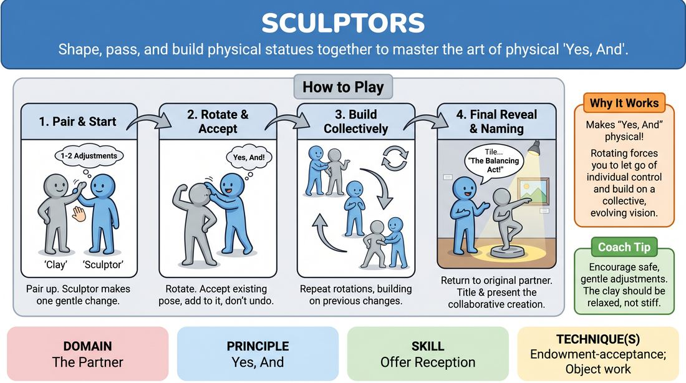

# Collaborative Sculptors

{ .game-hero }

> Shape, pass, and build physical statues together to master the art of physical 'Yes, And'.

## Overview
In this physical ensemble game, half the players act as blocks of clay while the other half act as sculptors. Sculptors rotate around the circle, making incremental adjustments to each statue, building directly on the physical choices of the previous artists. The game culminates in a gallery showing where the final collaborative masterpieces are unveiled and named.

## What It Trains
- **Domain:** D2 — The Partner
- **Principle(s):** Yes, And; Make Your Partner a Genius; Group Mind
- **Skill(s):** Physicality & Space Work; Offer Reception; Active Gifting; Support Work
- **Technique(s):** Object work; Endowment-acceptance; Endowment-gifting drills
- **Focus:** skill_drill

**Objective:** To develop physical offer reception and endowment-acceptance. Players learn to treat their partner's physical state as a valuable gift, building upon existing physical choices rather than erasing or resetting them.

## Setup
Divide the group into two equal teams. Team A (the Clay) forms a tight circle facing outward, standing completely still and neutral. Team B (the Sculptors) stands in an outer circle, each facing one member of Team A. No props or materials are required; ensure there is enough space for players to move safely around the circle.

## How to Play
1. Assign Team A as the 'Clay' and Team B as the 'Sculptors', pairing each sculptor with one piece of clay directly in front of them.
2. Instruct the sculptors to make exactly one or two physical adjustments to their clay (such as raising an arm, tilting the head, or bending a knee) using gentle, respectful touch or non-contact mirroring.
3. The clay must fully accept this physical endowment, holding the new shape with commitment while remaining relaxed and safe.
4. On the facilitator's cue, the sculptors rotate one position clockwise, standing in front of a new, partially formed sculpture.
5. The sculptors must accept the current pose of their new sculpture as a 'Yes' and add to it, rather than undoing or resetting any previous adjustments.
6. Repeat this rotation process several times until the sculptors have returned to their original starting partner.
7. Once reunited, each sculptor takes a moment to observe the final collaborative creation, gives the statue an artistic title, and presents it to the room.

## Facilitation Notes
- Side-coaching cue: 'Build on what is there! Do not reset your partner's limbs. If their arm is up, why is it up? What can you add to make that choice look brilliant?'
- Pitfall: Sculptors trying to force a pre-planned idea onto the clay, wiping away previous sculptors' work. Fix: Remind them that their job is to make the previous sculptor's choice look like a stroke of genius.
- Pitfall: Placing players in physically painful, unstable, or unsafe positions. Fix: Explicitly instruct the clay that they have 'veto power'—if a pose is physically uncomfortable or unsustainable, they should adjust it to a safe version immediately.
- Side-coaching cue: 'Clay, breathe! Keep your muscles engaged but relaxed. Do not hold your breath.'

## Variations
- Voice Chip: Once the sculptures are complete, the sculptor can tap the statue's shoulder to activate a 'voice chip.' The statue then speaks a single, character-revealing line of dialogue inspired by their physical pose.
- Non-Contact Sculpting: To practice spatial awareness and remote endowment, sculptors must shape their clay using imaginary 'puppet strings' or mirroring from a distance of two feet, without making physical contact.
- Emotional Clay: Instead of just physical shapes, each sculptor adjusts the clay's facial expression or posture to layer on a specific emotion, building a complex emotional narrative.

## Debrief
- How did it feel to have your physical choices built upon by multiple people versus having them altered or ignored?
- What did you discover about 'Yes, And-ing' a physical offer rather than a verbal one?
- As the clay, how did you practice active support and commitment even when you weren't the one making the active choices?

## Safety & Inclusion
Establish clear physical boundaries before starting. Offer a non-contact option where sculptors use 'invisible strings' or gestural commands to shape their partner without physical touch. Ensure players know they can adjust any pose that causes physical strain or discomfort without penalty.

## Why It Works
This game makes the abstract concept of 'Yes, And' highly concrete and physical. By rotating, players are forced to abandon their individual creative control and embrace a collective vision. It highlights the difference between 'tolerating' a partner's offer and actively celebrating it by making it the foundation of the next step.
