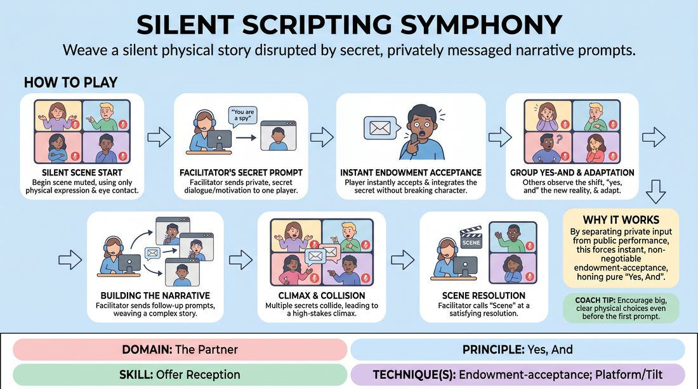

# Clandestine Chronicles

{ .game-hero }

> Weave a silent physical story disrupted by secret, privately messaged narrative prompts.

## Overview
In this virtual improv game, players begin a scene in complete silence, relying entirely on heightened physical expression and eye contact through their cameras. A facilitator acts as a hidden narrator, sending private text messages containing secret dialogue, hidden relationships, or sudden motivations to individual players. As players receive these secret prompts, they must instantly integrate them into the public scene, shifting the narrative direction in real time.

## What It Trains
- **Domain:** D2 — The Partner
- **Principle(s):** Yes, And; Serve the Story; The First Thought Is a Gift
- **Skill(s):** Offer Reception; Active Listening; Physicality & Space Work; Narrative Architecture; Raising the Stakes
- **Technique(s):** Endowment-acceptance; Platform/Tilt; Stakes-escalation reps
- **Focus:** narrative

**Objective:** Develops advanced offer reception and endowment-acceptance by training players to seamlessly absorb unexpected, privately delivered narrative shifts and immediately treat them as absolute truth, while sharpening active listening and physical storytelling.

## Setup
Played on a virtual video conferencing platform. All players must have their cameras on, be in gallery view, and have their private chat window open and easily visible. Mics are muted by default at the start of the scene.

## How to Play
1. The facilitator establishes a simple, non-verbal starting scenario for the group, such as strangers trapped in a stalled train car or rivals at a high-stakes silent art auction.
2. Players begin the scene in complete silence with their microphones muted, using exaggerated facial expressions, physical gestures, and virtual eye contact to establish initial relationships and tension.
3. The facilitator closely monitors the physical action and begins sending private chat messages to individual players containing specific dialogue, sudden character revelations, or hidden motivations.
4. Upon receiving a private message, the player must immediately accept this new endowment as absolute truth without breaking character or acknowledging the out-of-character source.
5. The player integrates the prompt into the scene, either by unmuting to deliver a specific line of dialogue with high dramatic impact, or by dramatically shifting their physical behavior to reflect their new secret motivation.
6. The other players must actively observe these sudden shifts, instantly yes-and the new reality, and adapt their own physical and verbal choices to support the evolving narrative.
7. The facilitator continues to reactively send follow-up private messages to different players, building on their choices to weave a complex, multi-layered story.
8. The scene reaches its climax as multiple secret motivations collide, and the facilitator calls scene once the narrative reaches a satisfying, high-stakes resolution.

## Facilitation Notes
- Keep your private prompts short and highly actionable to prevent players from stalling their physical performance while reading long paragraphs.
- Watch out for players staring blankly at their chat window; side-coach them to keep their eyes on their scene partners and only glance at the chat when they see a notification dot.
- Encourage players to make bold physical choices during the silent phases so the silence feels active and tense rather than passive or waiting.
- Vary the types of prompts you send, alternating between spoken dialogue, internal emotional shifts, and physical objectives to keep the narrative texture dynamic.

## Variations
- Double Agent: Two players receive the exact same secret prompt privately, but must discover this shared reality purely through physical play before speaking.
- The Puppet Master: One designated player, rather than the facilitator, acts as the off-camera writer sending the private messages to the active players.

## Debrief
- How did it feel to receive a sudden, secret instruction while trying to maintain a physical performance?
- What strategies did you use to make your acceptance of the private prompt feel seamless and natural to the other players?
- How did the silence help you pay closer attention to the physical offers and emotional shifts of your partners?

## Safety & Inclusion
Ensure players are comfortable with close-up facial expressions on camera. If a player has visual processing or reading difficulties, the facilitator can pre-arrange to send simplified, single-word prompts or use a different cueing system.

## Why It Works
By separating the narrative input from the public performance, this game forces players to practice pure endowment-acceptance. Because the offers are delivered privately, players cannot negotiate or delay; they must instantly yes-and the prompt, which bypasses overthinking and encourages immediate, high-commitment physical and verbal choices.
