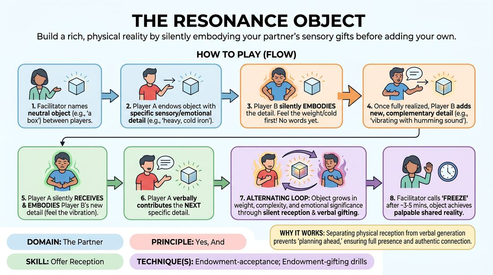

# The Resonance Object

{ .game-hero }

> Build a rich, physical reality by silently embodying your partner's sensory gifts before adding your own.

## Overview
Two players collaboratively construct a highly detailed, emotionally charged imaginary object. By requiring players to physically and emotionally absorb their partner's sensory details before speaking, the game builds deep interpersonal attunement and prevents intellectualized 'talking heads' play.

## What It Trains
- **Domain:** D2 — The Partner
- **Principle(s):** Yes, And; Make Your Partner a Genius; Assume Competence; Show, Don't Tell
- **Skill(s):** Active Listening; Single-Partner Empathy & Mirroring; Offer Reception; Active Gifting; Physicality & Space Work; World-Building
- **Technique(s):** Endowment-acceptance; Endowment-gifting drills; Mirror exercise; Emotional-echo drills; Object work; Last Word Response; Give them the answer
- **Focus:** skill_drill

**Objective:** To master endowment-acceptance and offer reception by translating a partner's verbal descriptions into immediate, physical, and emotional reactions before building further.

## At a Glance
| Aspect | Detail |
|---|---|
| Players | 2+ (ideal 2 (or rotating pairs)) |
| Time | ~10 min |
| Complexity | 2/5 |
| Skill level | advanced_beginner |
| Energy | medium |
| Physicality | medium |
| Modality | in_person |
| Space | minimal |
| Props | none |
| Audience | not required |

## Setup
Two players stand facing each other in the center of the space. No physical props are used. The facilitator provides a simple, neutral starting prompt, such as 'a stone,' 'a wooden box,' or 'a heavy key.'

## How to Play
1. The facilitator names a simple, neutral starting object to exist in the space between the two players.
2. Player A initiates by verbally endowing the object with a single, highly specific sensory and emotional detail, such as describing its temperature, weight, sound, or an emotional aura.
3. Before speaking, Player B must fully receive this offer by silently embodying its physical and emotional truth through their body language, facial expressions, and breath.
4. Once the physical reaction is fully realized, Player B verbally adds a new, complementary sensory or emotional detail to the same object.
5. Player A must then silently receive and physically embody Player B's new detail, letting the physical sensation alter their posture or emotional state.
6. Player A then verbally contributes the next specific detail, continuing the cycle of silent physical reception followed by verbal gifting.
7. The players continue this alternating loop, allowing the imaginary object to grow in physical weight, complexity, and emotional significance.
8. The facilitator calls 'freeze' or 'scene' after approximately three to five minutes, once the object has achieved a palpable, shared reality.

## Facilitation Notes
- Coaching Cue: Remind players to separate the physical reaction from the verbal response. Ensure they do not speak while they are first absorbing the partner's gift.
- Pitfall: Players often rush to speak, bypassing the physical embodiment. Fix: Side-coach with 'Breathe in the detail first' or 'Show me how that feels in your hands before you talk.'
- Coaching Cue: Encourage players to explore all five senses (smell, sound, texture, temperature) rather than just visual descriptions.
- Pitfall: The object becomes too complex or contradictory. Fix: Remind players to build on the existing reality rather than introducing completely unrelated elements that erase previous details.

## Variations
- The Stakes Progression: Once the object is established, the facilitator side-coaches a sudden shift in stakes, such as 'The object is now slipping' or 'The object is starting to wake up' to test how the players maintain their physical commitment under pressure.
- Abstract Elements: Instead of a physical object, start with an abstract concept or environmental element, such as 'a distant hum,' 'a sudden chill,' or 'a lingering memory.'

## Debrief
- How did waiting to speak until after you physically reacted change the way you listened to your partner's offer?
- In what ways did your partner's physical embodiment of your gift change how you viewed the object?
- How did the emotional weight of the object shift as you both layered sensory details onto it?

## Safety & Inclusion
Ensure players are mindful of physical boundaries when sharing the imaginary space. If players choose to physically 'pass' or touch the same imaginary object, they should establish clear spatial boundaries to maintain comfort and physical safety.

## Why It Works
By separating the reception of an offer from the generation of a new one, this game short-circuits the cognitive habit of planning ahead. Forcing a physical and emotional response first ensures that the player is fully present, practicing true 'Yes, And' through their body before their mind can overcomplicate the scene.
