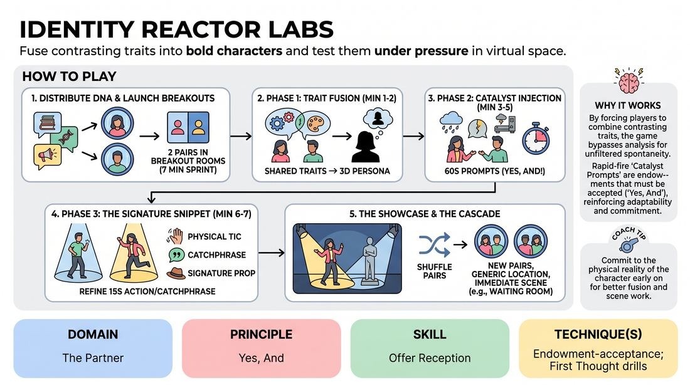

# Trait Fusion Lab

{ .game-hero }

> Fuse contrasting traits into bold characters and test them under pressure in virtual space.

## Overview
A fast-paced virtual character-development drill that challenges players to synthesize disparate personality traits into cohesive, physically realized personas. Operating in pairs within digital breakout rooms, players adapt to real-time environmental disruptions before launching their newly minted characters into spontaneous ensemble scenes.

## What It Trains
- **Domain:** D2 — The Partner
- **Principle(s):** Yes, And; The First Thought Is a Gift; Base Reality First
- **Skill(s):** Offer Reception; Unfiltered Spontaneity; Physicality & Space Work; World-Building
- **Technique(s):** Endowment-acceptance; First Thought drills; Character Walks/Centers; C.R.O.W. (Character, Relationship, Objective, Where)
- **Focus:** skill_drill

**Objective:** To master endowment-acceptance and rapid character building by instantly committing to contrasting traits, using physical and vocal choices to ground the character, and maintaining consistency when placed in new, unscripted scenarios.

## Setup
A virtual meeting platform with breakout rooms enabled, gallery view active, and the host prepared to broadcast messages. The facilitator should have a pre-generated list of contrasting character traits and a series of sudden environmental prompts (catalysts).

## How to Play
1. Distribute the DNA: The facilitator privately messages each participant two highly contrasting character traits (e.g., 'obsessive-compulsive librarian' and 'secret daredevil').
2. Launch Breakout Rooms: Send players into pairs in breakout rooms for a seven-minute character-building sprint.
3. Phase 1 - Trait Fusion (Minutes 1-2): Partners share their traits and help each other fuse their respective double-traits into a single, distinct, three-dimensional character. They must 'yes-and' each other's ideas, using virtual reactions to show enthusiastic agreement.
4. Phase 2 - Catalyst Injection (Minutes 3-5): Players begin interacting in character. Every 60 seconds, the facilitator broadcasts a sudden 'Catalyst Prompt' to all breakout rooms (e.g., 'An insect just crawled up your sleeve!' or 'You just realized you are being watched!'). Players must instantly accept this endowment and physically/vocally react in character.
5. Phase 3 - The Signature Snippet (Minutes 6-7): Each player refines a 15-second signature action, catchphrase, or physical tic that perfectly encapsulates their character's essence.
6. The Showcase: Bring everyone back to the main room. Spotlight each pair. One player performs their 15-second signature snippet while their partner acts as a silent 'hype-person,' using virtual emojis and physical reactions to enthusiastically support the performance.
7. The Cascade: Instantly shuffle players into brand-new breakout pairs. Give them a simple, generic location prompt (e.g., 'waiting room,' 'stuck elevator') and have them immediately play a scene using their established characters, testing how these deep-dive personas interact with unfamiliar partners.

## Facilitation Notes
- Coaching Cue: 'Don't try to make logical sense of the contradiction—embrace the friction! Let the physical posture of the character bridge the gap between the two traits.'
- Pitfall & Fix: Players spend too much time talking about the character instead of embodying them. Fix: Instruct them to stop discussing and start speaking as the character within the first 60 seconds of the breakout room.
- Coaching Cue: 'When the catalyst broadcast appears, react instantly. Your first physical reaction is the right one—don't filter it!'
- Pitfall & Fix: Technical lag or audio overlap in virtual scenes. Fix: Encourage heavy physical choices, exaggerated facial expressions, and deliberate pauses to allow the virtual medium to capture the performance.

## Variations
- Status Shift: During the Cascade phase, broadcast a status-reversing catalyst (e.g., 'The person with the lowest status is now in charge') to force immediate character adaptation.
- Three-Way Fusion: For odd numbers, create a trio where three traits are combined into a single, highly complex character, with two players playing 'inner voices' or physical halves of the same persona.

## Debrief
- How did physicalizing the character help you reconcile two completely opposite traits?
- What did it feel like to instantly accept the broadcasted catalysts? How did that change your character's trajectory?
- When you transitioned to the final scene with a new partner, how did having a fully realized character make your choices easier or more grounded?

## Safety & Inclusion
Since this is a virtual game focusing on rapid physical and vocal choices, remind players to be mindful of their physical surroundings (e.g., chairs, desks) when making bold physical movements. Encourage players to adapt physical choices to their comfort level and screen visibility, ensuring that vocal inflections or facial expressions can substitute for full-body movement if space is limited.

## Why It Works
By forcing players to combine contrasting traits, the game bypasses the analytical brain and taps into unfiltered spontaneity. The rapid-fire 'Catalyst Prompts' act as sudden endowments that players must accept ('Yes, And'), reinforcing the principle of treating every unexpected event as a gift. Finally, testing the character with a new partner in the final phase proves that a strong, physically grounded character can survive and thrive in any base reality.
