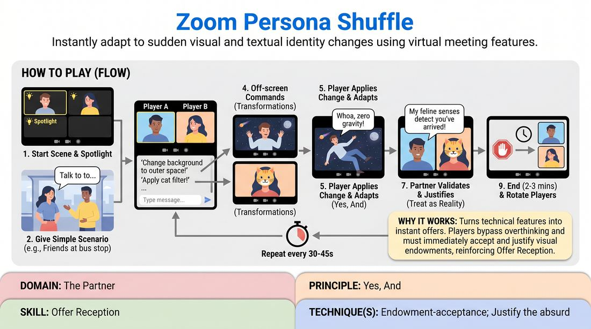

# Digital Identity Shift

{ .game-hero }

> Instantly adapt to sudden visual and textual identity changes using virtual meeting features.

## Overview
A fast-paced virtual scene-work game where players must immediately accept and justify sudden changes to their digital appearance and name. As off-screen players trigger changes to virtual backgrounds, video filters, and display names, the active performers must seamlessly integrate these new visual realities into their characters and relationships. This transforms the technical elements of video conferencing into dynamic, unpredictable improv offers.

## What It Trains
- **Domain:** D2 — The Partner
- **Principle(s):** Yes, And; Make Your Partner a Genius; The First Thought Is a Gift
- **Skill(s):** Offer Reception; Active Listening; Unfiltered Spontaneity; Justification; Physicality & Space Work
- **Technique(s):** Endowment-acceptance; Justify the absurd; First Thought drills
- **Focus:** mixed

**Objective:** Develops rapid offer reception and endowment-acceptance by forcing players to instantly 'Yes, And' unexpected visual and textual changes to their environment and identity.

## Setup
Played on a video conferencing platform on desktop or laptop computers. All participants must pre-load a variety of virtual backgrounds and video filters. Two active players are spotlighted, while the remaining participants act as 'shufflers' using the chat.

## How to Play
1. Select two active players to begin a scene and spotlight their video feeds so they are prominent for everyone.
2. Provide a simple, open-ended relationship or scenario to initiate the scene, such as two old friends meeting at a bus stop.
3. Instruct the active players to begin the scene using their natural appearance and names as a baseline.
4. Have the off-screen players or the facilitator type sudden transformation commands in the chat, such as 'Change background to outer space' or 'Apply cat filter'.
5. The targeted player must immediately apply the requested change on their video client without pausing the scene or breaking character.
6. The targeted player must instantly 'Yes, And' this new visual or textual endowment, adjusting their voice, posture, and attitude to justify the change.
7. The scene partner must immediately validate and justify this transformation, treating it as an absolute reality within the scene's universe.
8. Continue the scene with the facilitator or off-screen players calling out new changes every thirty to forty-five seconds to keep the momentum high.
9. End the scene after two to three minutes or once a satisfying comedic climax is reached, then rotate new players into the spotlight.

## Facilitation Notes
- Coaching Cue: 'Don't explain the tech! If you become a robot, don't say my filter changed, say my cybernetic implants are activating!'
- Pitfall and Fix: Players freezing or stopping the scene to find the right menu. Fix: Encourage a grace period where the partner keeps talking and justifying the impending change while the other player clicks, or simply accept the first filter they find.
- Coaching Cue: 'Make your partner a genius! If they suddenly get renamed The Whispering Wind, immediately treat them with the awe or fear that name deserves.'
- Pitfall and Fix: Technical lag or incompatible devices. Fix: Ensure before starting that everyone is on a desktop client with virtual backgrounds enabled; if a player cannot use filters, have them rely solely on renaming and physical/vocal shifts.

## Variations
- Silent Shift: The shufflers send the commands via private message to the player, so the partner has to discover the change purely through visual observation rather than reading the chat.
- Status Swap: The background or filter change dictates a mandatory shift in status, such as a crown filter meaning high status or a trash can background meaning low status.

## Debrief
- How did it feel to have your character's identity suddenly changed without your consent?
- What strategies did you use to justify a completely absurd visual change in a serious scene?
- How did active listening and watching your partner's screen help you support their new reality?

## Safety & Inclusion
Ensure all pre-loaded backgrounds and filters are appropriate for the group. If a player has sensory sensitivities or motion sickness related to flashing filters or virtual backgrounds, they can opt to play using only the renaming feature or participate as a shuffler in the chat.

## Why It Works
By turning the technical features of virtual platforms into direct physical and narrative offers, the game bypasses the analytical mind. Players cannot plan their next move because they do not know what visual endowment they will receive, forcing them to rely on unfiltered spontaneity and immediate justification.
