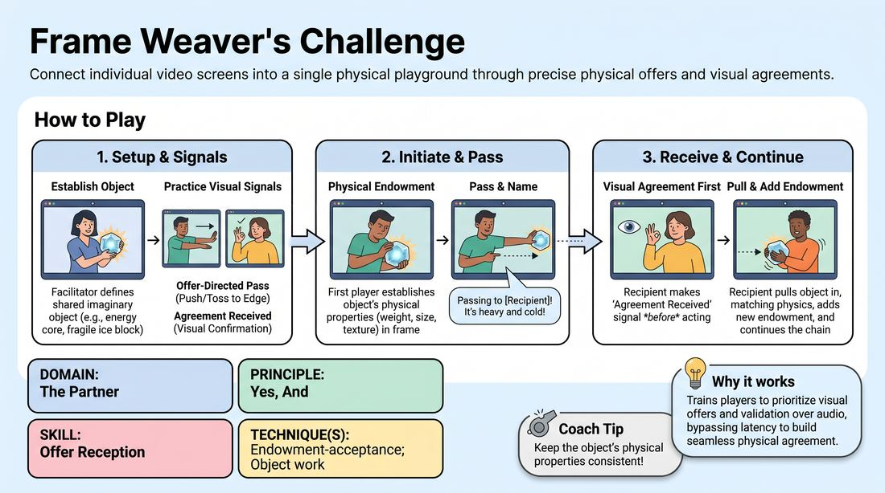

# Grid Weavers

{ .game-hero }

> Connect individual video screens into a single physical playground through precise physical offers and visual agreements.

## Overview
Grid Weavers is a virtual-native exercise that transforms individual video feeds into adjacent rooms of a shared physical space. By passing imaginary objects across screen borders using synchronized visual cues, players build a cohesive, physical reality together. This high-energy drill trains players to treat the digital grid as an interconnected stage.

## What It Trains
- **Domain:** D2 — The Partner
- **Principle(s):** Yes, And; Make Your Partner a Genius; Show, Don't Tell; Group Mind
- **Skill(s):** Physicality & Space Work; Active Listening; Offer Reception; Active Gifting; World-Building; Peripheral Awareness
- **Technique(s):** Object work; Endowment-acceptance; Endowment-gifting drills; Endowment chains
- **Focus:** skill_drill

**Objective:** Develops remote offer reception and endowment-acceptance by using clear physical boundaries, visual-first signaling, and active listening to overcome digital latency.

## Setup
Conducted on a video conferencing platform with all participants in gallery view. Players position their cameras to show their upper torso, head, and hands clearly, with about an arm's length of space behind them. No virtual backgrounds are recommended to keep hand movements highly visible.

## How to Play
1. The facilitator establishes a collaborative, imaginary task or object that must be passed across the screens, such as a fragile, glowing energy core.
2. The facilitator leads a brief practice of two essential visual signals: the 'Offer-Directed Pass' (a physical push or toss toward a specific screen edge) and the 'Agreement Received' signal (an exaggerated nod paired with a visible thumbs-up or OK sign held for two seconds).
3. The first player initiates by physically interacting with the imaginary object within their frame, establishing its weight, size, and texture through clear object work.
4. The active player moves the object toward one of their screen's edges and performs the 'Offer-Directed Pass' signal, pointing toward the recipient's position in the grid.
5. Simultaneously, the active player verbally names the recipient and describes the object's physical state (e.g., 'I am passing this freezing block of ice to you, Sarah, on my right!').
6. The recipient immediately responds with the 'Agreement Received' visual signal to confirm they see the offer, cutting through any audio lag.
7. The recipient then physically pulls the object into their frame from the corresponding edge, matching its established weight, temperature, and scale.
8. The recipient adds their own endowment to the object before passing it to the next player, keeping the chain of physical agreement going.
9. Only the active player holding the object speaks to describe their actions, while other players maintain focused silence to avoid audio overlap.

## Facilitation Notes
- Coaching cue: 'Visuals first, words second!' Remind players to make the physical pass and eye contact with the camera before or during their verbal description to beat latency.
- Pitfall: Players talking over each other due to lag. Fix: Enforce the rule that only the person holding the object speaks, while others use silent physical reactions.
- Coaching cue: 'Honor the weight!' If an object is described as heavy, ensure the recipient's muscles tense up as they pull it into their frame.
- Pitfall: Losing track of where the object is in the grid. Fix: Have the facilitator gently narrate the flow or pause to re-establish the object's current location.

## Variations
- Speed Run: Once the object is fully built or passed, try to pass it through the entire grid in reverse order as fast as possible using only visual cues and no words.
- Environmental Obstacles: The object must interact with a real-world item in each player's room (e.g., it must be wrapped around a real chair, or balanced on a real book) before being passed.
- Changing States: The facilitator calls out environmental changes (e.g., 'The gravity just tripled!' or 'The object is now made of liquid glass!') that players must instantly adapt to.

## Debrief
- How did prioritizing visual signals change how you accepted your partner's offer compared to relying on voice alone?
- What did you have to do to make the imaginary object feel continuous and real as it traveled from screen to screen?
- How did observing your partners' physical setups help you support their offers?

## Safety & Inclusion
Ensure players are mindful of their physical surroundings to avoid knocking over real-world items or straining themselves during physical movements. If a player has limited mobility or camera constraints, adapt the passing gestures to smaller, highly visible facial or hand movements that still clearly indicate direction.

## Why It Works
By forcing a 'visual-first' communication loop, the game bypasses the natural audio latency of virtual platforms. It trains players to look for physical offers (endowment) and immediately validate them (acceptance) before speaking, which builds a strong, shared physical reality and deepens the 'Yes, And' connection despite physical distance.
