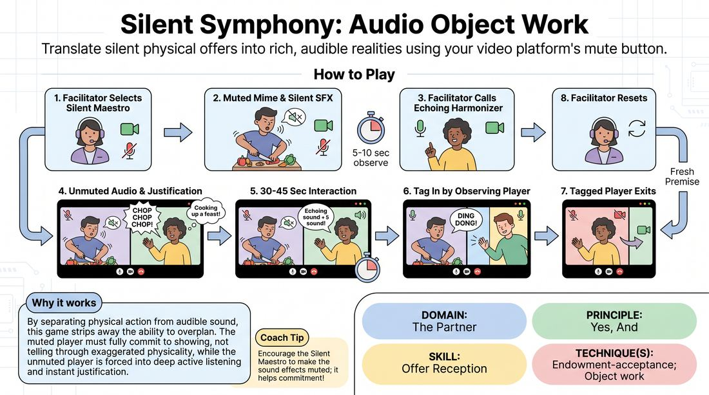

# Muted Symphony

{ .game-hero }

> Translate silent physical offers into rich, audible realities using your video platform's mute button.

## Overview
A virtual-first improv game where players turn the technical limitations of video conferencing into a creative engine. One player mimes an activity with high physical commitment while making silent, muted sound effects, while a second player unmutes to provide the live, audible soundscape and justification. Together, they build a collaborative scene where physical action and sound design are split between two minds.

## What It Trains
- **Domain:** D2 — The Partner
- **Principle(s):** Yes, And; Make Your Partner a Genius; Show, Don't Tell
- **Skill(s):** Physicality & Space Work; Active Listening; Offer Reception; Active Gifting; Justification
- **Technique(s):** Object work; Endowment-acceptance; Justify the absurd
- **Focus:** mixed

**Objective:** To develop advanced offer reception and endowment-acceptance by forcing players to closely observe physical cues, infer implied sounds, and immediately justify them with audible choices.

## At a Glance
| Aspect | Detail |
|---|---|
| Players | 5–15 (ideal 5-15) |
| Time | ~15 min |
| Complexity | 3/5 |
| Skill level | advanced_beginner |
| Energy | medium |
| Physicality | medium |
| Modality | virtual |
| Space | minimal |
| Props | none |
| Audience | not required |

## Setup
Conducted via a video conferencing platform in Gallery View. All players start with cameras on. No chat or digital reactions are used during play. Players should be familiar with quickly muting and unmuting themselves, ideally using a push-to-talk keyboard shortcut to reduce latency.

## How to Play
1. The facilitator designates one player as the Silent Maestro who keeps their camera on but mutes their microphone.
2. The Silent Maestro begins miming a highly physical, repetitive task while visibly making the corresponding sound effects with their mouth directly into their muted microphone.
3. After five to ten seconds of observation, the facilitator calls on a second player to become the Echoing Harmonizer.
4. The Echoing Harmonizer unmutes their microphone and immediately introduces a new, audible action and sound effect that creatively justifies what the Silent Maestro is doing.
5. The two players interact for thirty to forty-five seconds, with the Maestro remaining muted and the Harmonizer unmuted, providing live audio and verbal justification.
6. To transition, any observing player can tag in by unmuting their microphone, making a new distinct sound effect, and entering the scene physically.
7. The player who was tagged out immediately mutes their microphone and steps out of frame or turns off their camera to exit.
8. The facilitator periodically calls for a new Silent Maestro to reset the scene with a completely fresh physical premise.

## Facilitation Notes
- Coaching Cue: 'Show the weight!' Remind the Silent Maestro to exaggerate their physical tension and facial expressions so the implied sound has a clear texture, volume, and rhythm.
- Pitfall: The Harmonizer simply guesses what the Maestro is doing. Fix: Side-coach the Harmonizer to treat the movement as an absolute truth and immediately endow it with a creative explanation.
- Coaching Cue: 'Use keyboard shortcuts!' Encourage players to use their platform's push-to-talk shortcut to eliminate the lag of clicking the mute button, keeping the audio transitions snappy.
- Pitfall: Audio latency causing players to overlap or hesitate. Fix: Instruct the unmuted player to hold a steady, rhythmic sound pattern that the muted player can physically sync to, creating a shared tempo.

## Variations
- Gibberish Symphony: The Echoing Harmonizer must speak only in gibberish, forcing both players to rely entirely on emotional tone, physical pacing, and non-verbal endowment.
- Reversed Roles: The unmuted player makes random, bizarre sound effects first, and the muted player must instantly mime the physical action that would produce those exact sounds.

## Debrief
- How did it feel to have your physical actions endowed with a completely different sound or meaning than you originally intended?
- What visual cues were most helpful in determining the weight, speed, and texture of the silent partner's actions?
- How does splitting the physical action and the sound design between two players reinforce the principle of making your partner a genius?

## Safety & Inclusion
Ensure players who may have physical limitations or limited mobility can participate by focusing their mime on facial expressions, head movements, or small hand gestures. If a player cannot easily toggle their mute button quickly, designate a tech co-host to handle their muting and unmuting on cue.

## Why It Works
By separating physical action from audible sound, this game strips away the ability to overplan. The muted player must fully commit to showing, not telling through exaggerated physicality, while the unmuted player is forced into deep active listening and immediate yes-and acceptance. It perfectly exercises endowment-acceptance because the unmuted player must treat the silent partner's movements as a gift, instantly defining what those movements mean to the shared reality.
