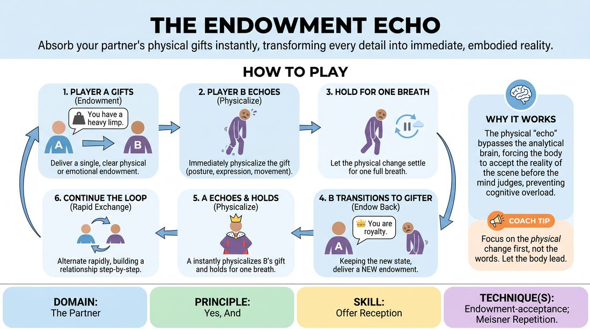

# The Endowment Loop

{ .game-hero }

> Absorb your partner's physical gifts instantly, transforming every detail into immediate, embodied reality.

## Overview
The Endowment Loop is a structured, rapid-fire partner drill that isolates offer reception and physical embodiment. Players alternate roles in a continuous cycle, with one player gifting a specific physical or situational detail and the other instantly absorbing and physicalizing it before passing the turn back. This rhythmic exchange strips away cognitive planning, forcing players to fully commit to their partner's reality.

## What It Trains
- **Domain:** D2 — The Partner
- **Principle(s):** Yes, And; Make Your Partner a Genius; Assume Competence; Base Reality First
- **Skill(s):** Active Listening; Status Modulation; Single-Partner Empathy & Mirroring; Offer Reception; Active Gifting; World-Building
- **Technique(s):** Meisner Repetition; Yes, And… sentence games; Endowment-acceptance; Endowment-gifting drills; Give them the answer; C.R.O.W. (Character, Relationship, Objective, Where)
- **Focus:** skill_drill

**Objective:** To train immediate, non-judgmental acceptance of partner offers by translating verbal endowments into instant physical adjustments, establishing a shared base reality without cognitive delay.

## At a Glance
| Aspect | Detail |
|---|---|
| Players | 2+ (ideal 2 (or 6-12 rotating)) |
| Time | ~10 min |
| Complexity | 2/5 |
| Skill level | advanced_beginner |
| Energy | medium |
| Physicality | low |
| Modality | in_person |
| Space | minimal |
| Props | none |
| Audience | not required |

## Setup
Two players stand facing each other in an open space, maintaining comfortable eye contact. The remaining participants form an active observation circle around them, ready to rotate in or provide focus.

## How to Play
1. Player A (the Gifter) makes direct eye contact and delivers a single, clear, declarative statement endowing Player B with a physical attribute, emotional state, or environmental detail.
2. Player B (the Echoer) immediately 'echoes' this gift by physicalizing it—instantly changing their posture, facial expression, or movement to reflect the endowment.
3. Player B holds this physicalized state for exactly one breath to fully register the change, letting the physical transformation settle before speaking.
4. Immediately after this brief physical hold, Player B transitions into the Gifter role, keeping their new physical state while delivering a brand-new, logical endowment back to Player A.
5. Player A now becomes the Echoer, instantly physicalizing Player B's gift, holding it for one breath, and then delivering a new endowment in return.
6. The players continue this rapid, alternating loop, building a highly specific, physically grounded relationship and environment step-by-step.

## Facilitation Notes
- Emphasize the 'one-breath hold' after the physicalization. This prevents players from rushing into their next gift before the current endowment has actually landed in their body.
- Use the side-coaching cue: 'Let it change you first!' If a player starts speaking their next gift before physically adapting, gently pause them and ask them to show the physical change first.
- Watch out for players asking questions instead of making statements. Remind them to gift with absolute certainty.
- For virtual/video-call play, adapt the physicalization to the camera frame. Players should focus on facial expressions, shoulder posture, hand gestures close to the screen, or vocal tone shifts to make the physical 'echo' highly visible online.
- Keep rounds short (90-120 seconds per pair) to maintain high energy and prevent cognitive fatigue. Rotate players frequently to keep the observation circle engaged.

## Variations
- The Silent Echo: Perform the entire loop in complete silence. Players must use physical gestures to endow their partner, and the partner must mirror and expand on that physical state.
- Status Seesaw: Every gifted endowment must explicitly raise or lower the partner's social status, forcing an immediate, dramatic shift in physical posture and eye contact.
- Virtual Frame Focus: Specifically designed for online play: players use the boundaries of their webcam frame as physical barriers or objects, endowing the partner's virtual space.

## Debrief
- How did pausing for one breath to physicalize the gift change your mental preparation for the next line?
- What physical adjustments felt most natural to adopt, and which ones challenged your usual physical habits?
- How does immediate physical commitment prevent you from denying or overthinking your partner's ideas?

## Safety & Inclusion
Ensure players know they have complete agency over their physical boundaries. If an endowment requires a movement that is physically inaccessible or uncomfortable, the player should adapt the gift metaphorically or emotionally (e.g., endowing 'heavy boots' can be physicalized as slow, deliberate speech or a heavy emotional weight rather than physical straining).

## Why It Works
By separating the act of receiving an offer from the act of generating a new one, this game bypasses cognitive overload. The physical 'echo' bypasses the analytical brain, forcing the body to accept the reality of the scene before the mind can negotiate or deny it, cementing the core principle of 'Yes, And' in a visceral way.
