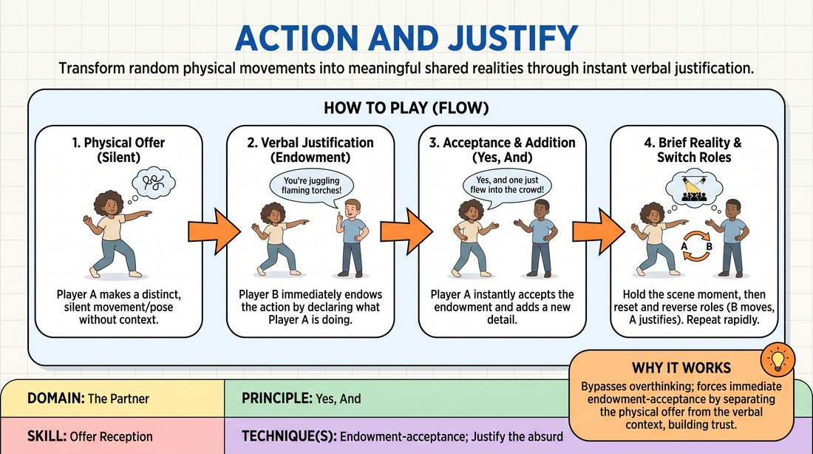

# Action and Justify

{ .game-hero }

> Transform random physical movements into meaningful shared realities through instant verbal justification.

## Overview
A dynamic partner exercise where players practice receiving physical offers and instantly giving them context. One player initiates a silent, abstract physical movement, and their partner immediately justifies the action by defining what they are doing. Together, they accept this newly established reality and build a brief, cohesive moment.

## What It Trains
- **Domain:** D2 — The Partner
- **Principle(s):** Yes, And; Base Reality First; The First Thought Is a Gift
- **Skill(s):** Offer Reception; Justification; Physicality & Space Work
- **Technique(s):** Endowment-acceptance; Justify the absurd; Object work
- **Focus:** skill_drill

**Objective:** To develop rapid offer reception and endowment-acceptance by translating physical movement into a logical, shared narrative context.

## Setup
Divide the group into pairs. Have partners stand facing each other with enough space between them to move their arms and bodies safely without collision. No props or chairs are required.

## How to Play
1. Designate one partner as Player A and the other as Player B for the first round.
2. Player A begins by making a distinct, silent physical movement or holding a specific physical posture without any premeditated context.
3. Player B closely observes Player A's physical state and immediately speaks, justifying the movement by declaring what Player A is doing or what situation they are both in.
4. Player A instantly accepts Player B's verbal endowment, responding with a 'Yes, and' statement that validates the justification and adds a new detail to the scene.
5. Both players briefly hold the physical reality of the scene for a moment to let the established context land.
6. Reset and switch roles, so Player B initiates the physical movement and Player A provides the justification.
7. Repeat this cycle rapidly, encouraging players to explore different physical levels, speeds, and shapes.

## Facilitation Notes
- Side-coach players to avoid overthinking the physical offer; the first physical shape that comes to mind is the perfect starting point.
- Pitfall: Player B waits too long to analyze the movement. Fix: Encourage Player B to speak on impulse, naming the very first thing the movement reminds them of.
- Remind Player A to fully accept the justification, even if it differs completely from what they might have sub-consciously imagined they were doing.
- Encourage players to use their whole bodies, not just their hands, to create more dynamic physical offers.

## Variations
- Continuous Scene: Instead of resetting after one exchange, players continue the scene, using subsequent physical movements to drive the narrative forward.
- Group Circle: One player steps into the center of a circle and strikes a pose; anyone from the circle can run in, justify the pose, and initiate a brief three-line scene before resetting.
- Emotional Endowment: The justifying partner must not only name the action but also assign a strong emotional state to the physical movement (e.g., 'You look absolutely terrified to open that mailbox').

## Debrief
- How did it feel to have your physical movement interpreted in a way you didn't expect?
- What strategies helped you instantly justify your partner's movement without hesitating?
- How does physicalizing an offer first change the way we discover the 'base reality' of a scene?

## Safety & Inclusion
Ensure players are mindful of their own physical boundaries and those of their partners. Remind participants that movements can be small and subtle; large or high-energy physical actions are not required to make a great offer.

## Why It Works
This game works because it bypasses intellectual planning by starting with the body. By separating the physical offer from the verbal justification, it forces players to practice true endowment-acceptance, demonstrating that any random movement can become a brilliant, logical choice when supported by a partner's 'Yes, And'.
