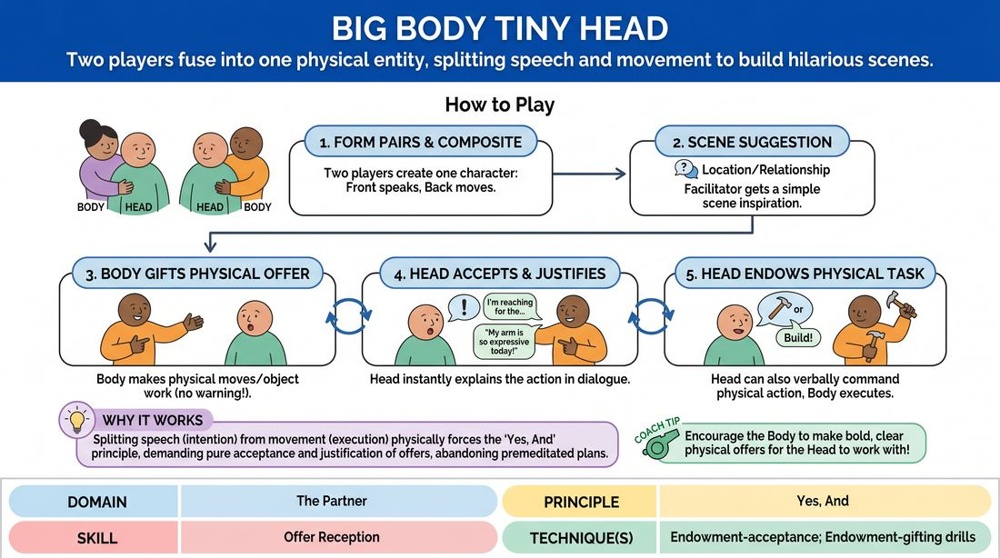

# Composite Characters

{ .game-hero }

> Two players fuse into one physical entity, splitting speech and movement to build hilarious scenes.

## Overview
In this high-energy physical game, players pair up to create composite characters where one person provides the voice and head, while the other provides the body and arms. Two of these composite characters engage in a scene, requiring intense physical awareness and instant justification of unexpected movements. The result is a comedic exercise in radical acceptance and physical endowment.

## What It Trains
- **Domain:** D2 — The Partner
- **Principle(s):** Yes, And; Make Your Partner a Genius; Commit 100%; Show, Don't Tell
- **Skill(s):** Offer Reception; Active Gifting; Physicality & Space Work; Support Work; Justification
- **Technique(s):** Endowment-acceptance; Endowment-gifting drills; Object work; Justify the absurd
- **Focus:** comedy_game

**Objective:** To develop endowment-acceptance, active gifting, and physical justification by forcing players to treat their own body's movements as external offers they must instantly 'yes-and' with their voice and dialogue.

## Setup
An open performance space. Four players step forward and form two pairs. In each pair, Player A (the Head) stands in front with their hands behind their back. Player B (the Body) stands directly behind Player A, threading their arms under Player A's armpits to act as the character's arms. The two composite characters face each other.

## How to Play
1. Divide the active players into two pairs, with each pair forming one composite character (one 'Head' in front, one 'Body' behind).
2. The facilitator obtains a simple scene suggestion, such as a location or a relationship, to initiate the scene.
3. The 'Heads' are responsible for all spoken dialogue, facial expressions, and the character's verbal point of view.
4. The 'Bodies' are responsible for all physical gestures, hand movements, object work, and physical shifts in space, such as taking steps or gesturing wildly.
5. The 'Body' must actively gift physical offers by moving the arms, touching objects, or changing posture without warning the 'Head'.
6. The 'Head' must instantly accept and justify these physical movements in their dialogue, explaining why they are gesturing, pointing, or moving in that manner.
7. Conversely, the 'Head' can verbally endow the 'Body' with physical tasks, which the 'Body' must immediately execute physically.
8. The scene continues for 3 to 5 minutes, focusing on the seamless integration of physical action and verbal justification between the split partners.

## Facilitation Notes
- Side-coaching cue: 'Justify the gesture!' If a hand moves, the speaker must immediately explain why they are doing that action.
- Side-coaching cue: 'Body, give them gifts!' Encourage the players in the back to make bold, specific physical choices rather than just idling.
- Pitfall: The 'Head' ignores the 'Body's' movements and just talks. Fix: Remind the 'Head' to keep the hands in their peripheral vision and treat every movement as an absolute truth.
- Pitfall: The 'Body' tries to speak or make noise. Fix: Remind the 'Body' that they are completely mute; their only voice is their partner's mouth.

## Variations
- Blind Body: The 'Body' closes their eyes, relying entirely on the 'Head's' verbal cues to guide their physical movements.
- Emotional Sync: The 'Body' initiates physical postures that represent strong emotional states, and the 'Head' must instantly adopt that emotion in their voice.
- The Giant: The 'Body' stands on a chair behind the 'Head', creating a giant-sized character with a tiny head, requiring the 'Head' to look up or speak from a lower physical plane.

## Debrief
- How did it feel to have no control over your own physical gestures? How did you practice 'yes-and' in that moment?
- For the 'Bodies', how did you balance making bold physical offers with supporting your partner's verbal narrative?
- What strategies helped you justify unexpected physical movements quickly and naturally?

## Safety & Inclusion
Since this game requires close physical proximity and contact (standing chest-to-back), always ask for explicit consent before pairing players. If players are uncomfortable with close physical contact, they can play a modified version where they stand side-by-side, or one player sits in a chair and the other stands directly behind them without making direct torso contact.

## Why It Works
This game physically manifests the core improv principle of 'Yes, And' by separating intention from execution. Because the speaking player cannot control their hands, they are forced to abandon premeditated plans and instead practice pure endowment-acceptance. Every physical movement becomes an external offer that must be justified, training the brain to find immediate, creative logic in the unexpected.
