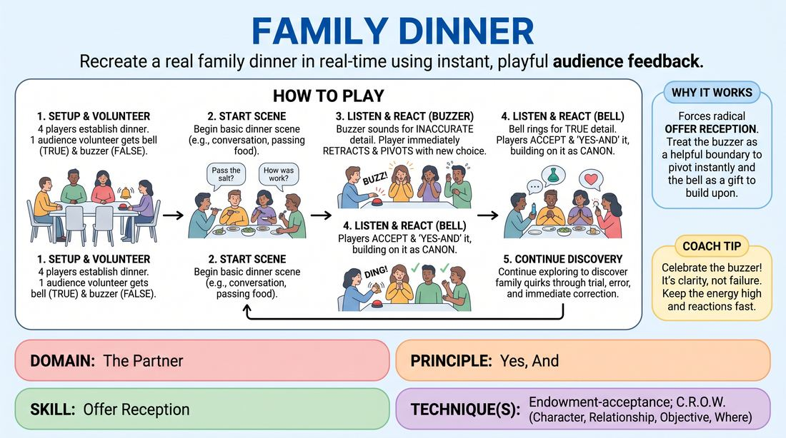

# Family Dinner

{ .game-hero }

> Recreate a real family dinner in real-time using instant, playful audience feedback.

## Overview
A group of players improvises a domestic dinner scene while guided by a single audience member equipped with a bell and a buzzer. The audience member dings for authentic details that match their own family life and buzzes for inaccuracies, forcing the players to instantly pivot and justify the new reality. It is a high-energy, comedic exercise in active listening, rapid adaptation, and collaborative world-building.

## What It Trains
- **Domain:** D2 — The Partner
- **Principle(s):** Yes, And; Make Your Partner a Genius; Base Reality First; The Audience Is the Final Scene Partner
- **Skill(s):** Offer Reception; Active Listening; World-Building; Justification; Room Reading
- **Technique(s):** Endowment-acceptance; C.R.O.W. (Character, Relationship, Objective, Where); Justify the absurd; Reading the suggestion's intent
- **Focus:** comedy_game

**Objective:** To develop rapid offer reception and endowment-acceptance by treating external, unpredictable audience feedback as absolute truth that must be instantly justified and integrated into the scene.

## Setup
Four players stand or sit in a semi-circle on stage, mimicking a dining table setup. One audience volunteer is seated in the front row, holding a bell (or high-pitched sound maker) and a buzzer (or low-pitched sound maker). The facilitator stands nearby to guide the initial setup.

## How to Play
1. Select four players to take the stage as family members and set up a basic dining table scene using imaginary props.
2. Recruit one audience volunteer who is willing to share a slice of their own family dynamic, and hand them a bell and a buzzer.
3. Instruct the volunteer that they are the ultimate authority on this family: they must ring the bell whenever an onstage choice, line, or behavior feels true to their own family dinners, and sound the buzzer whenever something feels false or unlike their family.
4. Begin the scene with the players establishing a basic dinner conversation, such as passing food or asking about someone's day.
5. When the buzzer sounds, the player who just spoke or acted must immediately retract their last offer and replace it with a different choice, continuing to guess or adapt until they receive a bell.
6. When the bell rings, the players must accept that detail as canon, 'Yes-And' it, and build upon it to weave it into the family's established reality.
7. Continue the scene, allowing the players to discover the specific quirks, tensions, and habits of this specific family through trial, error, and instant correction.

## Facilitation Notes
- Side-coaching cue: 'Don't freeze when you get buzzed! Instantly swap the detail and keep the momentum going.'
- Pitfall: Players trying to guess the 'right' answer intellectually instead of playfully offering different comedic choices. Fix: Encourage rapid-fire, contrasting offers rather than overthinking.
- Side-coaching cue: 'Listen to the bell! When you get a ding, double down on that detail and make it a core part of your character.'
- Pitfall: The audience volunteer being too polite or too slow to buzz/bell. Fix: Remind the volunteer before starting that fast, decisive feedback makes the game much funnier and easier for the players.

## Variations
- Holiday Reunion: Shift the setting from a standard dinner to a specific holiday gathering to raise the emotional stakes and introduce unique traditions.
- The Workplace Version: Apply the same mechanic to a staff meeting or office environment, using a volunteer's real-world job as the blueprint.

## Debrief
- How did it feel to have your choices instantly validated or rejected by an external source?
- What strategies helped you quickly justify a sudden change in direction after a buzzer?
- How did the bell help us build a cohesive, specific world instead of relying on generic family tropes?

## Safety & Inclusion
Family dynamics can sometimes touch on sensitive or traumatic themes. Instruct the players to keep the tone lighthearted and comedic, and ensure the audience volunteer feels comfortable pausing or redirecting if the scene accidentally veers into uncomfortable personal territory.

## Why It Works
This game forces players to abandon pre-planned narratives and practice radical offer reception. By treating the buzzer not as a failure but as a helpful boundary, players learn to treat every external constraint as a gift. The immediate feedback loop trains the brain to accept endowments instantly and justify them within the scene's base reality.
