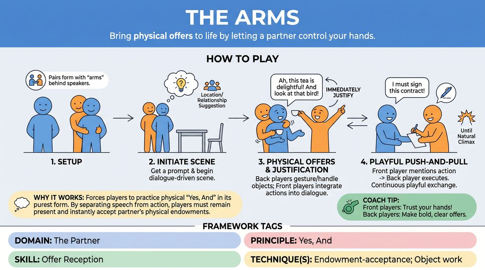

# Helping Hands

{ .game-hero }

> Bring physical offers to life by letting a partner control your hands.

## Overview
Two players perform a scene while standing in front of two other players, who slip their arms under the front players' armpits to act as their hands. The front players speak and react, while the back players physically gesture, handle imaginary objects, and make physical offers that must be instantly justified.

## What It Trains
- **Domain:** D2 — The Partner
- **Principle(s):** Yes, And; Make Your Partner a Genius; Show, Don't Tell
- **Skill(s):** Physicality & Space Work; Active Listening; Offer Reception; Active Gifting; Justification
- **Technique(s):** Object work; Endowment-acceptance; Endowment-gifting drills; Justify the absurd
- **Focus:** comedy_game

**Objective:** To develop deep physical listening, endowment-acceptance, and justification by treating unexpected physical movements as gifts to be integrated into the scene's narrative.

## At a Glance
| Aspect | Detail |
|---|---|
| Players | 4–8 (ideal 4 on stage) |
| Time | ~5 min |
| Complexity | 3/5 |
| Skill level | advanced_beginner |
| Energy | medium |
| Physicality | high |
| Modality | in_person |
| Space | minimal |
| Props | none |
| Audience | not required |

## Setup
Four players on stage, split into two pairs. In each pair, Player A stands in front with their hands clasped behind their back. Player B stands directly behind Player A, slipping their arms under Player A's armpits. The remaining players watch as the audience.

## How to Play
1. Set up two pairs of players in the physical configuration where the front player is the speaker and the back player provides the arms.
2. Obtain a simple location or relationship suggestion from the audience to initiate the scene.
3. The front players begin a dialogue-driven scene, keeping their own arms clasped behind their backs at all times.
4. The back players initiate physical movements, gestures, and object work, acting as the front players' hands.
5. The front players must immediately justify whatever their hands are doing, integrating the physical actions into their dialogue and emotional state.
6. If a front player mentions a specific action or object, the back player must immediately execute that physical action to support the dialogue.
7. The scene continues with a constant, playful push-and-pull of physical offers and verbal justifications until a natural comedic climax is reached.

## Facilitation Notes
- Coaching cue: 'Justify the gesture! If your hand slaps your face, why did you do it?'
- Coaching cue: 'Keep your real hands locked behind your back. Let your partner do all the work.'
- Pitfall: The arms player remains passive, waiting for verbal cues. Fix: Encourage the back player to make bold, independent physical offers.
- Pitfall: The front player ignores what their hands are doing. Fix: Pause the scene and ask the front player to look at their hand and explain its current position or action.

## Variations
- The Expert: A single pair performs a demonstration or cooking show, where the hands must handle real or highly detailed imaginary props.
- Three-Person Stack: Add a third player behind who acts as the legs, requiring coordinated movement across all three players.

## Debrief
- How did it feel to lose control of your physical body, and how did that affect your verbal choices?
- What strategies helped you instantly justify an unexpected physical movement?
- How did the back players balance initiating physical offers with supporting the spoken dialogue?

## Safety & Inclusion
Since this game requires close physical proximity and contact, always ask for explicit consent before pairing up. Allow players to opt out or modify the physical setup if they are uncomfortable with close physical contact.

## Why It Works
It forces players to practice physical 'Yes, And' in its purest form. By separating speech from physical action, players cannot plan ahead; they must remain entirely present, accepting the physical endowments of their partner and justifying them to build a cohesive, hilarious reality.
