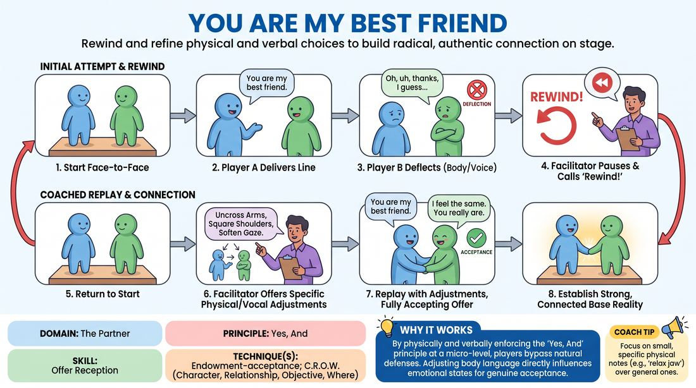

# The Best Friend Alignment

{ .game-hero }

> Rewind and refine physical and verbal choices to build radical, authentic connection on stage.

## Overview
Two players initiate a scene with a declaration of deep friendship. The facilitator actively pauses and rewinds the action, guiding players to adjust their body language, vocal tone, and dialogue to fully accept and honor the emotional offer rather than deflecting it.

## What It Trains
- **Domain:** D2 — The Partner
- **Principle(s):** Yes, And; Make Your Partner a Genius; Base Reality First
- **Skill(s):** Physicality & Space Work; Active Listening; Offer Reception; World-Building
- **Technique(s):** Endowment-acceptance; C.R.O.W. (Character, Relationship, Objective, Where)
- **Focus:** connection

**Objective:** To develop deep offer reception and endowment-acceptance by aligning physical posture and verbal responses with a high-stakes positive relationship.

## At a Glance
| Aspect | Detail |
|---|---|
| Players | 2+ (ideal 6-12) |
| Time | ~15 min |
| Complexity | 2/5 |
| Skill level | advanced_beginner |
| Energy | low |
| Physicality | low |
| Modality | in_person |
| Space | minimal |
| Props | none |
| Audience | not required |

## Setup
Two players stand or sit in the performance space facing each other. The rest of the group sits as an active, observant audience. No props or special staging are required.

## How to Play
1. Explain to the players that this is a highly coached exercise where the facilitator will frequently pause and 'rewind' the action to explore physical and emotional alignment.
2. Have two players take the stage and assume a starting posture facing one another.
3. Player A must open the scene with the exact line: 'You are my best friend.'
4. Player B must respond, attempting to fully accept the emotional weight and reality of that statement.
5. The facilitator monitors the physical posture, eye contact, and vocal delivery of both players, looking for any physical blocking or verbal deflection.
6. If a barrier is detected, the facilitator calls 'Rewind!' and instructs the players to return to their starting positions.
7. The facilitator offers specific physical or verbal adjustments, such as uncrossing arms, squaring shoulders, or slowing down the response.
8. The players replay the moment incorporating the adjustments, continuing the scene until a strong, connected base reality is established.

## Facilitation Notes
- Frame the 'rewinds' positively at the start so players know that being adjusted is a collaborative tool for discovery, not a correction of a mistake.
- Watch for micro-deflections like nervous laughter, immediate jokes, or physical steps backward, which are common defense mechanisms against vulnerability.
- Focus on physical barriers: coach players to uncross arms, square their hips toward each other, and maintain soft, warm eye contact.
- Encourage silence: remind players that accepting an emotional offer often requires a beat of silence to let the impact land before responding.

## Variations
- Varying Relationships: Change the opening line to other high-stakes emotional declarations, such as 'I am so proud of you' or 'I need your help.'
- Silent Alignment: Run the exercise entirely in silence, using only physical touch, eye contact, and posture to establish the deep connection before any words are spoken.
- The Status Shift: Start with a high-status/low-status dynamic and use the rewind mechanic to see how status affects the reception of a warm, friendly offer.

## Debrief
- How did it feel physically to adjust your posture to be more open and vulnerable?
- What internal impulses did you notice that tempted you to deflect or joke away the intimacy?
- How does establishing a strong, positive base reality first make the rest of the scene easier to navigate?

## Safety & Inclusion
While this game is not high-contact, establishing deep emotional intimacy can feel vulnerable. Remind players they can set boundaries regarding physical proximity and eye contact, and ensure the side-coaching remains supportive and respectful of personal comfort zones.

## Why It Works
By physically and verbally enforcing the 'Yes, And' principle at a micro-level, players learn to bypass their natural social defenses. Adjusting body language directly influences internal emotional states, making genuine endowment-acceptance intuitive and powerful.
