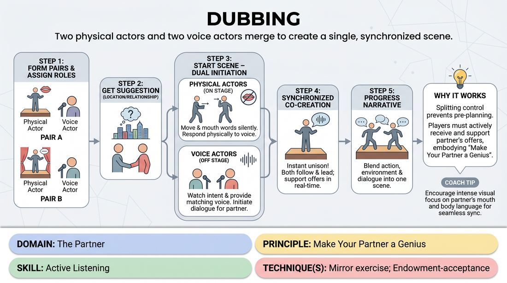

# Dubbing

{ .game-hero }

> Two physical actors and two voice actors merge to create a single, synchronized scene.

## Overview
Four players collaborate to perform a single scene split into physical and vocal components. Two actors perform physically on stage, silently mouthing words, while two off-stage players provide their spoken voices in real-time. The magic lies in the seamless synchronization, where neither the physical nor the vocal actor dominates, but instead they co-create the character's actions and dialogue.

## What It Trains
- **Domain:** D2 — The Partner
- **Principle(s):** Yes, And; Make Your Partner a Genius; Show, Don't Tell; Group Mind
- **Skill(s):** Active Listening; Single-Partner Empathy & Mirroring; Offer Reception; Active Gifting; Peripheral Awareness; Support Work
- **Technique(s):** Mirror exercise; Endowment-acceptance; Endowment-gifting drills
- **Focus:** connection

**Objective:** To develop deep active listening, peripheral awareness, and radical support by forcing players to share control of a single character's expression.

## At a Glance
| Aspect | Detail |
|---|---|
| Players | 4–4 (ideal 4) |
| Time | ~5 min |
| Complexity | 3/5 |
| Skill level | advanced_beginner |
| Energy | medium |
| Physicality | medium |
| Modality | in_person |
| Space | moderate |
| Props | none |
| Audience | not required |

## Setup
Four players participate. Two players stand in the performance space as the physical actors. The other two players stand at the sides of the stage (off-stage but clearly visible to their respective partners) acting as the voice actors. No props are required, though clear sightlines between partners are essential.

## How to Play
1. Assign players into two pairs; each pair consists of one physical actor on stage and one voice actor off stage.
2. Get a simple suggestion for a location or relationship to initiate a standard scene.
3. The physical actors begin moving and interacting in the space, using silent physical offers and mouthing words without making any vocal sound.
4. The voice actors must watch their assigned physical actor's mouth and body language intently, instantly providing the spoken words and vocalizations that match the physical movements.
5. Conversely, a voice actor can initiate a line of dialogue, requiring their on-stage partner to immediately begin mouthing along and physically embodying the spoken offer.
6. Both partners in each pair must remain highly sensitive to each other, ensuring that mouth movements and spoken words start and stop in perfect unison.
7. The scene progresses with both pairs interacting, blending physical action, environment work, and dialogue into a cohesive narrative.

## Facilitation Notes
- Side-coaching cue: 'Watch the mouth!' Remind voice actors to keep their eyes locked on their partner's face to catch the exact moment they start and stop mouthing.
- Side-coaching cue: 'Share the lead.' If the voice actor is writing a script and ignoring the physical actor's physical offers, call out 'Let the body lead.' If the physical actor is ignoring the voice, call out 'Let the voice lead.'
- Common Pitfall: The voice actor speaks while the physical actor's mouth is closed. Fix: Have the voice actor pause immediately and wait for the physical actor to open their mouth, or have the physical actor quickly catch up to the voice.
- Encourage physical actors to make bold physical choices (e.g., picking up a heavy object) to give the voice actor rich material to interpret vocally.

## Variations
- Gibberish Translation: The on-stage actors speak in an expressive gibberish language, and the off-stage actors translate their lines into English during the pauses.
- Three-Way Dubbing: Three players stand on stage in a triangle. Player A voices Player B, Player B voices Player C, and Player C voices Player A, creating a highly complex loop of physical and vocal synchronization.

## Debrief
- How did it feel to surrender half of your character's control to another player?
- What cues did you rely on to stay in sync with your partner without looking directly at them the whole time?
- How did this exercise force you to listen more closely than you would in a standard scene?

## Safety & Inclusion
Ensure that off-stage voice actors have a clear, unobstructed line of sight to the physical actors without straining. If a player has visual or auditory accessibility needs, pair them intentionally or adjust positioning so they can comfortably track physical movements or vocal cues.

## Why It Works
This game dismantles the habit of pre-planning dialogue. Because control is split, players cannot rely on their own internal script; they must actively receive and support their partner's physical or vocal offers in real-time. It embodies 'making your partner a genius' by requiring both players to constantly adapt to make the shared character appear unified and coherent.
