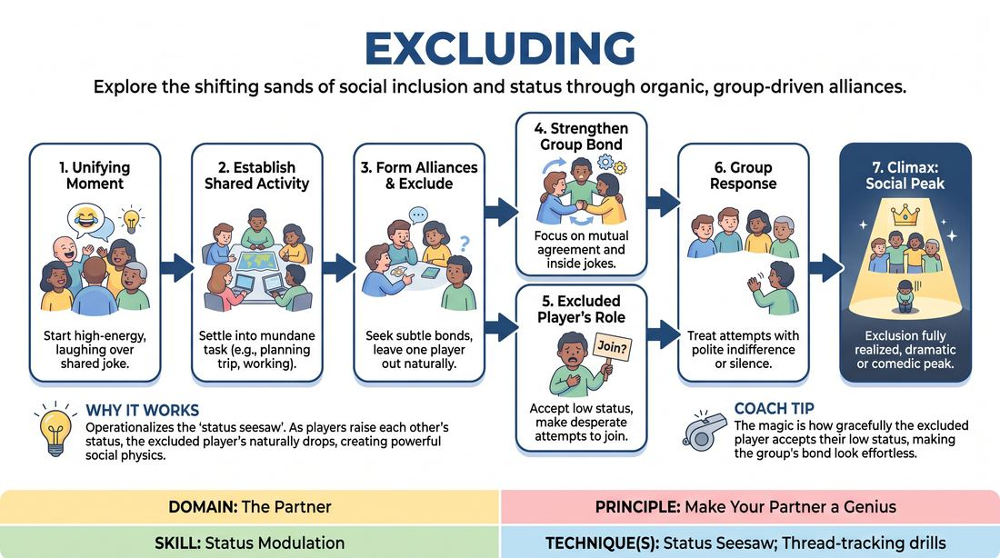

# Status Alliances

{ .game-hero }

> Explore the shifting sands of social inclusion and status through organic, group-driven alliances.

## Overview
A scene-based exercise for four to six players where alliances naturally form, leaving one player on the outside. Rather than playing malicious bullying, players use subtle status shifts and social alignment to create a compelling, high-stakes comedic or dramatic dynamic. The magic lies in how gracefully the excluded player accepts their low-status position, making the group's bond look effortless and hilarious.

## What It Trains
- **Domain:** D2 — The Partner
- **Principle(s):** Make Your Partner a Genius; Group Mind; Yes, And
- **Skill(s):** Status Modulation; Peripheral Awareness; Game Identification
- **Technique(s):** Status Seesaw; Thread-tracking drills; Finding & Playing the Game
- **Focus:** skill_drill

**Objective:** To master status modulation and the 'status seesaw' technique by dynamically adjusting one's social standing in response to group alignment, while practicing the principle of making your partner look good by enthusiastically accepting a low-status, excluded role.

## Setup
An open performance space. Four to six players stand or sit in a semi-circle or around an imaginary table. No physical props are required. The facilitator stands to the side to coach.

## How to Play
1. Begin the scene with all players sharing a high-energy, unifying moment, such as laughing together as if a hilarious joke has just been told.
2. As the initial laughter subsides, players must establish a mundane, shared activity or conversation, such as planning a trip, working in an office, or eating dinner.
3. Players must actively seek to form subtle alliances with one another through eye contact, physical proximity, agreement, and shared inside jokes.
4. Rather than actively attacking or bullying one player, the group must focus on strengthening their mutual bonds, which naturally leaves one player out of the loop.
5. The player who notices they are being left out must immediately 'Yes, And' this reality by accepting their low-status position, reacting with desperate attempts to re-integrate or quiet resignation.
6. The allied players must maintain their bond, treating the excluded player's attempts to join with polite indifference, mild distraction, or unified silence, thereby elevating the comedic tension.
7. The scene reaches its climax when the exclusion is fully realized and acknowledged, resulting in a clear, dramatic, or comedic peak of social division.

## Facilitation Notes
- Side-coaching cue: 'Don't play mean, play close!' Remind players that exclusion is a byproduct of others bonding, not active bullying.
- Pitfall: The excluded player fights too hard or gets angry, turning it into a conflict. Fix: Coach them to play the 'status seesaw'—letting their status drop gracefully makes the game funnier and more poignant.
- Side-coaching cue: 'Find the pattern.' Encourage the group to notice who is on the outside and lean into the established social geometry.
- Pitfall: Players hesitate to exclude anyone out of politeness. Fix: Remind them that in improv, making your partner a genius means giving them a clear, playable game. Being excluded is a gift of a clear role.

## Variations
- The Seesaw Swing: Allow the excluded player to successfully win over one ally, shifting the alliance and leaving a different player excluded.
- Silent Alliances: Play the entire scene in gibberish or completely silently, relying purely on physical status, eye contact, and body language to establish the exclusion.
- The Secret Protagonist: The excluded player is secretly the boss or high-status figure, creating a high-status/low-status clash where the group excludes their superior.

## Debrief
- How did it feel to be the excluded player, and how did accepting that low-status role help the scene?
- What was the difference between actively 'bullying' someone versus simply strengthening alliances with others?
- How did eye contact and physical positioning signal the shifts in status and alliance?

## Safety & Inclusion
Because social exclusion can trigger real-world anxieties, establish a clear boundary before playing. Emphasize that the exclusion must remain strictly situational and character-based, never targeting a player's real-life identity or personal traits. Players can use a non-verbal 'pause' signal if the emotional intensity feels too real.

## Why It Works
This game works because it operationalizes the 'status seesaw.' When three players raise each other's status through mutual agreement, the fourth player's status naturally drops. By leaning into this social physics rather than fighting it, players discover that playing low-status is highly empowering and comedic. It relies on Group Mind to sense the shifting social landscape without explicit verbal planning.
