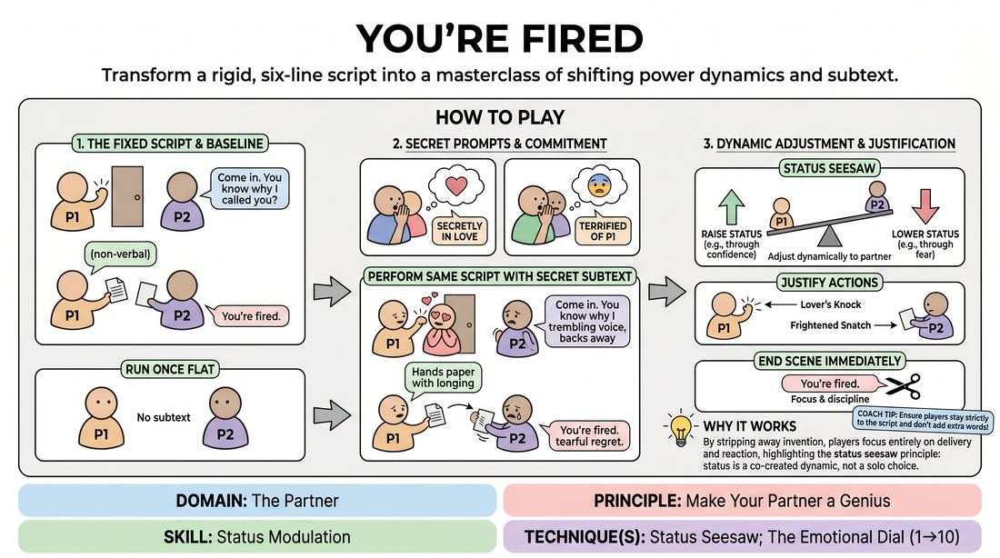

# The Pink Slip Script

{ .game-hero }

> Transform a rigid, six-line script into a masterclass of shifting power dynamics and subtext.

## Overview
Two players perform a brief, pre-written scene with fixed dialogue and actions. By layering in secret physical, emotional, or status-based constraints, players discover how subtext, status modulation, and physical commitment completely redefine the meaning of the exact same words.

## What It Trains
- **Domain:** D2 — The Partner
- **Principle(s):** Make Your Partner a Genius; Yes, And; Commit 100%; Show, Don't Tell
- **Skill(s):** Status Modulation; Offer Reception; Emotional Fluidity; Physicality & Space Work; Justification
- **Technique(s):** Status Seesaw; The Emotional Dial (1→10); Character Walks/Centers; Justify the absurd
- **Focus:** skill_drill

**Objective:** To master status modulation and the status seesaw technique, demonstrating how physical choices and emotional justification can elevate a partner's performance and transform a static text.

## Setup
Two chairs facing each other or a simple desk setup. The rest of the group acts as active observers. No physical props are needed; all items (door, paper) are mimed.

## How to Play
1. Introduce the fixed script to the two active players and the group: Player 1 knocks; Player 2 says 'Come in. You know why I called you?'; Player 1 non-verbally indicates they do not know; Player 2 hands Player 1 a mimed piece of paper; Player 1 says 'I thought you wouldn't take that into account?'; Player 2 says 'You're fired.'; Player 1 says 'Fine. I hated that stupid job anyway.'
2. Run the scene once 'flat' with no subtext or extra physical choices, establishing a baseline of how dry literal text can be.
3. Pull each player aside individually to give them a secret, distinct prompt (e.g., Player 1 is secretly in love with Player 2; Player 2 is terrified of Player 1 but trying to assert dominance).
4. Instruct the players to perform the exact same script, maintaining the exact words and actions, but fully committing to their secret prompts.
5. Encourage players to use the status seesaw technique: as one player attempts to raise their status, the other must dynamically adjust theirs to highlight the shift, making their partner's choice look brilliant.
6. Have the players justify every physical action (the knock, the paper hand-off) through the lens of their secret prompt.
7. End the scene immediately after the final line is delivered, keeping the focus tight and disciplined.

## Facilitation Notes
- Side-coaching cue: 'Let the physical constraint dictate your voice, not just your body!'
- Pitfall: Players adding extra words or ad-libbing. Fix: Remind them that the magic lies in the silence between the lines and the physical subtext; enforce the strict script.
- Side-coaching cue: 'React to what your partner is giving you, even if it contradicts your secret prompt. Justify their behavior!'
- Pitfall: Playing the scene too fast. Fix: Encourage players to find the pauses, allowing the status shifts to land with the audience.

## Variations
- Status Swap: Run the scene where Player 1 starts at high status and Player 2 at low status, then they must completely invert their statuses by the time the paper is handed over.
- The Silent Subtext: Perform the entire sequence without speaking any of the lines aloud, using only gibberish or pure physical theater while keeping the exact same beats.
- Audience-Assigned Secrets: Have the observing group silently write down physical or emotional secrets on slips of paper for the actors to draw before the scene starts.

## Debrief
- How did your partner's secret prompt change the way you delivered your own lines, even though your words couldn't change?
- What physical choices made the power dynamic (the status seesaw) feel the most dramatic or surprising?
- How does having a rigid constraint actually give you more freedom to play with subtext and physicality?

## Safety & Inclusion
Ensure physical prompts (like physical limitations or sensory changes) are played with respect and do not rely on cheap caricatures of real-world disabilities. Encourage players to focus on internal emotional states or absurd, non-offensive physical constraints (e.g., wearing shoes that are too tight, or being secretly made of glass).

## Why It Works
By stripping away the burden of inventing dialogue, players are forced to focus entirely on how they deliver their lines and how they react to their partner. This highlights the status seesaw principle: status is not a solo choice, but a collaborative dance where making your partner look powerful or weak directly shapes the scene's tension.
