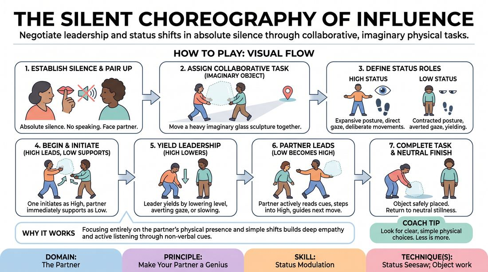

# Silent Status Seesaw

{ .game-hero }

> Negotiate leadership and status shifts in absolute silence through collaborative, imaginary physical tasks.

## Overview
A non-verbal duet where partners must complete a collaborative physical task using imaginary objects or spatial movement. By stripping away speech, players rely entirely on body language, eye contact, and spatial relationships to negotiate who leads and who follows. The exercise creates a dynamic, physical status seesaw where leadership shifts fluidly to make the partner look brilliant.

## What It Trains
- **Domain:** D2 — The Partner
- **Principle(s):** Yes, And; Make Your Partner a Genius; Assume Competence
- **Skill(s):** Physicality & Space Work; Active Listening; Status Modulation; Single-Partner Empathy & Mirroring; Offer Reception; Active Gifting
- **Technique(s):** Object work; Status Seesaw; High/low-status walks; Endowment-acceptance; Endowment-gifting drills; Give them the answer
- **Focus:** connection

**Objective:** To master status modulation and non-verbal attunement, training players to read subtle physical offers and seamlessly transition between high and low status roles.

## At a Glance
| Aspect | Detail |
|---|---|
| Players | 2+ (ideal 2-20 (in pairs)) |
| Time | ~10 min |
| Complexity | 3/5 |
| Skill level | competent |
| Energy | medium |
| Physicality | medium |
| Modality | in_person |
| Space | moderate |
| Props | none |
| Audience | not required |

## Setup
Pairs stand facing each other in a clear space. No physical props are required; the exercise utilizes imaginary space work to ensure accessibility and flexibility.

## How to Play
1. Divide players into pairs and have them stand facing each other, establishing absolute silence with no speaking or vocalizations allowed.
2. Assign the pair a collaborative task involving an imaginary object, such as moving a heavy, fragile glass sculpture across the room together.
3. Explain the two status roles: High Status (expansive posture, direct eye contact, deliberate movements) and Low Status (contracted posture, averted gaze, yielding movements).
4. Begin the task with one player initiating a movement as the High Status leader, while the partner immediately adopts the Low Status supporting role to assist.
5. To shift the status seesaw, the leading player must consciously yield leadership by lowering their physical level, averting their gaze, or slowing down.
6. The supporting player must actively read these non-verbal cues, step into High Status by expanding their posture and taking the physical lead, and guide the next movement.
7. Continue this fluid exchange of leadership back and forth, ensuring that every physical choice is accepted and supported by the partner.
8. The task is complete when the imaginary object is safely placed and both players return to a neutral, synchronized stillness.

## Facilitation Notes
- Side-coaching cue: 'Watch your partner's chest and eyes. If their chest expands and they hold your gaze, they are leading. If they soften their posture, step in to support them.'
- Common Pitfall: Players rush through the movement, losing the status dynamic. Fix: Instruct players to move in slow motion, which heightens awareness of subtle status shifts.
- Common Pitfall: One player dominates the leadership role. Fix: Side-coach the dominant player to 'give away your power' by physically lowering their head or taking a step back.
- Side-coaching cue: 'Make your partner a genius. If they drop the imaginary object, react as if that was the perfect, intended choice and adapt your status to match.'

## Variations
- Virtual Screen Adaptation: Play over video call. Partners use the camera frame to negotiate status. High status is represented by moving close to the camera and looking directly into the lens; low status is represented by backing away or looking down. The task is to 'pass' an imaginary object across the screen boundaries in perfect synchronization.
- The Gravity Shift: Perform the task while imagining the room's gravity is constantly changing, forcing players to use extreme physical tension and level changes to maintain balance.
- Group Wave: Scale the exercise by forming a circle. One player initiates a silent status shift, which must ripple around the circle as each player adapts their status to the person to their left.

## Debrief
- How did you signal a desire to yield leadership without using touch or words?
- What physical adjustments did you make to ensure your partner looked competent and in control?
- For the virtual version, how did screen depth and camera proximity affect your perception of status?
- How can we apply this non-verbal sensitivity to verbal scenes when negotiating who has the platform?

## Safety & Inclusion
This game is fully playable without physical contact. Players can signal status shifts entirely through spatial distance, eye contact, and body levels. For players with limited mobility, status can be modulated using facial expressions, head tilts, and vocal-free breath cues.

## Why It Works
By removing physical props and verbal communication, players must focus entirely on their partner's physical presence. The status seesaw becomes highly legible through simple shifts in posture and gaze. This builds deep empathy and active listening, forcing players to instantly accept and elevate their partner's physical offers.
