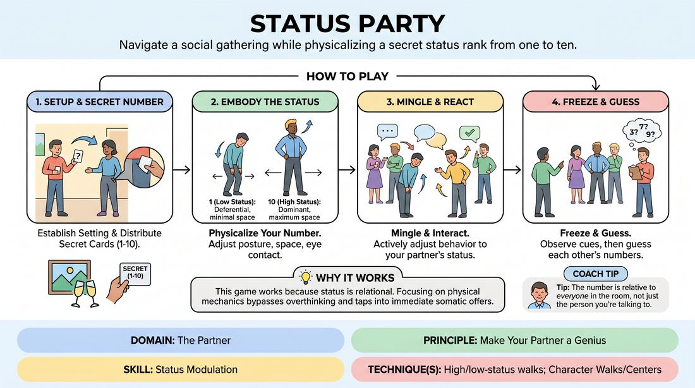

# Status Spectrum Party

{ .game-hero }

> Navigate a social gathering while physicalizing a secret status rank from one to ten.

## Overview
Players embody a secret numerical status from 1 (lowest) to 10 (highest) during a simulated social gathering. By adjusting their posture, eye contact, and spatial relationships, players interact dynamically, revealing their rank through behavior rather than explicit statements. The exercise culminates in a collective analysis of the physical and verbal cues that signaled each player's standing.

## What It Trains
- **Domain:** D2 — The Partner
- **Principle(s):** Commit 100%; Make Your Partner a Genius
- **Skill(s):** Physicality & Space Work; Active Listening; Status Modulation; Peripheral Awareness
- **Technique(s):** Character Walks/Centers; Meisner Repetition; Status Seesaw; High/low-status walks
- **Focus:** skill_drill

**Objective:** To develop status modulation skills by physicalizing relative social power (using high/low-status walks, posture, and eye contact) and to practice making partners look good by instantly reacting to and validating their projected status.

## At a Glance
| Aspect | Detail |
|---|---|
| Players | 5+ (ideal 8-12) |
| Time | ~15 min |
| Complexity | 2/5 |
| Skill level | advanced_beginner |
| Energy | medium |
| Physicality | medium |
| Modality | in_person |
| Space | moderate |
| Props | Slips of paper or cards numbered 1 to 10 |
| Audience | not required |

## Setup
Prepare a set of small cards or slips of paper numbered 1 through 10. Clear a moderate playing space to represent a party or networking venue. Have all players stand outside the playing area or close their eyes while the facilitator prepares to distribute the secret numbers.

## How to Play
1. Establish a specific social setting for the scene, such as a high-end gallery opening, a corporate networking event, or a neighborhood block party.
2. Distribute one secret numbered card (from 1 to 10) to each player. Instruct players to look at their number privately and pocket it without revealing it to anyone else.
3. Explain the scale: 1 represents the absolute lowest status in the room (extremely deferential, avoiding space, minimal eye contact), while 10 represents the absolute highest status (commanding space, sustained eye contact, relaxed posture).
4. Have players enter the playing space one by one or in small groups, immediately adopting the physical walk, posture, and attitude of their assigned number.
5. Instruct players to mingle and engage in casual conversation, focusing heavily on how they use physical space, eye contact, and vocal tone to express their relative rank.
6. Encourage players to actively adjust their behavior based on who they are interacting with, lifting their partner's status up or yielding to it to make the relationship clear.
7. Freeze the action after 5 to 7 minutes of active mingling.
8. Have the group observe the frozen tableau, then go around and have players guess each other's numbers based on the physical and verbal behaviors exhibited during the scene before revealing the actual cards.

## Facilitation Notes
- Side-coach physical adjustments: Remind players to use high/low-status walks. High status moves with a steady head and open chest; low status moves with jerky transitions, touching their face, or protecting their torso.
- Watch for the 'tyrant trap': Remind players that high status (9 or 10) doesn't mean being angry or mean. True high status is often effortless, calm, and generous, while low status can be eager to please rather than just sad.
- Emphasize 'making your partner a genius': If someone treats you like a king, accept it and treat them like a subject. Status is a cooperative game; you cannot be a 10 unless others play lower than you.
- Pitfall: Players stating their status or job title to force the rank. Fix: Side-coach them to show, not tell. Ban explicit mentions of wealth, job titles, or social standing.

## Variations
- The Blind Rank: Tape the numbers to players' foreheads or backs. Players do not know their own number and must deduce their status solely based on how others treat them.
- The Status Clash: Secretly give every single player the exact same number (e.g., all 10s or all 1s) and watch how they attempt to establish equilibrium.
- Internal vs. External: Give players two numbers. The first is their internal feeling (how they feel inside), and the second is their external mask (how they try to present themselves to the world.

## Debrief
- What physical cues (eye contact, posture, movement speed) made it easiest to identify someone's status?
- How did it feel to make your partner 'the genius' by yielding space or attention to their higher status?
- How did your physical walk and posture influence your internal feelings of confidence or deference?
- What happened when two players with similar mid-range numbers (like a 5 and a 6) interacted?

## Safety & Inclusion
Ensure players are aware of physical boundaries, as high-status characters might naturally try to dominate physical space. Remind players that high status does not grant permission to touch others without consent or violate personal safety boundaries.

## Why It Works
This game works because status is inherently relational rather than individual. By focusing on physical mechanics—such as high/low-status walks, stillness, and eye contact—players bypass intellectualizing and tap into immediate somatic offers. It directly trains the principle of making your partner a genius, as a player's status is only real if their partner validates and reacts to it.
