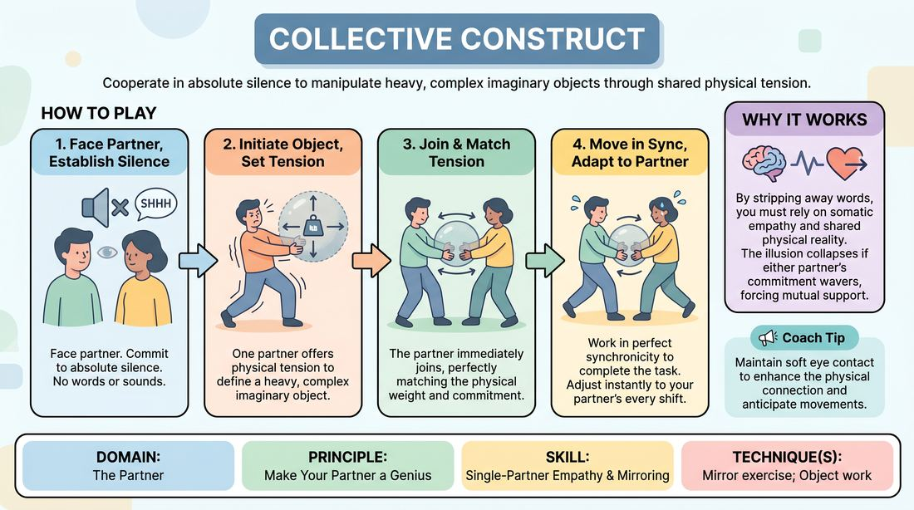

# Shared Gravity

{ .game-hero }

> Cooperate in absolute silence to manipulate heavy, complex imaginary objects through shared physical tension.

## Overview
A non-verbal partner exercise where pairs collaboratively lift, move, or operate a highly demanding imaginary object. By removing verbal communication, players must rely entirely on physical attunement, shared resistance, and mutual commitment to keep the invisible object real. If one partner's focus or physical tension slips, the illusion collapses for both, making mutual support an absolute necessity.

## What It Trains
- **Domain:** D2 — The Partner
- **Principle(s):** Yes, And; Make Your Partner a Genius; Assume Competence
- **Skill(s):** Physicality & Space Work; Active Listening; Status Modulation; Single-Partner Empathy & Mirroring; Offer Reception; Active Gifting
- **Technique(s):** Object work; Mirror exercise; Emotional-echo drills; Yes, And… sentence games; Endowment-acceptance; Endowment-gifting drills
- **Focus:** connection

**Objective:** To develop deep non-verbal empathy, physical listening, and the instinct to support a partner's physical choices ('Make Your Partner a Genius') by sharing the physical burden of an imagined object.

## At a Glance
| Aspect | Detail |
|---|---|
| Players | 2+ (ideal 2 per pair) |
| Time | ~5 min |
| Complexity | 2/5 |
| Skill level | advanced_beginner |
| Energy | medium |
| Physicality | medium |
| Modality | in_person |
| Space | moderate |
| Props | none |
| Audience | not required |

## Setup
Pairs stand facing each other or side-by-side in a clear space with enough room to move freely. No props are required. The room should be quiet to support non-verbal focus.

## How to Play
1. Divide the group into pairs and instruct them to stand facing each other, establishing soft eye contact.
2. Establish a rule of absolute silence: no speaking, whispering, or vocal sound effects are permitted throughout the exercise.
3. Assign each pair a specific, physically demanding task involving a large, heavy, or highly elastic imaginary object (e.g., lifting a massive stone block, stretching a thick industrial rubber band, or turning a giant rusty crank).
4. One partner initiates the action by making a clear physical offer, establishing the initial size, weight, and location of the object through their body tension.
5. The second partner immediately joins the movement, matching the physical tension and accepting the established weight and dimensions of the object.
6. Both partners must work in perfect synchronicity to complete the task, adjusting their muscle resistance, balance, and speed to match their partner's movements.
7. If one partner increases the tension or shifts the weight, the other must instantly compensate to maintain the object's physical integrity.
8. Continue the physical interaction for 2 to 3 minutes, allowing the task to naturally progress (e.g., lifting the object, carrying it across the space, and carefully setting it down).

## Facilitation Notes
- Side-coaching cue: 'Show me the weight in your muscles, not just your hands.' This prevents casual, low-stakes pantomime.
- If partners lose synchronization or the object seems to disappear, call out: 'Re-establish the tension. Feel where your partner is holding it right now.'
- Pitfall: Players moving too fast, which destroys the illusion of weight. Fix: Side-coach them to slow down the movement by 50% to feel the resistance.
- Encourage players to alternate who leads and who follows fluidly without planning; a slight lean or shift in gaze can signal a change in direction.

## Variations
- Dynamic Environments: Introduce external physical forces, such as a sudden strong wind, a slippery floor, or a changing gravity field, requiring partners to adapt their shared tension.
- The Delicate Construct: Instead of a heavy object, partners must manipulate an incredibly fragile, complex glass sculpture, shifting the focus from heavy resistance to extreme precision and micro-movements.
- Blind Attunement: One partner closes their eyes while the other gently guides them to move the object through physical contact alone (e.g., keeping palms pressed together without gripping).

## Debrief
- How did you know when your partner was struggling or shifting their weight without them speaking?
- What physical adjustments did you have to make to ensure your partner looked strong and competent?
- How did the absolute silence change how closely you observed your partner compared to a verbal scene?
- When did you feel a shift in who was leading the movement, and how did that transition happen?

## Safety & Inclusion
Ensure participants are mindful of their own physical limits; players should simulate heavy resistance through muscle tension (isometric contraction) without straining their actual joints or back. Offer low-impact alternatives, such as manipulating a light but highly complex delicate object, for players with mobility or joint concerns.

## Why It Works
By stripping away verbal communication, the exercise forces players to bypass cognitive planning and activate somatic empathy. The shared physical challenge creates an immediate, felt consequence: if one partner stops committing, the illusion instantly dies. This mechanical interdependence makes 'making your partner a genius' a physical necessity rather than just an intellectual concept.
