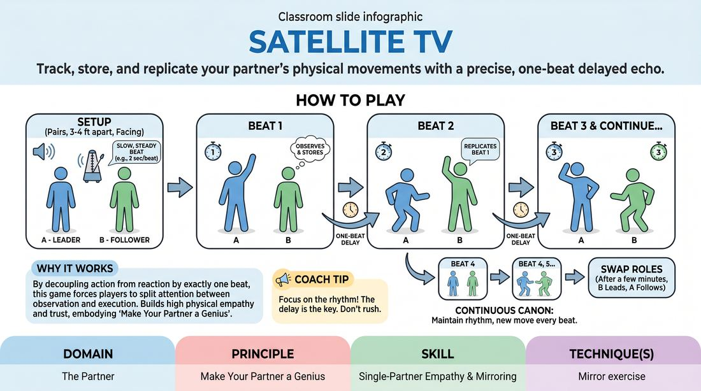

# Echo Mirror

{ .game-hero }

> Track, store, and replicate your partner's physical movements with a precise, one-beat delayed echo.

## Overview
In this physical partner exercise, players work in pairs to establish a rhythmic physical dialogue. One player leads with a new movement on every beat, while the other mirrors those movements exactly one beat behind. It creates a beautiful, canon-like physical sequence that demands intense focus, memory, and physical empathy.

## What It Trains
- **Domain:** D2 — The Partner
- **Principle(s):** Make Your Partner a Genius; Yes, And
- **Skill(s):** Single-Partner Empathy & Mirroring; Active Listening; Physicality & Space Work
- **Technique(s):** Mirror exercise
- **Focus:** connection

**Objective:** To develop deep physical empathy, active observation, and rhythmic synchronization, training players to support their partner's choices by committing to them with absolute precision.

## At a Glance
| Aspect | Detail |
|---|---|
| Players | 2+ (ideal 2 (in pairs)) |
| Time | ~5 min |
| Complexity | 2/5 |
| Skill level | advanced_beginner |
| Energy | medium |
| Physicality | medium |
| Modality | in_person |
| Space | moderate |
| Props | none |
| Audience | not required |

## Setup
Players stand in pairs facing each other with comfortable space to move. No props are needed. The facilitator can establish a steady, slow metronome-like beat (clapping or tapping) to help players keep time.

## How to Play
1. Divide the group into pairs and have partners stand facing each other, about three to four feet apart.
2. Designate one player as the Leader (Player A) and the other as the Follower (Player B).
3. Establish a slow, steady, rhythmic beat (e.g., one beat every two seconds) through facilitator clapping or a collective group pulse.
4. On Beat 1, Player A initiates a distinct physical movement or pose (e.g., raising their right arm). Player B remains completely still.
5. On Beat 2, Player A transitions to a new movement (e.g., bending their knees), while Player B simultaneously performs Player A's first movement (raising their right arm).
6. On Beat 3, Player A moves to a third position, while Player B performs Player A's second movement (bending their knees).
7. Continue this continuous, one-beat-delayed physical canon, maintaining the established rhythm without stopping.
8. After a few minutes, swap roles so Player B leads and Player A follows.

## Facilitation Notes
- Coaching cue: 'Keep your eyes locked on your partner's core and use your peripheral vision, rather than just staring at their hands.'
- Pitfall: The leader moves too fast or too complexly, making it impossible to follow. Fix: Remind the leader that their job is to make their partner look like a genius; keep movements clean, distinct, and rhythmic.
- Coaching cue: 'Embrace the delay. Don't try to anticipate or catch up; trust the beat and commit to the lag.'
- Pitfall: The follower tries to mirror in real-time instead of waiting for the delay. Fix: Have the facilitator count the beats out loud ('One, Two, Three...') to anchor the timing.

## Variations
- Two-Beat Lag: Increase the cognitive and physical difficulty by having the follower mirror with a strict two-beat delay.
- Bidirectional Echo: Both players lead and follow simultaneously without designated roles, passing the physical impulse back and forth organically.
- Vocal Echo: Add a simple vocal sound or syllable to each physical movement, which must also be mirrored with a one-beat delay.
- Latency-Leveraged Echo (Online): For video calls, use the natural internet lag as the delay. The follower mirrors the leader's movements as they appear on screen, using a shared verbal count to keep the rhythm synchronized.

## Debrief
- How did it feel to be the follower, knowing you had to store your partner's movement in your memory while executing the previous one?
- As a leader, how did you adjust your movements to ensure your partner could succeed?
- How does this level of physical attention translate to active listening in a spoken scene?

## Safety & Inclusion
Ensure players are mindful of physical limits. For limited mobility, players can sit and focus on upper-body or facial movements. For visual impairments, adapt to an auditory echo using vocal tones or claps. For neurodivergent players, allow side-by-side shadow mirroring to reduce intense eye contact.

## Why It Works
By decoupling the action from the reaction by exactly one beat, this game forces players to split their attention between immediate observation and physical execution. This builds a high level of physical empathy and trust, embodying the 'Make Your Partner a Genius' principle by requiring the leader to offer clear, usable offers and the follower to commit fully to reproducing them.
