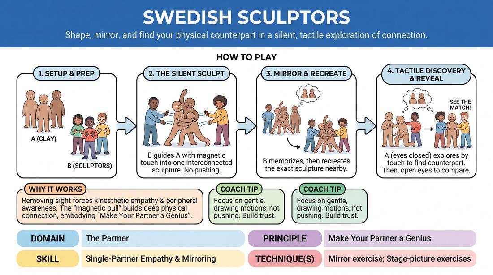

# The Living Clay Mirror

{ .game-hero }

> Shape, mirror, and find your physical counterpart in a silent, tactile exploration of connection.

## Overview
In this deep, physical exercise, players divide into two groups: the Sculptors and the Clay. The Sculptors silently guide the blindfolded or eyes-closed Clay into a single, interconnected sculpture using gentle, magnetic touch cues, then attempt to recreate that exact sculpture with their own bodies. The original Clay players must then use their sense of touch to find their physical counterparts in the new structure.

## What It Trains
- **Domain:** D2 — The Partner
- **Principle(s):** Make Your Partner a Genius; Vulnerability; Group Mind
- **Skill(s):** Single-Partner Empathy & Mirroring; Physicality & Space Work; Peripheral Awareness; Boundary Navigation
- **Technique(s):** Mirror exercise; Stage-picture exercises; Negotiating physical contact
- **Focus:** connection

**Objective:** To develop deep physical empathy, non-verbal communication, and spatial awareness by relying on tactile feedback and mirroring without visual cues.

## Setup
An open, safe room with plenty of space to move without tripping hazards. Divide the group into two equal teams (Team A and Team B). No props are required, but players must be comfortable with gentle, respectful physical contact.

## How to Play
1. Divide the players into two equal groups: Team A (the Clay) and Team B (the Sculptors).
2. Instruct Team A to stand in the space and close their eyes. They must keep their eyes closed throughout the entire sculpting and transition phases.
3. Direct Team B to silently collaborate to shape Team A into a single, interconnected sculpture where every Clay player is touching at least one other Clay player.
4. Explain the sculpting mechanic: Sculptors must not physically force or push the Clay. Instead, they place an open hand gently on a joint or limb and slowly draw it away; the Clay player must sense this magnetic pull and follow the hand's movement, freezing when the contact stops.
5. Once the sculpture is complete, Team B steps back to silently memorize the exact shape, poses, and points of contact of the entire structure.
6. Team B then recreates this exact sculpture using their own bodies nearby, stepping into the identical poses and connections to form a mirror-image replica.
7. With their eyes still closed, the players of Team A are instructed to gently explore the space to find the new sculpture and, using touch alone, locate their own physical counterpart (the person holding their pose).
8. Once all Team A players believe they have matched themselves to their counterpart, the facilitator calls freeze, and Team A opens their eyes to see how closely the sculpture was replicated and how accurately they found themselves.

## Facilitation Notes
- Coaching cue: 'Move like magnet and metal.' Remind the Clay to follow the pull of the hand immediately, rather than resisting or guessing the pose.
- Pitfall: Sculptors using physical force to move limbs. Fix: Pause and remind them that the Clay must actively follow the gentle guide of an open hand, maintaining agency over their own balance.
- Coaching cue: 'Observe the negative space.' Encourage the Sculptors to look at the angles and gaps in the original sculpture to make their recreation as precise as possible.
- Ensure the transition phase is quiet. The Clay must rely entirely on tactile memory and spatial awareness, not verbal clues or heavy footsteps.

## Variations
- The Emotional Sculpture: Assign a specific abstract emotion or theme (e.g., 'Betrayal' or 'Hope') that the Sculptors must convey through the Clay's final pose.
- No-Touch Sculpting: Sculptors guide the Clay using only sound cues (like clicking or humming) or wind/air pressure, increasing the sensory challenge.
- The Rotating Gallery: Run the exercise with multiple smaller groups, where one group's sculpture becomes the blueprint for another group's recreation.

## Debrief
- How did it feel to surrender visual control and rely entirely on tactile guidance to find your shape?
- What non-verbal cues helped you identify your counterpart in the replicated sculpture?
- How did this exercise shift your awareness of your partner's physical presence and boundaries?

## Safety & Inclusion
Since this game involves physical touch and closed eyes, establish clear boundaries before starting. Players may opt out of touch by holding a specific hand signal (e.g., hand on heart), indicating sculptors should guide them using verbal cues or non-contact shadow-sculpting instead. Ensure the floor is completely clear of obstacles.

## Why It Works
By removing sight, players are forced to heighten their kinesthetic empathy and peripheral awareness. The 'magnetic pull' mechanic builds a deep physical connection where partners must tune into subtle shifts in weight and tension, embodying the principle of making their partner look like a genius through absolute responsiveness.
