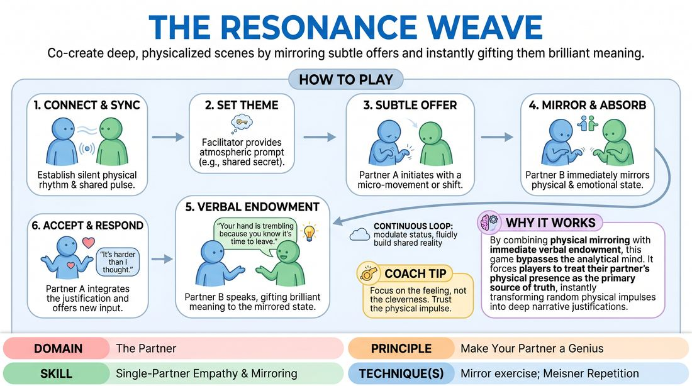

# Resonance Weaving

{ .game-hero }

> Co-create deep, physicalized scenes by mirroring subtle offers and instantly gifting them brilliant meaning.

## Overview
A high-attunement partner exercise where players build a shared reality from micro-movements and unspoken emotional shifts. By physically echoing a partner's subtle physical offers and immediately verbalizing a deep justification for them, players learn to treat every accidental or quiet gesture as a stroke of genius.

## What It Trains
- **Domain:** D2 — The Partner
- **Principle(s):** Yes, And; Make Your Partner a Genius; Assume Competence
- **Skill(s):** Active Listening; Status Modulation; Single-Partner Empathy & Mirroring; Offer Reception; Active Gifting; Emotional Fluidity; Physicality & Space Work
- **Technique(s):** Meisner Repetition; Last Word Response; Status Seesaw; Mirror exercise; Emotional-echo drills; Yes, And… sentence games; Endowment-acceptance; Endowment-gifting drills; Give them the answer
- **Focus:** connection

**Objective:** To develop deep interpersonal attunement, physical empathy, and the ability to instantly endow a partner's physical choices with narrative brilliance and emotional depth.

## At a Glance
| Aspect | Detail |
|---|---|
| Players | 2+ (ideal 2 (per pair)) |
| Time | ~10 min |
| Complexity | 4/5 |
| Skill level | competent |
| Energy | medium |
| Physicality | medium |
| Modality | in_person |
| Space | minimal |
| Props | none |
| Audience | not required |

## Setup
Pairs stand facing each other in an open space with comfortable distance. No props or chairs are required.

## How to Play
1. Begin in pairs, standing face-to-face, maintaining soft eye contact to establish a silent, shared physical rhythm or pulse through synchronized breathing or micro-sways.
2. The facilitator provides a highly open-ended, atmospheric prompt, such as a shared secret or an impending departure, to set a loose thematic backdrop.
3. Partner A initiates the scene by making a subtle, non-verbal physical offer—such as a slight hand tremor, a shift in posture, or a fleeting facial expression—imbued with a specific, unspoken emotion.
4. Partner B immediately mirrors and absorbs this physical and emotional state, matching the posture, gesture, and energetic quality to achieve physical alignment.
5. Partner B then speaks, delivering a verbal endowment that justifies and names the mirrored physical state, framing Partner A's subtle movement as a brilliant, intentional choice with deep backstory.
6. Partner A accepts this verbal justification, integrating it into their physical and emotional reality, and responds with a new verbal or physical offer.
7. Both players continue this continuous loop, fluidly modulating their relative status and emotional intensity while ensuring every physical shift is mirrored and justified.

## Facilitation Notes
- Side-coach players to keep their physical offers incredibly subtle; the goal is to detect and amplify micro-expressions, not broad theatrical gestures.
- If a player struggles to find a verbal justification, coach them to give their partner the answer by stating the first logical reason that explains the physical tension.
- Watch out for players who drop the physical mirroring once they start speaking; remind them to sustain the shared physical posture to keep the connection active.
- Encourage fluid status shifts; if one partner becomes emotionally vulnerable, the other should adjust their status to support or challenge that vulnerability dynamically.

## Variations
- Silent Resonance: Play the entire exercise without any spoken words, relying purely on physical mirroring, status shifts, and spatial adjustments to tell the story.
- Status Seesaw: Explicitly require that every verbal endowment must invert the current status dynamic, forcing players to constantly trade the dominant and submissive roles.

## Debrief
- How did it feel to have your smallest physical movements instantly validated and given deep narrative meaning?
- What challenges did you face in maintaining physical mirroring while simultaneously processing and delivering verbal dialogue?
- How did the initial silent pulse phase influence the trust and flow of the subsequent scene?

## Safety & Inclusion
Ensure players establish comfortable physical boundaries before beginning. Since this exercise requires sustained eye contact and close physical mirroring, players should feel free to adjust the distance or blink naturally to avoid physical strain or discomfort.

## Why It Works
By combining physical mirroring with immediate verbal endowment, this game bypasses the analytical mind. It forces players to treat their partner's physical presence as the primary source of truth, instantly transforming random physical impulses into brilliant, intentional narrative choices.
