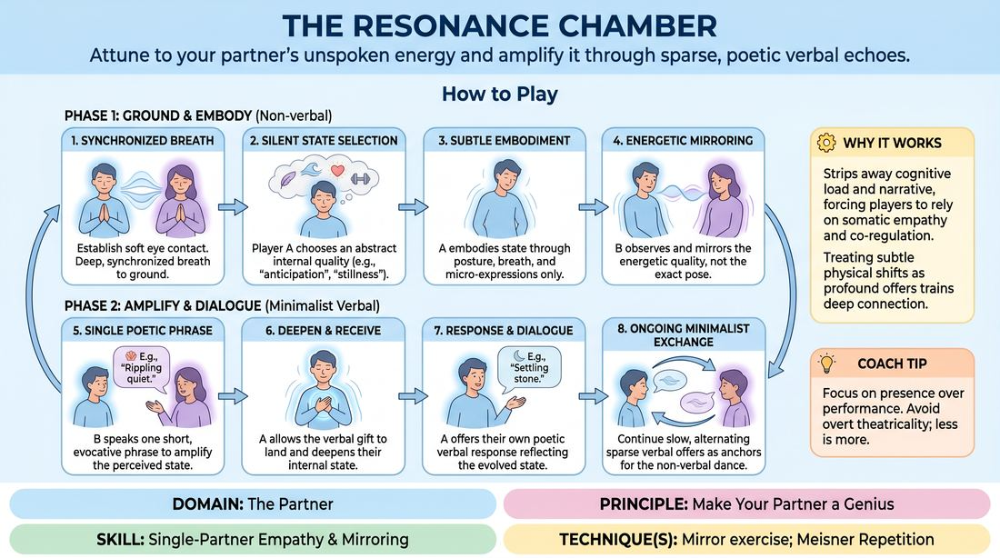

# The Resonance Chamber

{ .game-hero }

> Attune to your partner's unspoken energy and amplify it through sparse, poetic verbal echoes.

## Overview
A deep, slow-tempo partner exercise where players communicate through subtle physical states and minimalist verbal anchors. By focusing entirely on somatic attunement, pairs learn to read, mirror, and elevate each other's internal emotional landscapes. The result is a highly connected, co-created space where partners feel profoundly seen and supported.

## What It Trains
- **Domain:** D2 — The Partner
- **Principle(s):** Vulnerability; Yes, And; Make Your Partner a Genius; Assume Competence
- **Skill(s):** Active Listening; Status Modulation; Single-Partner Empathy & Mirroring; Offer Reception; Active Gifting
- **Technique(s):** Meisner Repetition; Last Word Response; Status Seesaw; High/low-status walks; Mirror exercise; Emotional-echo drills; Yes, And… sentence games; Endowment-acceptance; Endowment-gifting drills; Give them the answer
- **Focus:** connection

**Objective:** To develop deep interpersonal attunement, somatic empathy, and the ability to make your partner look brilliant by validating and amplifying their unspoken emotional offers.

## Setup
Players stand in pairs, facing each other about an arm's length apart in a quiet room. No props or special materials are required. The facilitator establishes a calm, focused atmosphere before beginning.

## How to Play
1. Begin with soft, sustained eye contact. Both partners take a deep, synchronized breath together to ground themselves and focus entirely on each other.
2. Designate Player A to silently select a subtle, abstract internal state or quality to embody (such as 'anticipation', 'heaviness', 'expansion', or 'stillness').
3. Player A embodies this state using only posture, breath, micro-expressions, and weight distribution, avoiding overt gestures or theatrical movements.
4. Player B actively observes and absorbs Player A's physical presence, mirroring the energetic quality of the state rather than directly mimicking the exact physical movements.
5. Once the non-verbal connection is established, Player B speaks a single, short, evocative phrase that names or poetically amplifies the state they perceive (e.g., 'A quiet dawn' or 'Deep roots').
6. Player A receives this verbal gift, allowing it to land, and then subtly shifts or deepens their internal state in response to Player B's validation.
7. Player A then offers their own brief, poetic verbal response that reflects this newly evolved state, continuing the dialogue.
8. The pair continues this slow, minimalist exchange, alternating sparse verbal offers that serve as anchors for their ongoing, non-verbal energetic dance.

## Facilitation Notes
- Side-coaching cue: 'Don't try to guess the exact word; instead, feel the weight and temperature of their presence in your own body.'
- Common pitfall: Players choosing highly dramatic, narrative-heavy emotions (like 'anger' or 'fear') instead of subtle, abstract states. Fix: Guide them back to elemental qualities like 'buoyancy', 'friction', or 'stillness'.
- Side-coaching cue: 'Keep the verbal offers sparse. Let the words be the tip of an iceberg of non-verbal connection.'
- Common pitfall: Direct, literal mimicry of physical movements. Fix: Remind players to mirror the 'feeling' or 'energy' of the posture rather than copying the exact physical shape like a mirror reflection.

## Variations
- Blind Resonance: Partners begin with eyes closed, attuning only through the sound of each other's breath and the physical proximity of their bodies before opening their eyes for the verbal phase.
- Status Shift: Introduce subtle status modulation where one partner gently takes the lead in shifting the emotional state, and the other smoothly yields and follows, practicing the fluid exchange of control.

## Debrief
- How did it feel to have your unspoken internal state validated and named by your partner?
- What physical cues (breath, posture, tension) were most helpful in reading your partner's energy?
- How did the sparse, poetic verbal offers change or deepen the physical connection you were building?

## Safety & Inclusion
Because this exercise involves sustained eye contact and close physical proximity, players should be invited to blink naturally, look away briefly if overwhelmed, and establish comfortable physical boundaries before starting. Facilitators should offer an alternative focus point (like the partner's collarbone) for anyone uncomfortable with direct eye contact.

## Why It Works
This game works because it strips away the cognitive load of narrative generation, forcing players to rely entirely on somatic empathy and co-regulation. By treating the partner's subtle physical shifts as profound offers, players practice the core of 'making your partner a genius'—validating their presence so deeply that even a tiny physical shift becomes a brilliant, shared theatrical reality.
