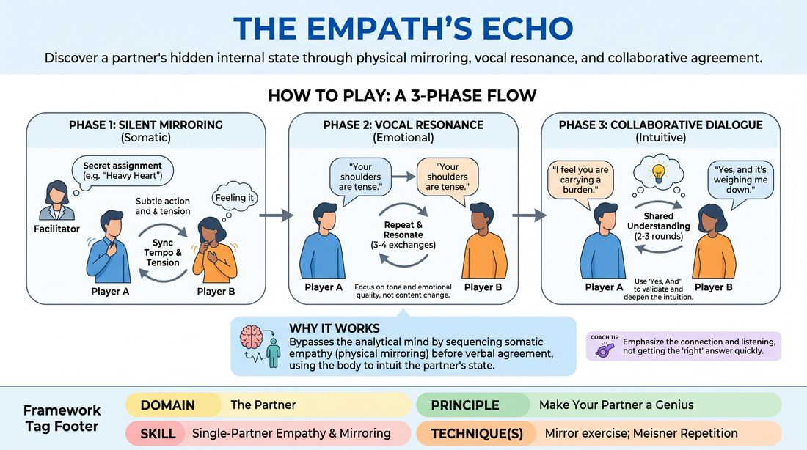

# The Empathetic Echo

{ .game-hero }

> Discover a partner's hidden internal state through physical mirroring, vocal resonance, and collaborative agreement.

## Overview
A two-player exercise where one player subtly embodies a secret internal state, desire, or intention. Through a structured three-phase progression—moving from silent physical mirroring to emotional vocal repetition, and finally to collaborative dialogue—the partner attempts to intuitively receive and articulate this hidden state. The focus is not on rapid guessing, but on deep, mutual attunement and making the partner look brilliant.

## What It Trains
- **Domain:** D2 — The Partner
- **Principle(s):** Vulnerability; Yes, And; Make Your Partner a Genius; Assume Competence
- **Skill(s):** Emotional Fluidity; Active Listening; Single-Partner Empathy & Mirroring; Offer Reception; Active Gifting
- **Technique(s):** Meisner Repetition; Mirror exercise; Emotional-echo drills; Yes, And… sentence games; Endowment-acceptance; Endowment-gifting drills
- **Focus:** connection

**Objective:** To develop deep interpersonal attunement, emotional resonance, and active gifting by practicing physical mirroring, precise offer reception, and using 'Yes, And' to guide a partner toward a shared truth.

## Setup
Players stand in pairs facing each other with comfortable space between them. The facilitator privately assigns Player A (the Gifter) a secret internal state, unspoken intention, or hidden motivation (e.g., 'You are holding a fragile, priceless heirloom you must protect,' or 'You are carrying heavy news that will deeply affect your partner'). Player B (the Receiver) starts with no knowledge of the secret.

## How to Play
1. The facilitator secretly assigns Player A a specific internal state, intention, or emotional burden to internalize.
2. Phase 1 begins with Player A initiating a slow, repetitive physical action (e.g., adjusting a collar, shifting weight) that is subtly infused with the emotional weight of their secret.
3. Player B silently mirrors Player A's physical movements, matching their exact tempo, physical tension, and implied emotional quality to physically 'feel into' the state.
4. Phase 2 transitions to vocal resonance: Player A stops the movement and makes a direct verbal observation about Player B's physical state (e.g., 'Your shoulders are tense'), delivering it with the emotional subtext of their secret.
5. Player B repeats Player A's exact words back, striving to mirror the precise vocal tone, rhythm, and emotional quality of the delivery.
6. This vocal repetition continues back and forth for three to four exchanges, focusing entirely on transmitting and receiving emotional data rather than changing the words.
7. Phase 3 begins as Player B makes an 'endowment offer,' stating what they perceive Player A's underlying emotional state or situation to be (e.g., 'You are carrying a heavy secret that you are afraid to share with me').
8. Player A responds using 'Yes, And' to validate Player B's intuition; if the guess is close, Player A deepens it, and if it is off, Player A accepts the observation but gently redirects with a clearer emotional clue.
9. The partners engage in two to three rounds of this collaborative 'Yes, And' dialogue until they reach a shared, resonant understanding of the hidden state.

## Facilitation Notes
- Coaching Cue: Remind the Gifter to avoid over-acting or pantomiming. The physical action should be a natural, subtle outlet of the internal state, not a game of charades.
- Coaching Cue: Encourage the Receiver to focus on the physical sensation of mirroring. Replicating the partner's physical tension helps unlock the corresponding emotional state.
- Common Pitfall: The Receiver tries to intellectually guess the secret too early. Fix: Instruct them to stay present in the physical and vocal repetition phases before attempting to name the state.
- Coaching Cue: During the 'Yes, And' phase, the Gifter must make their partner a genius. If the partner's guess is slightly off, find the truth in it and gently guide them closer rather than shutting them down.

## Variations
- Status Shift: Add a specific status dynamic to the secret prompt (e.g., 'You feel deeply intimidated by your partner's authority'), requiring players to modulate their physical and vocal status.
- Last-Word Repetition: In Phase 2, instead of repeating the entire phrase, Player B must use the last word of Player A's statement to build their response, increasing the focus on active listening.

## Debrief
- How did physically mirroring your partner's movements change your emotional state or perception of them?
- What vocal cues (tempo, pitch, volume) were most effective in transmitting the emotional subtext?
- How did it feel as the Gifter to use 'Yes, And' to guide your partner instead of just telling them the secret?
- In what ways did this exercise require you to make your partner look like a genius?

## Safety & Inclusion
Ensure players establish comfortable physical boundaries before beginning. Since mirroring requires close observation, players should maintain a comfortable standing distance and may opt out of intense eye contact if it feels overwhelming.

## Why It Works
By sequencing the exercise from non-verbal physical mirroring to vocal repetition and finally to verbal agreement, the game bypasses the analytical mind. It leverages somatic empathy—using the body's physical state to mirror and understand another's emotional reality—while using 'Yes, And' as a collaborative guiding tool rather than a transactional guessing mechanic.
