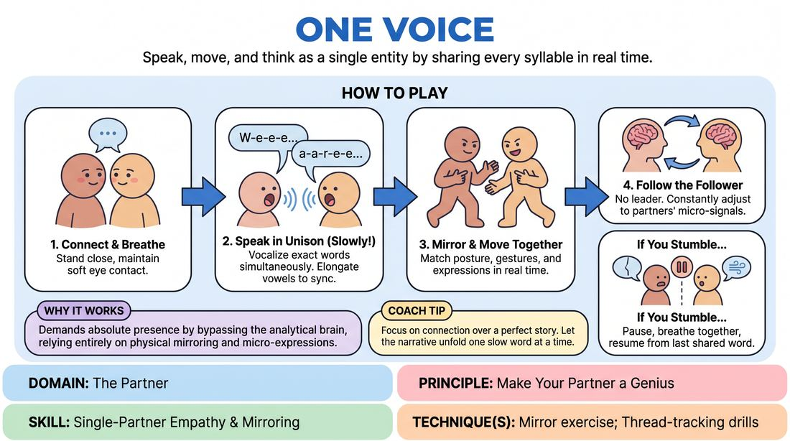

# Unison Voice

{ .game-hero }

> Speak, move, and think as a single entity by sharing every syllable in real time.

## Overview
Two to three players stand close together and attempt to speak in perfect unison, telling a single cohesive story or answering questions as one collective mind. Rather than taking turns, players must vocalize the exact same words, sounds, and physical gestures at the exact same moment. The result is an intense exercise in deep listening, shared control, and physical synchronization.

## What It Trains
- **Domain:** D2 — The Partner
- **Principle(s):** Make Your Partner a Genius; Group Mind; Follow the Follower
- **Skill(s):** Active Listening; Single-Partner Empathy & Mirroring; Peripheral Awareness; Pacing & Rhythm
- **Technique(s):** Mirror exercise; Thread-tracking drills; Timing exercises
- **Focus:** connection

**Objective:** To develop deep partner empathy, physical mirroring, and the ability to 'follow the follower' by relinquishing individual control and merging vocal and physical expression.

## At a Glance
| Aspect | Detail |
|---|---|
| Players | 2–4 (ideal 2-3) |
| Time | ~5 min |
| Complexity | 2/5 |
| Skill level | advanced_beginner |
| Energy | medium |
| Physicality | medium |
| Modality | in_person |
| Space | minimal |
| Props | none |
| Audience | not required |

## Setup
Players stand in pairs or trios, facing each other closely (about arm's length apart) in a quiet space. No props or special staging are required.

## How to Play
1. Form pairs or trios and stand close together, maintaining direct, soft eye contact with your partners.
2. Begin speaking together in unison, attempting to vocalize the exact same words at the exact same millisecond.
3. Slow down your speech significantly, elongating vowels (e.g., 'W-e-e-e a-a-r-e-e...') to give your partners time to sense and match the upcoming syllable.
4. Incorporate physical mirroring: match the posture, hand gestures, and facial expressions of your partners as you speak, moving as a single body.
5. Adopt a 'follow the follower' mindset, where no single player leads the sentence; instead, everyone constantly adjusts to the micro-signals of the others.
6. If the group stumbles or speaks different words, pause briefly, breathe together, and resume from the last shared word without judgment.
7. Focus on telling a simple, linear narrative, allowing the story to unfold one slow, shared word at a time.

## Facilitation Notes
- Coaching cue: 'Elongate your vowels!' Short, clipped words make synchronization nearly impossible. Stretching sounds creates a runway for agreement.
- Coaching cue: 'Breathe together.' Encourage players to synchronize their inhalations before starting a new sentence.
- Pitfall: One dominant player takes the lead, dragging the other along. Fix: Instruct the dominant player to close their eyes or deliberately slow down, forcing them to listen and wait for their partner's impulse.
- Coaching cue: 'Soft eyes.' Advise players to use peripheral vision to catch body language shifts rather than staring intensely at just one spot.

## Variations
- The Press Conference: The unison players act as a single expert being interviewed by the rest of the group, answering questions on the fly.
- The Monologue: The players face the audience (or the rest of the class) and deliver a unified speech or story directly to them.
- The Scene Partner: Two unison players act as a single character interacting with another solo improviser in a standard scene.

## Debrief
- How did it feel to let go of your individual ideas about where the story should go?
- What physical or vocal cues did you rely on to stay in sync with your partner?
- When did the unison feel most effortless, and what allowed that to happen?

## Safety & Inclusion
Since this game requires close physical proximity and sustained eye contact, check in with players regarding comfort levels. Allow players to adjust their distance or look at a neutral point (like the partner's forehead or shoulder) if direct eye contact feels overstimulating.

## Why It Works
By forcing players to speak at the exact same time, the exercise bypasses the analytical brain and demands absolute presence. It strips away the ability to plan ahead, forcing players to rely entirely on physical mirroring, micro-expressions, and shared breath. This builds a profound sense of 'group mind' and teaches players to value their partner's impulses as equal to their own.
