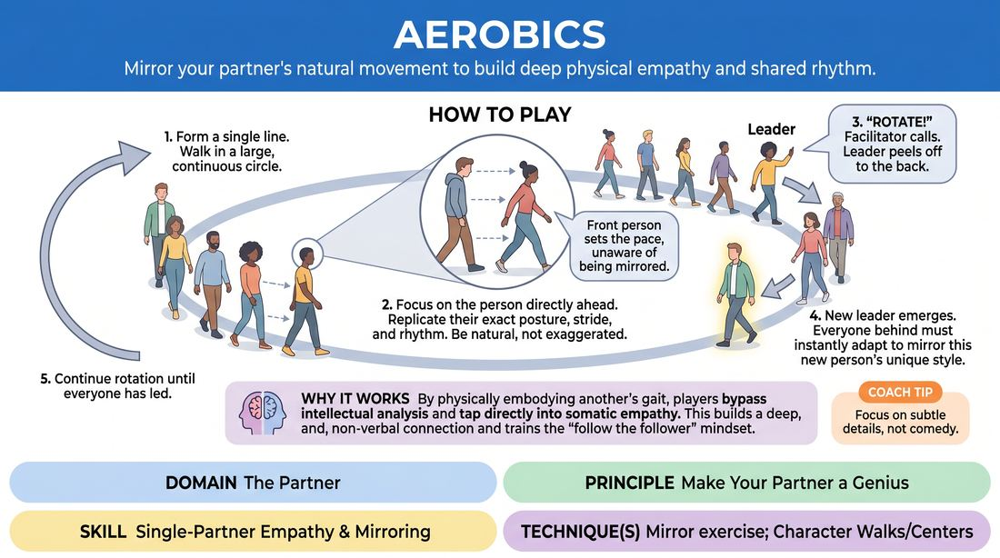

# Gait Mirror

{ .game-hero }

> Mirror your partner's natural movement to build deep physical empathy and shared rhythm.

## Overview
Players walk in a continuous circle, with each person closely observing and replicating the exact physical gait, posture, and rhythm of the person directly in front of them. As the leader periodically peels off to the back of the line, the focus shifts, challenging players to adapt instantly to a new physical model.

## What It Trains
- **Domain:** D2 — The Partner
- **Principle(s):** Make Your Partner a Genius; Follow the Follower
- **Skill(s):** Single-Partner Empathy & Mirroring; Physicality & Space Work; Peripheral Awareness
- **Technique(s):** Mirror exercise; Character Walks/Centers
- **Focus:** connection

**Objective:** Develops deep physical empathy, active observation, and the ability to validate and match a partner's natural movement patterns without caricature.

## At a Glance
| Aspect | Detail |
|---|---|
| Players | 3+ (ideal 6-15) |
| Time | ~10 min |
| Complexity | 1/5 |
| Skill level | novice |
| Energy | medium |
| Physicality | medium |
| Modality | in_person |
| Space | moderate |
| Props | none |
| Audience | not required |

## Setup
A clear, open room with enough space for all participants to walk in a large, unobstructed circle. No props required.

## How to Play
1. Have all players form a single-file line, standing one behind the other.
2. Instruct the entire line to begin walking in a large, continuous circle around the perimeter of the space.
3. Explain that each player must focus entirely on the person directly in front of them, attempting to mirror their exact posture, stride length, arm swing, and tempo.
4. Emphasize that players should walk naturally at first, avoiding exaggerated or comical movements to focus on high-fidelity replication of subtle, real-life gaits.
5. The person at the very front of the line sets the initial pace and style of movement, unaware of how they are being mirrored behind them.
6. After about 30 to 45 seconds, the facilitator calls out 'Rotate!' or 'Switch!'
7. Upon hearing the cue, the leader at the front of the line peels away from the circle and walks to the very back of the line, becoming the final follower.
8. The second person in line now becomes the new leader, and the person behind them must immediately adapt to mirror this new leader's unique physical style.
9. Continue this rotation cycle until every player has had a turn leading the line and everyone has practiced mirroring multiple different partners.

## Facilitation Notes
- Side-coaching cue: 'Look for the micro-movements—how do their shoulders move? Where is their weight distributed?'
- Pitfall: Players try to be funny or performative by walking in a bizarre, exaggerated way. Fix: Remind them that the magic of this exercise lies in capturing the subtle, authentic truth of another person's natural movement.
- Side-coaching cue: 'Don't just watch them with your eyes; feel their rhythm in your own body. Let your muscles copy theirs.'
- Pitfall: The line bunches up or spreads out too much. Fix: Coach players to maintain a consistent, safe distance of about three to four feet from the person in front of them.

## Variations
- Emotional Undertone: Introduce a subtle emotional state (e.g., 'you are slightly late,' 'you are pleasantly surprised') that the leader must embody physically, which then ripples down the line.
- Blind Follow: The leader walks, and the person behind them mirrors them. The third person mirrors the second person only, without looking at the first person, creating a physical 'telephone' effect.
- Tempo Shift: The facilitator calls out different speeds (from slow-motion to brisk walking) to see how the physical mirroring adapts under different temporal pressures.

## Debrief
- What did you notice about your partner's movement that you wouldn't have seen without trying to mirror it?
- How did it feel to have your natural walk mirrored by someone else? Did it feel supportive or exposing?
- How does 'making your partner a genius' apply when we are copying their physical choices instead of verbal ones?

## Safety & Inclusion
Ensure the walking pace is accessible to all participants. Encourage players to adapt the mirroring to their own physical comfort and range of motion; mirroring is about capturing the essence and rhythm of the movement, not risking physical strain or injury.

## Why It Works
By physically embodying another person's gait, players bypass intellectual analysis and tap directly into somatic empathy. This builds a deep, non-verbal connection and trains the 'follow the follower' mindset, as players must surrender their own physical habits to elevate and match their partner's choices.
