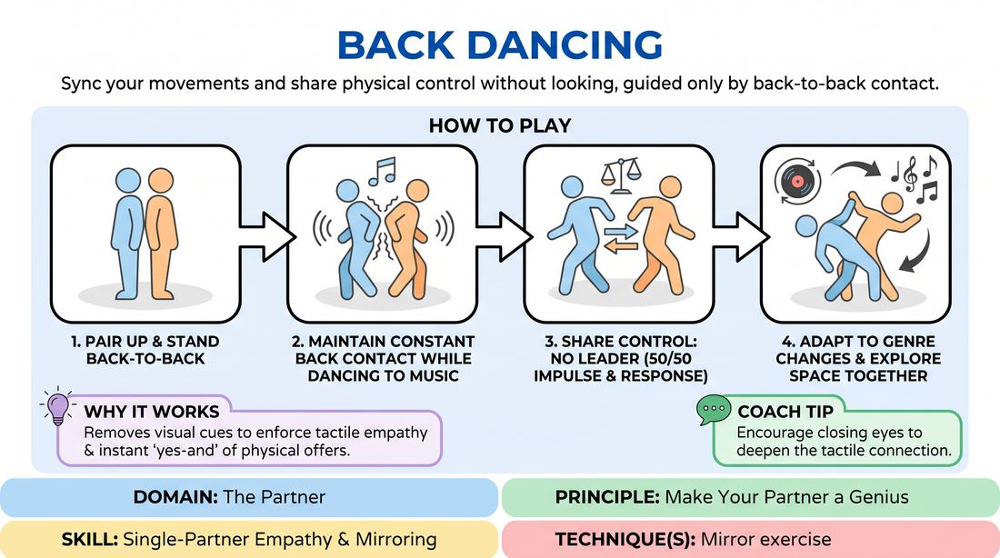

# Spine Sync

{ .game-hero }

> Sync your movements and share physical control without looking, guided only by back-to-back contact.

## Overview
Players pair up and stand back-to-back, maintaining constant physical contact along their spines while dancing to changing musical genres. Without visual cues, partners must intuitively share the lead, mirroring and responding to each other's physical impulses. It is a high-energy, tactile exercise that builds deep physical empathy and non-verbal connection.

## What It Trains
- **Domain:** D2 — The Partner
- **Principle(s):** Make Your Partner a Genius; Yes, And; Commit 100%
- **Skill(s):** Single-Partner Empathy & Mirroring; Physicality & Space Work; Peripheral Awareness
- **Technique(s):** Mirror exercise
- **Focus:** connection

**Objective:** To develop physical empathy, non-verbal collaboration, and peripheral awareness by learning to read and support a partner's physical choices through touch alone.

## At a Glance
| Aspect | Detail |
|---|---|
| Players | 2+ (ideal 2-30) |
| Time | ~5 min |
| Complexity | 1/5 |
| Skill level | novice |
| Energy | medium |
| Physicality | high |
| Modality | in_person |
| Space | moderate |
| Props | music player, audio tracks of different genres |
| Audience | not required |

## Setup
An open room with plenty of space for pairs to move safely without colliding. A music player with a playlist of three to four distinct musical genres (e.g., classical, funk, electronic, heavy metal) is required.

## How to Play
1. Instruct players to find a partner of similar height if possible, and stand back-to-back in the center of the room.
2. Explain the core constraint: partners must maintain continuous physical contact between their backs (shoulders, spine, or lower back) throughout the entire exercise.
3. Start playing the first music track and instruct the pairs to begin moving and dancing to the rhythm, keeping their backs connected.
4. Emphasize that there is no designated leader; both partners must continuously offer movement impulses and accept their partner's impulses, sharing control fifty-fifty.
5. Every sixty to ninety seconds, transition to a completely different genre of music, prompting players to adapt their physical style and energy level together.
6. Encourage pairs to explore different levels (high, medium, low) and travel around the room while maintaining their back-to-back connection and avoiding other pairs.

## Facilitation Notes
- Side-coaching cue: 'Feel the weight shift. If your partner sinks low, support them and follow them down.'
- Side-coaching cue: 'No one is leading, and no one is just following. Find the middle ground where the dance is happening to you both.'
- Pitfall: One partner dominates the movement, dragging the other around. Fix: Remind them to 'make your partner a genius' by slowing down and listening to the subtle pressures of the other person's back.
- Pitfall: Pairs lose contact during fast transitions. Fix: Coach them to slow down their movements and prioritize the connection over matching the exact speed of the music.

## Variations
- Tempo Shift: Play music that speeds up or slows down dramatically, forcing pairs to adjust their physical tension and responsiveness.
- Blind Groove: Have one partner close their eyes while the other keeps theirs open to navigate the space, switching roles halfway through.
- Group Blob: Combine pairs into trios or quads, forming a back-to-back circle or line where everyone must stay physically connected while moving.

## Debrief
- How did you negotiate who was leading and who was following without using words or sight?
- What physical cues did you rely on to sense your partner's next move?
- How did changing the music genre affect your level of trust and physical connection?

## Safety & Inclusion
Since this game requires sustained physical contact, always ask for explicit consent before pairing up. Offer an alternative version where partners mirror each other face-to-face with a two-inch gap between their hands (no-contact mirroring) for those who are uncomfortable with touch or have mobility limitations.

## Why It Works
By removing visual feedback, players are forced to rely entirely on tactile and kinesthetic empathy. This heightens their peripheral awareness and forces them to 'yes-and' physical offers instantly. It embodies the principle of making your partner a genius, as any movement must be supported and balanced by the other player to keep both upright and in flow.
