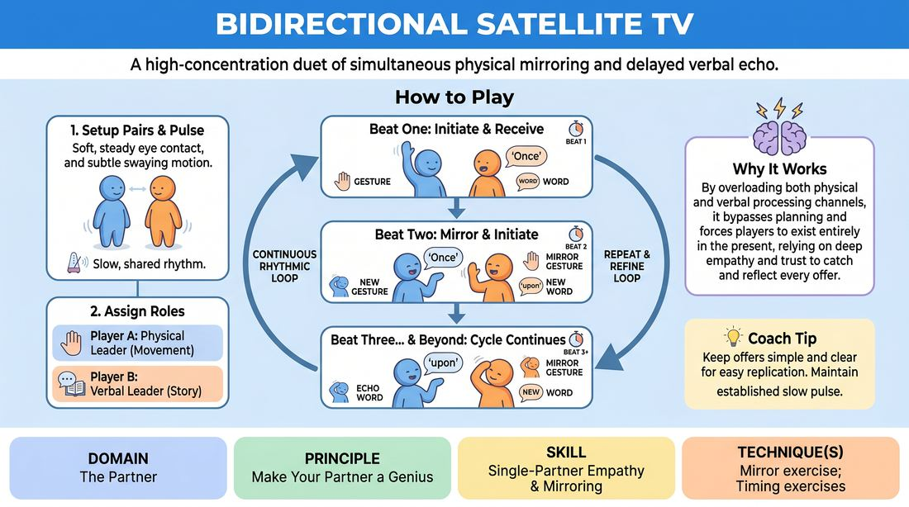

# Dual-Channel Echo Mirror

{ .game-hero }

> A high-concentration duet of simultaneous physical mirroring and delayed verbal echo.

## Overview
In this high-focus exercise, pairs synchronize their minds and bodies by splitting leadership roles. One partner leads the physical movement while the other leads a spoken narrative, with both players mirroring their partner's previous action on a one-beat delay. This creates a mesmerizing, highly synchronized dance of shared focus and deep interpersonal connection.

## What It Trains
- **Domain:** D2 — The Partner
- **Principle(s):** Make Your Partner a Genius; Yes, And; Group Mind
- **Skill(s):** Single-Partner Empathy & Mirroring; Active Listening; Physicality & Space Work; Pacing & Rhythm
- **Technique(s):** Mirror exercise; Timing exercises
- **Focus:** connection

**Objective:** To build deep partner empathy, active listening, and physical coordination by sharing cognitive leadership, training players to make their partners look brilliant through clear, simple offers.

## Setup
Pairs stand facing each other with comfortable space to move. For online play, players pin each other's video feeds to ensure direct, uninterrupted eye contact.

## How to Play
1. Step 1: Form pairs and stand facing each other about four feet apart, establishing soft, steady eye contact.
2. Step 2: Establish a slow, collective physical pulse (such as a gentle sway or a snap every two to three seconds) to anchor the tempo of the room.
3. Step 3: Designate Player A as the Physical Leader (who initiates movement) and Player B as the Verbal Leader (who initiates a spoken story).
4. Step 4: On Beat One, Player A performs a single, distinct physical gesture (e.g., raising a hand) while Player B speaks a single, clear word (e.g., 'Once').
5. Step 5: On Beat Two, both players must mirror what their partner did on the previous beat while initiating their own new offer: Player A echoes Player B's first word ('Once') while making a new gesture; Player B mirrors Player A's first gesture while speaking a new word ('upon') to continue the story.
6. Step 6: On Beat Three and beyond, the cycle continues: Player A echoes Player B's spoken word from the previous beat while initiating a new movement, while Player B mirrors Player A's movement from the previous beat while speaking the next word of the story.
7. Step 7: Maintain this continuous, rhythmic loop, focusing on keeping both physical and verbal offers simple and easy for the partner to replicate.

## Facilitation Notes
- Scaffolding for Beginners: If players struggle with the dual channels, scaffold the exercise by starting with physical-only mirroring for one minute, then verbal-only echo for one minute, before combining them.
- Managing Online Latency: In virtual settings, instruct players to embrace the audio lag as a feature rather than a bug. Encourage them to wait for the visual cue of the partner's movement and treat the audio delay like a 'satellite transmission' where the delay is a deliberate, stylized choice.
- Coaching Cue: 'Make your partner a genius! Keep your gestures slow and your words simple. If you move too fast or use complex vocabulary, you set your partner up to fail.'
- Pitfall & Fix: If the story becomes incoherent, remind the Verbal Leader to speak in simple, sequential narrative words (nouns, verbs, basic adjectives) rather than abstract concepts, allowing the Echoer to repeat them effortlessly.

## Variations
- Role Swap: On a facilitator's signal (e.g., 'Switch!'), the roles instantly swap: Player A becomes the Verbal Leader and Player B becomes the Physical Leader without breaking the established rhythm.
- Satellite Delay (Online Adaptation): Intentionally extend the delay to two beats to accommodate high-latency connections, turning the lag into a rhythmic, stylized call-and-response.
- Emotional Mirroring: Add an emotional tone to the physical gesture, which the partner must mirror not only physically but also echo in their vocal delivery and tone.

## Debrief
- How did it feel to lead one channel while simultaneously following and mirroring another?
- What specific adjustments did you make to ensure your partner could easily mirror or echo your offers?
- How did maintaining a steady, shared physical rhythm help quiet your analytical mind?

## Safety & Inclusion
This exercise can be easily adapted for varying physical abilities. Gestures can be restricted to facial expressions, head movements, or upper-body only. For neurodivergent players or those experiencing high cognitive load, slow the tempo down significantly to allow comfortable processing time.

## Why It Works
By overloading both the physical and verbal processing channels, this game bypasses the analytical mind's tendency to plan ahead. Players are forced to exist entirely in the present moment, relying on deep empathy and trust to catch and reflect their partner's offers instantly.
