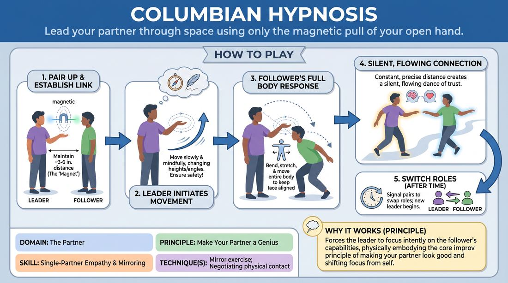

# Magnetic Palm

{ .game-hero }

> Lead your partner through space using only the magnetic pull of your open hand.

## Overview
In this physical connection exercise, players work in pairs to explore movement and trust. One player guides their partner's physical path by moving an open hand near their face, while the partner maintains a constant, precise distance from the palm. The result is a silent, flowing dance that builds deep physical empathy and spatial awareness.

## What It Trains
- **Domain:** D2 — The Partner
- **Principle(s):** Make Your Partner a Genius; Consent & Boundaries
- **Skill(s):** Single-Partner Empathy & Mirroring; Physicality & Space Work; Boundary Navigation
- **Technique(s):** Mirror exercise; Negotiating physical contact
- **Focus:** connection

**Objective:** Develops non-verbal communication, physical empathy, and the core principle of supporting your partner by tailoring your actions to their physical capabilities.

## Setup
Clear a moderate space so pairs can move around safely without colliding. No props are required. Players stand in pairs facing each other.

## How to Play
1. Divide the group into pairs and have them stand facing each other with comfortable spacing.
2. Designate one player as the Leader and the other as the Follower for the first round.
3. The Leader raises one hand, palm open and fingers pointing up, positioning it approximately three to six inches away from the Follower's face.
4. The Follower must keep their face at exactly this fixed distance from the Leader's palm at all times, as if bound by an invisible magnetic force.
5. The Leader begins to move their hand slowly and smoothly through the air, changing heights, angles, and positions.
6. The Follower must bend, stretch, and move their entire body to keep their face aligned with the hand, maintaining the exact initial distance.
7. The Leader must move mindfully, ensuring they do not push the Follower into unsafe physical positions or other pairs.
8. After a few minutes, signal the pairs to switch roles so the Follower becomes the Leader.

## Facilitation Notes
- Coaching cue: 'Leaders, your job is to make your partner look graceful and successful, not to trick or trip them.'
- Coaching cue: 'Followers, let your whole body engage—bend your knees, twist your torso, and use the space.'
- Pitfall: Leaders moving too fast or making sudden, erratic jerks. Fix: Remind them that the goal is seamless connection, not a test of reflexes.
- Pitfall: Spatial collisions with other pairs. Fix: Encourage peripheral vision and slow, controlled movements.

## Variations
- Dual Magnetic Palms: The leader uses both hands, controlling the follower's head with one hand and a hand or torso with the other.
- Group Chain: One leader guides a line of followers, where each person's hand guides the next person's face.
- Silent Switch: The roles of leader and follower shift dynamically without verbal communication, based on subtle physical cues.

## Debrief
- How did it feel to be responsible for your partner's physical comfort and safety while leading?
- What non-verbal cues did you rely on to anticipate your partner's physical limits?
- How does this exercise relate to 'making your partner look like a genius' in a spoken scene?

## Safety & Inclusion
Since this game requires close physical proximity and movement, establish clear boundaries before starting. Players should communicate any physical limitations (such as back or knee issues) to their partner. Emphasize that players can adjust the starting distance of the hand to whatever feels comfortable and safe for them, and physical contact is never required.

## Why It Works
This exercise physically instantiates the core improv principle of making your partner look good. The leader cannot succeed unless they pay exquisite attention to the follower's physical capabilities, forcing a shift from self-consciousness to deep partner-consciousness.
