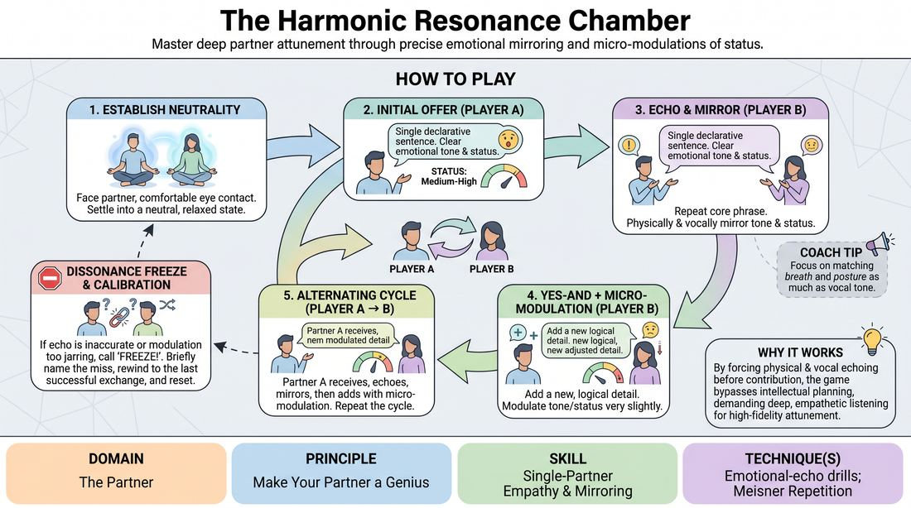

# The Resonance Chamber

{ .game-hero }

> Master deep partner attunement through precise emotional mirroring and micro-modulations of status.

## Overview
Two players engage in a highly focused, alternating dialogue where they must perfectly mirror their partner's emotional tone and status before building on the offer. It creates a hyper-aware feedback loop where players self-correct any dissonance to maintain a seamless, co-created flow.

## What It Trains
- **Domain:** D2 — The Partner
- **Principle(s):** Yes, And; Make Your Partner a Genius; Assume Competence
- **Skill(s):** Active Listening; Status Modulation; Single-Partner Empathy & Mirroring; Offer Reception; Active Gifting; Emotional Fluidity; Physicality & Space Work; Vocal Craft
- **Technique(s):** Meisner Repetition; Last Word Response; Status Seesaw; Mirror exercise; Emotional-echo drills; Yes, And… sentence games; Endowment-acceptance; Endowment-gifting drills; Give them the answer
- **Focus:** connection

**Objective:** To develop deep interpersonal attunement, precise emotional mirroring, and granular control over status and emotional shifts, ensuring every offer is fully received and elevated.

## Setup
Pairs stand facing each other, about four feet apart, in a neutral physical stance. No props or special materials are required; just a quiet space where pairs can hear each other clearly.

## How to Play
1. Form Pairs and Establish Neutrality: Have players pair up, stand facing each other with comfortable eye contact, and settle into a neutral physical and emotional baseline.
2. The Initial Multi-Layered Offer: Player A initiates the scene with a single, simple declarative sentence that carries a clear, committed emotional tone and a distinct status level.
3. The Echo and Mirror: Player B immediately responds by repeating the last few words or core phrase of Player A's statement while physically and vocally mirroring Player A's exact emotional state and status level.
4. The Yes-And with Micro-Modulation: Immediately following the echo, Player B adds a new, logical detail that accepts and builds on the established reality, while subtly shifting exactly one element—either slightly adjusting the emotional intensity or modulating their status.
5. The Alternating Cycle: Player A now takes the receiving role, echoing Player B's new statement, mirroring the new emotional/status baseline, and then adding a new statement with another single micro-modulation.
6. The Dissonance Freeze: If either player feels that the echo was inaccurate, the emotional/status mirror was missed, or the subsequent modulation was too jarring, they must immediately call a gentle Freeze.
7. The Calibration and Reset: The player who called the freeze briefly and non-judgmentally names what was missed, then the pair rewinds to the last successful exchange and resumes play from that point.

## Facilitation Notes
- Coaching Cue: Don't rush the echo. Let your partner's physical and emotional state land in your own body before you speak.
- Pitfall & Fix: Players often try to modulate both emotion and status at the same time, which muddles the scene. Remind them to isolate just one dial—keep the emotion identical but step the status up or down, or keep the status identical but shift the emotion.
- Coaching Cue: Keep the verbal additions simple. The magic is in the micro-shifts of how you say it, not the complexity of what you say.
- Pitfall & Fix: The Dissonance Freeze can sometimes feel punitive or stall momentum. Frame the freeze as a collaborative calibration tool, like tuning an instrument, rather than a mistake.

## Variations
- Physical-Only Resonance: Play the entire game without words, using only gibberish, physical gestures, and posture to mirror and modulate the emotional and status dynamics.
- The Status Seesaw: Restrict the modulation phase so that players must strictly alternate raising and lowering their status relative to their partner, practicing precise status control.

## Debrief
- How did it feel to have your exact emotional state mirrored back to you before your partner responded?
- What challenges did you face when trying to isolate and modulate only one element (status or emotion) at a time?
- How did the Dissonance Freeze change your level of listening and presence compared to a standard improv scene?

## Safety & Inclusion
Since this exercise requires sustained eye contact and close physical mirroring, remind players that they can adjust the distance between themselves to maintain personal comfort. Encourage players to communicate boundaries regarding intense emotional expressions if needed.

## Why It Works
By forcing players to physically and vocally echo their partner before contributing, the game bypasses intellectual planning and demands deep, empathetic listening. The self-correction mechanism ensures high-fidelity attunement, training improvisers to treat their partner's subtle offers as the absolute foundation of the scene.
