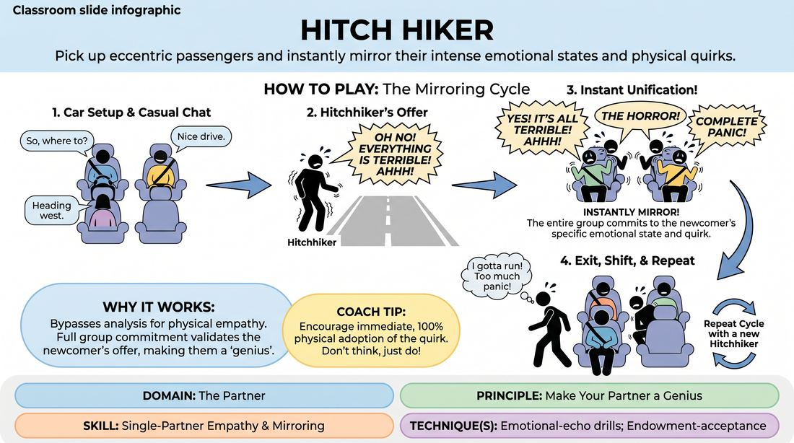

# The Hitchhiker

{ .game-hero }

> Pick up eccentric passengers and instantly mirror their intense emotional states and physical quirks.

## Overview
In this classic, high-energy character game, players ride in an imaginary car constructed from four chairs. When a new passenger (the hitchhiker) is picked up, everyone in the car instantly adopts that passenger's distinct emotional state, physical tick, or vocal pattern. It creates a hilarious, unified group mind where everyone is perfectly in sync with the newest arrival.

## What It Trains
- **Domain:** D2 — The Partner
- **Principle(s):** Make Your Partner a Genius; Yes, And; Commit 100%; Base Reality First
- **Skill(s):** Single-Partner Empathy & Mirroring; Offer Reception; Emotional Fluidity; Physicality & Space Work; Justification
- **Technique(s):** Emotional-echo drills; Endowment-acceptance; The Emotional Dial (1→10); Character Walks/Centers; Justify the absurd
- **Focus:** comedy_game

**Objective:** To develop deep partner empathy, rapid offer reception, and emotional fluidity by instantly mirroring and justifying another player's physical and emotional choices.

## At a Glance
| Aspect | Detail |
|---|---|
| Players | 4+ (ideal 6-12) |
| Time | ~10 min |
| Complexity | 2/5 |
| Skill level | advanced_beginner |
| Energy | medium |
| Physicality | medium |
| Modality | in_person |
| Space | moderate |
| Props | 4 chairs |
| Audience | not required |

## Setup
Arrange four chairs in a 2x2 grid to represent the front and back seats of a car. The rest of the players form a line offstage to act as the upcoming hitchhikers.

## How to Play
1. Place four chairs in a 2x2 grid to simulate a car interior. Three players sit in the car (Driver, Front Passenger, Back Passenger), leaving one back seat empty.
2. The initial passengers begin a casual, low-stakes conversation, establishing a baseline reality of where they are driving and their relationship.
3. A player from the sideline steps up to the roadside as a hitchhiker, embodying a highly specific, exaggerated emotional state, physical quirk, or vocal pattern.
4. The driver pulls over, and the passengers invite the hitchhiker into the empty seat.
5. As soon as the hitchhiker enters the car and begins interacting, all other passengers must instantly and seamlessly adopt the hitchhiker's exact emotional state, physical posture, and energy level.
6. The group plays the scene in this shared emotional reality, justifying why they are all feeling or acting this way within the context of their journey.
7. After a minute of high-energy play, one of the original passengers must find a logical, in-character reason to exit the car.
8. The remaining passengers shift seats to leave one seat open (e.g., the front passenger becomes the driver, back passengers move up), and the cycle repeats with a new hitchhiker from the sideline.

## Facilitation Notes
- Side-coaching cue: 'Don't just copy the emotion—feel it! Let it affect how you hold the steering wheel, how you look at each other, and how you speak.'
- Side-coaching cue: 'Justify! If everyone is suddenly crying, why are you crying? Is it the song on the radio? Is it a shared memory?'
- Pitfall: Players sometimes delay mirroring the hitchhiker, waiting for a perfect moment. Fix: Coach them to mirror instantly, even before they understand why they are doing it. The justification can come after the physical and emotional commitment.
- Pitfall: The player exiting the car simply vanishes without a reason. Fix: Remind players to make their exit a mini-scene beat with a clear, justified excuse that fits the current emotional tone.

## Variations
- Emotional Dial: The facilitator can call out 'Volume 10!' or 'Volume 2!' to force the entire car to scale the intensity of the shared emotion up or down together.
- Wordless Car: The passengers can only communicate through non-verbal sounds, sighs, and physical mirroring, emphasizing pure physical empathy.
- Status Shift: Instead of an emotion, the hitchhiker brings a specific social status (high or low), and everyone in the car shifts their status to match or complement it.

## Debrief
- How did it feel to instantly adopt someone else's emotional state without planning it beforehand?
- What made some transitions feel seamless, and what caused friction?
- How does mirroring your partner's physical and emotional choices make them look like a genius?

## Safety & Inclusion
Ensure players are mindful of physical boundaries when entering and exiting the tight space of the chair car. Encourage players to choose emotional states that are fun and expressive (e.g., excitement, suspicion, awe) rather than triggering or highly sensitive psychological states.

## Why It Works
By forcing immediate, unhesitating mirroring, the game bypasses the analytical brain and taps directly into physical empathy. When the entire group commits 100% to the newcomer's offer, it validates the newcomer's choice instantly, demonstrating the core principle of making your partner look like a genius through total agreement.
