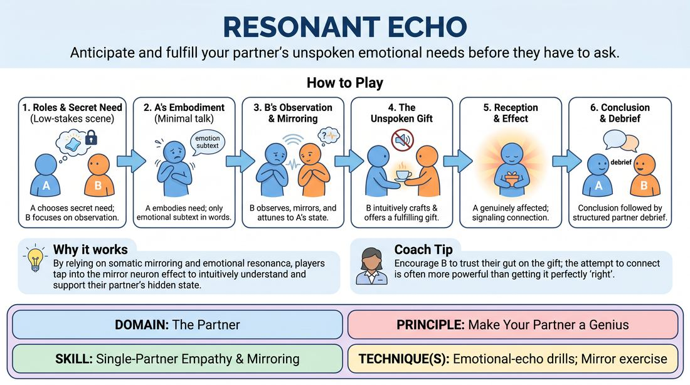

# Resonant Echo

{ .game-hero }

> Anticipate and fulfill your partner's unspoken emotional needs before they have to ask.

## Overview
A quiet, high-attunement exercise where one player secretly holds an unexpressed physical or emotional need while their partner observes their subtle non-verbal cues. By deeply mirroring and reading their partner's physical state, the second player attempts to organically fulfill this hidden desire. The result is a profound experience of mutual connection and proactive support on stage.

## What It Trains
- **Domain:** D2 — The Partner
- **Principle(s):** Make Your Partner a Genius; Yes, And; Assume Competence
- **Skill(s):** Single-Partner Empathy & Mirroring; Active Listening; Active Gifting; Offer Reception; Silence & Stillness; Status Modulation
- **Technique(s):** Emotional-echo drills; Mirror exercise; Meisner Repetition; Give them the answer; Endowment-gifting drills; Endowment-acceptance
- **Focus:** connection

**Objective:** To develop advanced partner attunement, non-verbal empathy, and proactive gifting by training players to read subtext, physical tension, and emotional shifts, ultimately making their partner look brilliant and feel supported.

## At a Glance
| Aspect | Detail |
|---|---|
| Players | 2+ (ideal 2-12) |
| Time | ~10 min |
| Complexity | 3/5 |
| Skill level | competent |
| Energy | low |
| Physicality | low |
| Modality | hybrid |
| Space | minimal |
| Props | none |
| Audience | not required |

## Setup
Can be played in-person or in a virtual gallery view. Divide players into pairs. No props or special staging are required; players simply need to face each other clearly.

## How to Play
1. Assign roles within each pair: Player A is the 'Sender' and Player B is the 'Receiver'.
2. Player A secretly selects a simple, concrete, and actionable internal desire (e.g., needing comfort, wanting to escape, craving playfulness, or seeking quiet reassurance) that they cannot explicitly state.
3. The facilitator establishes a simple, low-stakes scenario for the pair, such as waiting in a lobby, working at a desk, or sitting on a park bench.
4. Player A initiates the scene, embodying their secret desire entirely through physical posture, breathing patterns, eye contact, and micro-expressions.
5. Player A may speak, but their dialogue must be minimal, carrying only the emotional subtext of their desire without ever naming it directly.
6. Player B enters the scene with no knowledge of Player A's secret, focusing entirely on silent observation, matching their partner's physical rhythm, and sensing their emotional state.
7. Using intuitive deduction, Player B crafts a subtle, physical, or verbal 'gift' designed to fulfill Player A's unspoken need without asking permission first.
8. Player A receives the gift, letting it genuinely affect their character's physical and emotional state, signaling a successful connection.
9. The scene concludes once the gift has been delivered and received, followed by a structured partner debrief.

## Facilitation Notes
- Coaching Cue: 'Don't rush to speak. Let the silence build so you can feel the physical weight of your partner's presence.'
- Pitfall: Player A makes the desire too obscure (e.g., 'I want to go to Paris in 1920') or too obvious (e.g., panting heavily for water). Fix: Guide Player A to choose immediate, relational needs like comfort, space, or validation.
- Coaching Cue: 'Give the answer, don't ask the question.' Encourage Player B to make a definitive, supportive choice rather than asking 'What do you need?'
- Pitfall: Player B over-analyzes intellectually instead of mirroring physically. Fix: Have Player B subtly match Player A's breathing pattern to build somatic empathy.

## Variations
- Silent Echo: Run the entire scene in complete silence, relying solely on physical touch, object work, and spatial relationships to communicate and fulfill the desire.
- Virtual Attunement: In a digital space, players focus heavily on facial expressions, vocal tone, and framing within the camera to convey and read the unspoken need.
- Status Shift: Player B must fulfill the desire while consciously modulating their status (e.g., taking a high-status nurturing role or a low-status serving role) to see how it alters the dynamic.

## Debrief
- Player A, how did it feel to have an unspoken need met without having to ask for it?
- Player B, what specific physical or vocal cues tipped you off to your partner's internal state?
- How did matching your partner's physical rhythm or breathing help you understand their emotional need?
- In what ways does anticipating a partner's needs on stage elevate the overall quality of a scene?

## Safety & Inclusion
Since this game relies on close observation and potential physical touch (like offering a hand or a comforting gesture), establish clear boundaries regarding physical contact before starting. Players should feel free to fulfill needs entirely through object work or verbal offers if physical touch is uncomfortable.

## Why It Works
By stripping away explicit verbal communication, this game forces players to rely on somatic mirroring and emotional resonance. When Player B physically aligns with Player A, they tap into the mirror neuron effect, allowing them to intuitively feel what their partner needs. Fulfilling this need without verbal negotiation builds deep trust and exemplifies the core principle of making your partner look like a genius.
