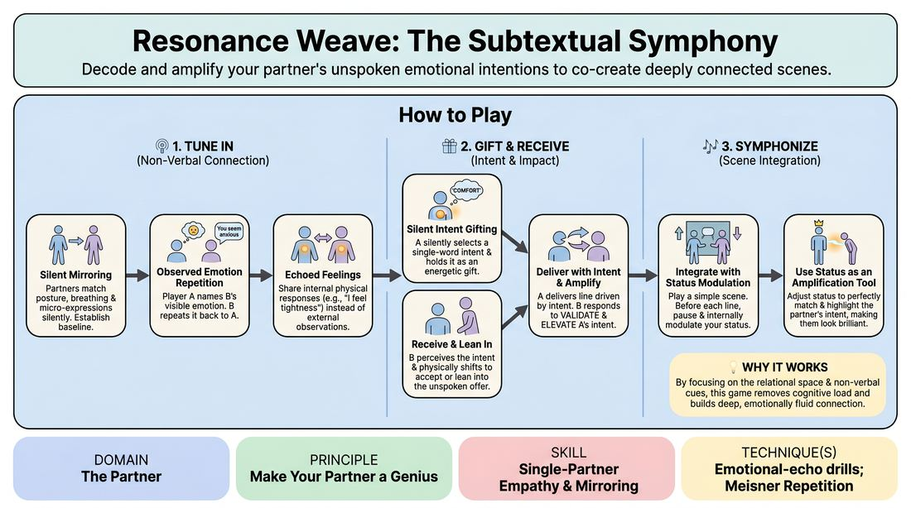

# The Resonance Weave

{ .game-hero }

> Decode and amplify your partner's unspoken emotional intentions to co-create deeply connected scenes.

## Overview
This exercise guides players through a three-stage progression to tune into their partner's pre-verbal impulses and emotional subtext. Moving from physical mirroring to active intent-gifting, players learn to read subtle non-verbal cues and use status shifts to make their partner's choices look brilliant. The result is a highly connected, emotionally fluid scene where the unspoken dialogue is as powerful as the spoken words.

## What It Trains
- **Domain:** D2 — The Partner
- **Principle(s):** Yes, And; Make Your Partner a Genius; Assume Competence; Vulnerability
- **Skill(s):** Active Listening; Status Modulation; Single-Partner Empathy & Mirroring; Offer Reception; Active Gifting; Emotional Fluidity
- **Technique(s):** Meisner Repetition; Status Seesaw; Mirror exercise; Emotional-echo drills; Endowment-acceptance; Endowment-gifting drills; Give them the answer
- **Focus:** connection

**Objective:** To develop advanced partner attunement, emotional mirroring, and active subtextual listening, specifically training players to use status modulation as a collaborative tool to elevate their partner's artistic choices.

## At a Glance
| Aspect | Detail |
|---|---|
| Players | 2–20 (ideal 6-20) |
| Time | ~20 min |
| Complexity | 3/5 |
| Skill level | competent |
| Energy | low |
| Physicality | low |
| Modality | in_person |
| Space | minimal |
| Props | none |
| Audience | not required |

## Setup
Players stand in pairs facing each other with comfortable eye contact. The exercise can be run with all pairs working simultaneously in the space, or with one pair performing in the center while the rest of the group observes.

## How to Play
1. Begin with Silent Mirroring: Partners stand face-to-face, matching each other's posture, breathing patterns, and micro-expressions without speaking, establishing a shared physical rhythm.
2. Transition to Observed Emotion Repetition: Player A observes Player B's physical state and names a visible emotion (e.g., 'You seem anxious'). Player B repeats the observation ('I seem anxious') and then makes their own observation of Player A, continuing this cycle to build objective observation skills.
3. Shift to Echoed Feelings: Instead of naming external observations, players share their internal physical responses to their partner (e.g., 'I feel a tightness in my chest when I look at you'), establishing a deep, empathetic feedback loop.
4. Introduce Silent Intent Gifting: Player A silently selects a single-word emotional intent or desired impact (such as 'comfort', 'disarm', or 'challenge') and holds this focus internally, letting it shape their posture and gaze.
5. Receive and Lean In: Player B observes Player A's silent posture, attempts to perceive the unspoken intent, and physically shifts their own body to accept or lean into that energy before any words are spoken.
6. Deliver the Line with Intent: Once the connection is established, Player A speaks a single line of dialogue, letting their chosen intent fully drive the delivery.
7. Amplify the Partner's Choice: Player B responds with a line or action designed specifically to validate and elevate Player A's intent, making Player A's choice look brilliant and highly effective.
8. Integrate into a Scene with Status Modulation: Give the pair a simple relationship scenario. They play a scene line-by-line, but before speaking, each player internally sets a new emotional intent.
9. Use Status as an Amplification Tool: The receiving player adjusts their own status (raising or lowering it) to perfectly match and highlight the partner's intent (e.g., lowering status to amplify a partner's intent to 'intimidate'), ensuring the partner's offer lands with maximum impact.

## Facilitation Notes
- Side-coaching cue: 'Look into their eyes, not just at their mouth. What is the body telling you before the voice speaks?'
- Pitfall: Players trying to guess the exact word of the intent. Fix: Remind them that the goal is emotional resonance and physical alignment, not a mind-reading vocabulary test.
- Side-coaching cue: 'Give them the answer. Show them with your reaction that their emotional arrow hit its target perfectly.'
- Pitfall: Using high-impact intents like 'diminish' or 'provoke' to shut down the partner. Fix: Coach players that status drops and vulnerability are gifts; if your partner tries to diminish you, play the affected, lower-status role fully to make them look powerful.
- Encourage slow, deliberate pacing. The silence between lines is where the subtextual negotiation and attunement actually happen.

## Variations
- Silent Symphony: Run the entire three-phase progression completely non-verbally, relying entirely on physical touch, gaze, and status shifts to tell a story.
- Exaggerated Intent: Have players whisper their chosen intent to the facilitator before delivering their line, allowing the facilitator to coach the partner on how to amplify it even more effectively.
- The Status Seesaw: Restrict the scene so that every line must result in a clear, visible shift in the status balance, driven entirely by the partner's emotional offers.

## Debrief
- How did it feel to have your silent emotional intent immediately recognized and physically validated before you even spoke?
- What physical cues (breath, posture, eye contact) were the most reliable indicators of your partner's unspoken intent?
- How did modulating your status help make your partner's choices look more powerful or brilliant?
- In what ways did slowing down the space between lines change the depth of your connection?

## Safety & Inclusion
Because this exercise involves sustained eye contact and close physical observation, players should be reminded that they can adjust the distance between themselves to maintain comfort. If eye contact feels too intense or inaccessible, players can focus on their partner's forehead, shoulder alignment, or breathing rhythm instead. Clearly establish that high-impact intents (like 'provoke' or 'diminish') must remain strictly within the fictional space and should be paused immediately if real-world discomfort arises.

## Why It Works
This game works because it strips away the cognitive load of plotting narrative details and forces players to focus entirely on the relational space between them. By structuring the progression from simple physical mirroring to complex status modulation, it builds a safe, step-by-step pathway to vulnerability. Using status as a collaborative tool rather than a competitive one directly reinforces the principle of making your partner a genius, turning every emotional offer into a shared victory.
