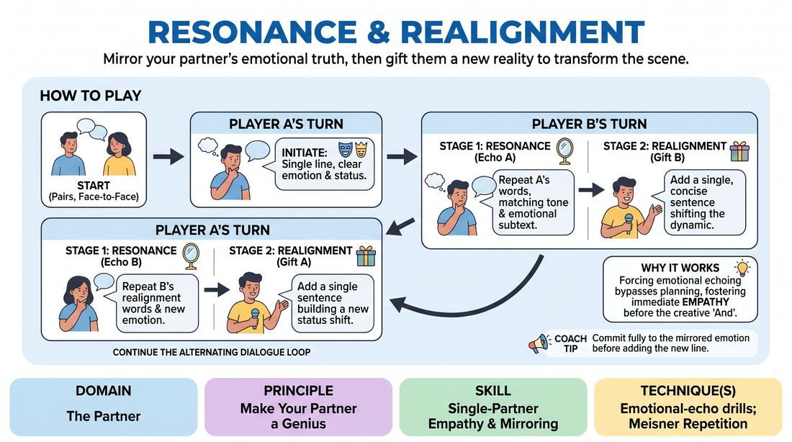

# Echo and Align

{ .game-hero }

> Mirror your partner's emotional truth, then gift them a new reality to transform the scene.

## Overview
A structured, two-player dialogue loop where partners alternate between deep emotional mirroring and active status gifting. Players must fully absorb and repeat their partner's last statement with matching emotional subtext before adding a single line that shifts the relationship dynamic. This creates a highly connected, push-and-pull conversation where every offer is deeply validated and immediately built upon.

## What It Trains
- **Domain:** D2 — The Partner
- **Principle(s):** Yes, And; Make Your Partner a Genius; Assume Competence
- **Skill(s):** Active Listening; Status Modulation; Single-Partner Empathy & Mirroring; Offer Reception; Active Gifting
- **Technique(s):** Meisner Repetition; Last Word Response; Status Seesaw; Mirror exercise; Emotional-echo drills; Yes, And… sentence games; Endowment-acceptance; Endowment-gifting drills; Give them the answer
- **Focus:** connection

**Objective:** To develop deep interpersonal attunement, precise status modulation, and generous endowment-gifting by practicing emotional mirroring and immediate, supportive acceptance of partner offers.

## At a Glance
| Aspect | Detail |
|---|---|
| Players | 2+ (ideal 2 (or any even numbered group)) |
| Time | ~15 min |
| Complexity | 3/5 |
| Skill level | competent |
| Energy | medium |
| Physicality | low |
| Modality | hybrid |
| Space | minimal |
| Props | none |
| Audience | not required |

## Setup
Players stand or sit in pairs directly facing one another. This game can be played in-person or in a virtual gallery view. No props or physical materials are required.

## How to Play
1. Divide the group into pairs, facing each other, and designate one person as Player A and the other as Player B.
2. Player A initiates the scene with a single, short line of dialogue delivered with a clear, distinct emotion and an implied status level.
3. Player B begins their turn with Resonance by repeating Player A's exact words, matching and embodying the same vocal tone, physical posture, and emotional subtext they perceived.
4. Immediately after the repetition, Player B performs Realignment by adding a single, concise sentence that builds on the established reality and gifts Player A with a specific character trait, relationship detail, or status shift.
5. Player A then takes their turn, starting with Resonance by repeating Player B's realignment statement verbatim, fully embodying the new emotion, status, or character trait that was just gifted to them.
6. Immediately after echoing, Player A adds their own Realignment sentence, building on the scene and gifting a new status shift or endowment back to Player B.
7. Continue this alternating loop of mirroring and gifting for several minutes, ensuring each player fully accepts and embodies every offer before adding their own.

## Facilitation Notes
- Coaching Cue: 'Don't just repeat the words; feel the weight of them.' Remind players that the echo phase is about genuine empathy and physical/vocal mirroring, not robotic repetition.
- Pitfall: Players writing paragraphs during the realignment phase. Fix: Enforce a strict one-sentence limit for the realignment statement to keep the focus on immediate, punchy gifting.
- Coaching Cue: 'Accept the gift first.' Ensure players do not try to fight or deny the status or endowment given to them; the echo must fully embrace the partner's offer.
- Pitfall: Intellectualizing the emotion. Fix: Encourage players to mirror the physical posture and facial expression of their partner first, which naturally helps unlock the corresponding vocal tone and feeling.

## Variations
- Non-Verbal Realignment: Instead of speaking the realignment, players must shift the status or gift an endowment purely through a physical gesture or shift in posture before the partner echoes.
- Status Seesaw: Force players to alternate high and low status with each realignment, practicing rapid transitions between dominance and submission.
- Silent Resonance: The mirroring phase is done entirely through silent physical and facial mirroring for three seconds before the realignment line is spoken.

## Debrief
- How did it feel to hear your own words and emotional state mirrored back to you so directly?
- What made a gifted endowment easy to accept and play with, versus one that felt difficult?
- How did the strict structure of mirroring first change how you listened to your partner's offers?

## Safety & Inclusion
Because this game involves close emotional mirroring and status shifts, establish a neutral reset signal (like a double-tap on the chest) if a player feels uncomfortable with a specific emotional direction or status dynamic, allowing them to instantly reset the tone to neutral.

## Why It Works
By forcing players to repeat their partner's words with matching emotional subtext, the game bypasses intellectual planning and fosters immediate empathy. The structured transition from mirroring (Yes) to gifting (And) ensures that status shifts and character endowments are grounded in mutual agreement, making partner play feel safe, collaborative, and highly dynamic.
