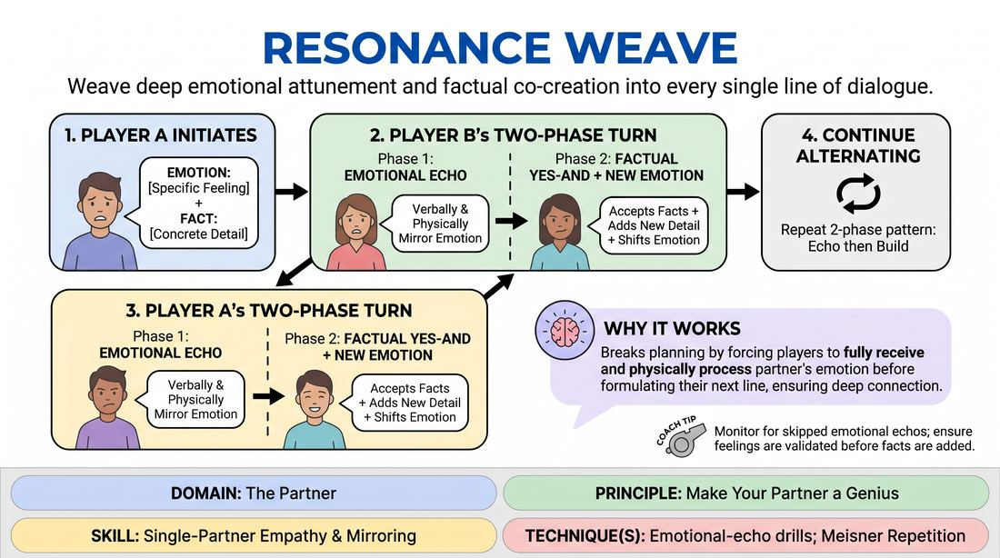

# Resonance Weave

{ .game-hero }

> Weave deep emotional attunement and factual co-creation into every single line of dialogue.

## Overview
Resonance Weave is a two-player scene-building exercise that challenges improvisers to prioritize emotional connection alongside narrative progression. Instead of rushing to advance the plot, players must first pause to mirror and validate their partner's emotional state before introducing new information. This creates a rich, deeply felt reality where characters are constantly affected by each other's feelings.

## What It Trains
- **Domain:** D2 — The Partner
- **Principle(s):** Make Your Partner a Genius; Yes, And; Assume Competence; Base Reality First
- **Skill(s):** Single-Partner Empathy & Mirroring; Active Listening; Offer Reception; Active Gifting; Status Modulation; Emotional Fluidity; World-Building
- **Technique(s):** Emotional-echo drills; Meisner Repetition; Last Word Response; Yes, And… sentence games; Endowment-acceptance; Endowment-gifting drills; Give them the answer; Mirror exercise; Status Seesaw
- **Focus:** skill_drill

**Objective:** To develop advanced emotional mirroring, active listening, and the ability to track and build upon both factual and emotional offers, reinforcing the principle of making your partner look like a genius.

## At a Glance
| Aspect | Detail |
|---|---|
| Players | 2+ (ideal 2-12) |
| Time | ~10 min |
| Complexity | 3/5 |
| Skill level | competent |
| Energy | medium |
| Physicality | low |
| Modality | in_person |
| Space | minimal |
| Props | none |
| Audience | not required |

## Setup
Two players stand facing each other in the center of the playing space, maintaining soft eye contact. The remaining participants observe as active listeners. No props, chairs, or prior suggestions are needed.

## How to Play
1. Player A initiates the scene with a single line of dialogue that clearly conveys both a specific emotion and a concrete factual detail.
2. Before responding with new information, Player B must execute Phase 1: the Emotional Echo, physically and verbally mirroring the emotional state of Player A's line to validate the feeling.
3. Immediately following the echo, Player B executes Phase 2: Factual Yes-And, accepting the established facts and adding a new factual detail to the scene.
4. To complete their turn, Player B must inject a new or shifted emotional state into their delivery, giving Player A a fresh emotional offer to work with.
5. Player A now takes their turn, starting by echoing Player B's new emotional state through their own physical and verbal reaction.
6. Player A then builds on the established facts, adds a new factual offer, and endows the scene with another emotional shift.
7. The players continue alternating in this two-phase pattern, ensuring every line begins with an emotional validation of the partner before any narrative progression occurs.
8. The facilitator monitors the scene, ensuring players do not skip the emotional echo phase or rush past their partner's feelings to force a plot point.

## Facilitation Notes
- Watch out for intellectualizing the echo; players should physically embody the mirrored emotion rather than just naming it academically.
- If a player struggles to identify their partner's emotion, coach them to mirror the physical posture and vocal tone of the partner first.
- Ensure the emotional shift in Phase 2 is a gift, not a block; the new emotion should feel like an organic evolution of the scene's stakes.
- Use the side-coaching cue: Breathe in their feeling first, and let it land in your body before you speak.
- Keep the pace deliberate; this is a high-cognitive-load drill, so encourage players to take a breath and find the emotional connection rather than rushing.

## Variations
- Silent Resonance: Play the entire exercise using only gibberish, non-verbal sounds, and physical mirroring, focusing entirely on the emotional exchange without factual plot points.
- Status Seesaw: Integrate status shifts into the emotional endowments, where the new emotion explicitly raises or lowers the player's status relative to their partner.
- Group Weave: Run the exercise in a circle where Player A offers to Player B, Player B echoes and offers to Player C, and so on, keeping the chain of emotional resonance moving.

## Debrief
- How did it feel to have your character's emotions explicitly validated and mirrored before any plot was advanced?
- What was more challenging: identifying and echoing your partner's emotion, or generating a new emotional shift for them?
- How did this exercise change the way you listen to your partner's subtext compared to a standard scene?
- In what ways did prioritizing your partner's emotional state make them look like a genius?

## Safety & Inclusion
Because this game involves deep emotional mirroring, players should establish clear boundaries regarding intense emotional states before starting. Encourage players to use a wide range of lighter or dramatic emotions and remind them they can step out or adjust the intensity at any time.

## Why It Works
By forcing a two-phase response, this game breaks the habit of planning ahead. Players cannot formulate their next line until they have fully received and physically processed their partner's emotional state. This structural gate ensures that the scene's base reality is built on mutual empathy and shared emotional stakes, transforming Yes-And from a cognitive agreement into a deeply felt physical connection.
