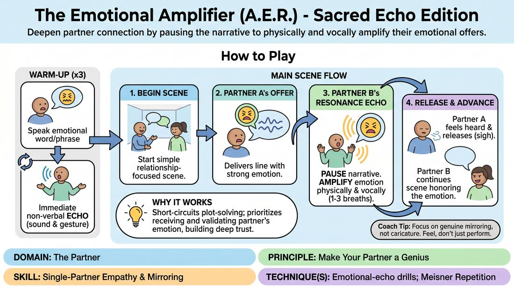

# The Resonance Chamber

{ .game-hero }

> Deepen partner connection by pausing the narrative to physically and vocally amplify their emotional offers.

## Overview
The Resonance Chamber is a partner-focused exercise designed to cultivate radical emotional acceptance and deep interpersonal attunement. Instead of rushing to advance the plot, players pause the narrative to physically and vocally mirror their partner's emotional state at an amplified level. This non-judgmental echo validates the initiator's offer, creating a profound sense of being seen that naturally unlocks authentic, vulnerable scene work.

## What It Trains
- **Domain:** D2 — The Partner
- **Principle(s):** Vulnerability; Yes, And; Make Your Partner a Genius; Assume Competence
- **Skill(s):** Emotional Fluidity; Active Listening; Single-Partner Empathy & Mirroring; Offer Reception; Active Gifting
- **Technique(s):** Meisner Repetition; Mirror exercise; Emotional-echo drills; Endowment-acceptance; Endowment-gifting drills
- **Focus:** connection

**Objective:** To develop advanced single-partner empathy, emotional mirroring, and active listening by prioritizing emotional validation over plot progression, ensuring every emotional offer is fully received and amplified.

## Setup
Players stand in pairs facing each other with comfortable space to move. No props are required. The exercise can be run in-person or in a virtual gallery view where partners pin each other's video feeds.

## How to Play
1. Begin with a warm-up where Partner A speaks a single word or short phrase with a distinct, intense emotion.
2. Partner B immediately responds not with words, but with a pure, non-verbal sound and a physical gesture that captures the raw essence of Partner A's emotion.
3. Partner A provides brief, silent feedback to confirm if the non-verbal echo resonated with their internal feeling, repeating this warm-up three times.
4. Transition to the main scene where Partner A and Partner B begin a simple, relationship-focused scene in a clear setting.
5. Partner A delivers a line with a strong, clear emotional underpinning.
6. Instead of replying with dialogue, Partner B pauses the narrative and performs the Resonance Echo, physically and vocally embodying an amplified, respectful, and non-judgmental version of Partner A's emotion.
7. Partner B sustains and deepens this physical and vocal echo for one to three breath cycles, focusing entirely on honoring and validating Partner A's emotional state.
8. Partner A receives this echo, allowing themselves to feel fully heard until they experience a visible physical release, such as a sigh or a softening of the shoulders.
9. Once Partner B detects this physical release, they transition back into the scene, delivering a verbal line that advances the narrative while fully honoring the established emotional truth.

## Facilitation Notes
- Side-coach the echoing player to avoid caricature or mockery; the amplification must feel respectful, supportive, and grounded in genuine empathy.
- Watch out for players rushing the echo, and remind them to hold the physical and vocal posture until they see a physical release in their partner.
- If the echoing player struggles to find the emotion, coach them to mirror their partner's physical posture first, letting the physical shape generate the vocal resonance.
- Encourage initiators to accept the echo fully rather than intellectualizing it, letting the partner's amplification land on them like a physical wave.

## Variations
- Vocal-Only Resonance: The echoing partner must remain physically still and use only non-verbal vocalizations to mirror the emotion.
- Physical-Only Resonance: The echoing partner must remain completely silent, using only facial expressions, breath, and body language to amplify the emotion.
- Blind Resonance: The echoing partner closes their eyes and mirrors the emotion based purely on the vocal tone and breath patterns of the initiator.

## Debrief
- As the initiator, how did it feel to have your emotion amplified rather than immediately answered with plot?
- As the echoing partner, what physical cues did you look for to detect your partner's emotional release?
- How did pausing the narrative to focus on emotional resonance change the quality of the scene when dialogue resumed?

## Safety & Inclusion
Because this exercise invites high emotional vulnerability, remind players they are always in control of their boundaries. They can choose to play lighter, accessible emotions rather than deep personal trauma, and can use a silent hand-raise to pause the exercise if needed.

## Why It Works
By forcing a temporary pause in narrative progression, the game short-circuits the common improvisational habit of plot-solving emotional problems. It demands that players fully receive and validate their partner's emotional state. This deep mirroring builds immense trust, making the partner look brilliant by treating their emotional offer as the most important element of the scene.
