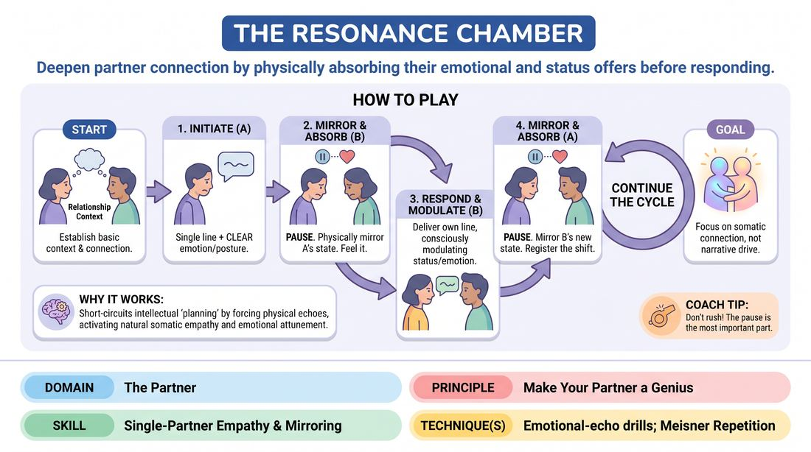

# Resonant Echoes

{ .game-hero }

> Deepen partner connection by physically absorbing their emotional and status offers before responding.

## Overview
A two-player exercise that slows down interaction to build profound physical and emotional attunement. Players take turns delivering a single line of dialogue wrapped in a distinct physical posture, emotional state, and status level. The receiving partner must fully mirror and inhabit this physical and emotional state for a few seconds before offering their own modulated response, turning the scene into a deeply connected, somatic conversation.

## What It Trains
- **Domain:** D2 — The Partner
- **Principle(s):** Yes, And; Make Your Partner a Genius; Assume Competence; Vulnerability
- **Skill(s):** Active Listening; Status Modulation; Single-Partner Empathy & Mirroring; Offer Reception; Active Gifting; Emotional Fluidity; Physicality & Space Work
- **Technique(s):** Meisner Repetition; Mirror exercise; Emotional-echo drills; Status Seesaw; High/low-status walks; Endowment-acceptance; Endowment-gifting drills
- **Focus:** connection

**Objective:** To develop deep, multi-modal offer reception and empathetic mirroring, training players to physically internalize their partner's emotional and status choices before formulating a response.

## At a Glance
| Aspect | Detail |
|---|---|
| Players | 2+ (ideal 2 (or pairs in a larger group)) |
| Time | ~10 min |
| Complexity | 3/5 |
| Skill level | competent |
| Energy | medium |
| Physicality | medium |
| Modality | in_person |
| Space | moderate |
| Props | none |
| Audience | not required |

## Setup
Players work in pairs, standing about an arm's length apart, facing each other in a clear space. No props are needed. The facilitator provides a simple, open-ended relationship prompt (e.g., "two coworkers waiting for a performance review" or "two estranged siblings meeting at a diner").

## How to Play
1. Stand facing your partner at a comfortable distance, maintaining soft eye contact, and establish a basic relationship context.
2. Player A initiates the scene by delivering a single, concise line of dialogue while simultaneously embodying a clear emotional state, a distinct physical posture, and an implied status level.
3. Player B must not speak immediately; instead, they must physically and emotionally mirror Player A's exact posture, facial expression, and emotional energy for two to three seconds.
4. During this brief physical echo, Player B actively registers how this posture and emotion feel in their own body, absorbing the status and subtext of Player A's offer.
5. Once the echo is fully registered, Player B delivers their own single line of dialogue, intentionally modulating their status (shifting it up, down, or holding steady) and adopting a new, logical emotional and physical state.
6. Player A now pauses, physically and emotionally mirrors Player B's new posture and emotional state for two to three seconds, and absorbs the shift.
7. Player A responds with a new line of dialogue, modulating their own status and physical state in response to what they just mirrored.
8. Continue this cycle of pulse, physical echo, and modulated response, focusing entirely on the somatic connection and relationship rather than driving a narrative plot.

## Facilitation Notes
- Coaching cue: 'Don't just copy the shape; feel the weight of their posture. Let their emotion land in your chest.'
- Pitfall: Players often rush the echo phase, treating it as a quick chore before speaking. Fix: Have the facilitator ring a bell or call out 'Echo' to force a full three-second hold of the mirrored state before allowing the response.
- Coaching cue: 'Make your physical and status choices clear and readable. Give your partner a generous gift to mirror.'
- Pitfall: Performative mockery or caricature during the mirroring phase. Fix: Remind players that this is an exercise in empathy, not parody. The goal is to feel what it is like to be in their partner's shoes, matching their exact intensity rather than exaggerating it.

## Variations
- Silent Resonance: Run the entire exercise without any spoken dialogue, relying purely on physical postures, emotional shifts, and status changes to tell the story of the relationship.
- Status Seesaw: The facilitator calls out specific status directions (e.g., 'A raises status, B lowers status') to force dramatic shifts during the modulation phase.
- Gibberish Attunement: Replace the spoken lines with gibberish, forcing players to rely entirely on vocal tone, physical posture, and emotional resonance to communicate meaning.

## Debrief
- How did it feel to physically inhabit your partner's posture and emotion before responding? Did it change what you wanted to say?
- How did this exercise slow down your typical impulse to plan your next line?
- What did you notice about how status naturally shifts when you are forced to mirror your partner first?

## Safety & Inclusion
Ensure players are mindful of physical boundaries and comfort levels when mirroring postures. If a partner has physical limitations or discomfort with certain movements, the mirroring should adapt to a comfortable, safe approximation of the emotional and physical energy rather than a rigid, literal copy.

## Why It Works
By forcing a physical and emotional echo before any verbal response, the game short-circuits the intellectual 'planning' brain and activates somatic empathy. Mirroring a partner's physical state naturally triggers corresponding emotional states and status feelings in the receiver, ensuring that the subsequent response is deeply rooted in the shared reality of the moment rather than an arbitrary, pre-planned line.
