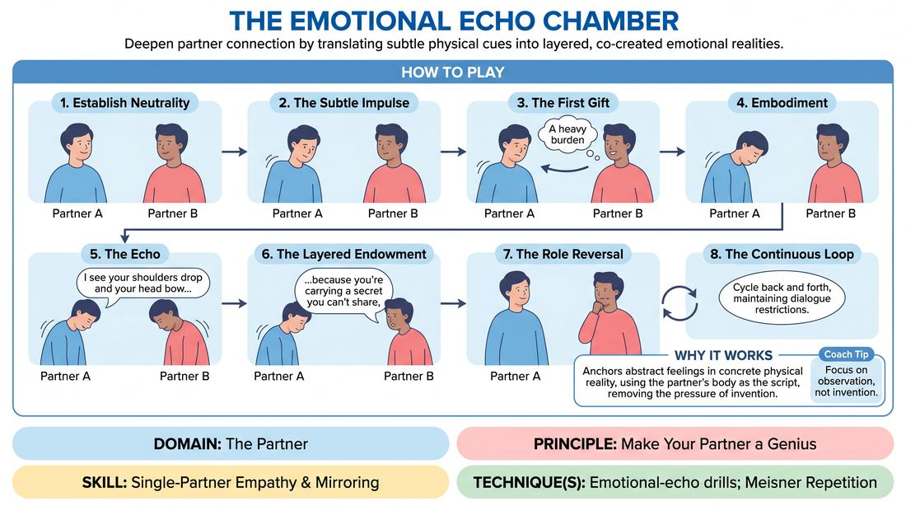

# The Resonance Loop

{ .game-hero }

> Deepen partner connection by translating subtle physical cues into layered, co-created emotional realities.

## Overview
This exercise is a structured, intimate partner drill that strips away conversational dialogue to focus on deep emotional attunement. Players take turns observing their partner's subtle physical shifts, naming the underlying internal state, and embodying those discoveries. The result is a continuous, reciprocal loop of physical feedback and emotional expansion that builds profound onstage trust.

## What It Trains
- **Domain:** D2 — The Partner
- **Principle(s):** Yes, And; Make Your Partner a Genius; Assume Competence; Vulnerability
- **Skill(s):** Active Listening; Single-Partner Empathy & Mirroring; Offer Reception; Active Gifting; Emotional Fluidity; Physicality & Space Work
- **Technique(s):** Meisner Repetition; Emotional-echo drills; Endowment-acceptance; Endowment-gifting drills; Give them the answer
- **Focus:** connection

**Objective:** To develop advanced partner empathy, precise physical mirroring, and the ability to gift complex internal states. It trains players to treat every physical adjustment as a brilliant offer, practicing radical acceptance and emotional fluidity.

## At a Glance
| Aspect | Detail |
|---|---|
| Players | 2–2 (ideal 2 (can be run simultaneously in pairs)) |
| Time | ~10 min |
| Complexity | 3/5 |
| Skill level | competent |
| Energy | low |
| Physicality | low |
| Modality | hybrid |
| Space | minimal |
| Props | none |
| Audience | not required |

## Setup
Pairs stand or sit facing each other in a quiet space with comfortable eye contact. No props or special staging are required. This can be run simultaneously for an entire group divided into pairs, either in-person or in a virtual gallery view.

## How to Play
1. Establish Neutrality: Partners sit or stand facing each other, establishing soft eye contact and settling into a relaxed, neutral physical state.
2. The Subtle Impulse: One player initiates by introducing a very subtle, non-verbal physical shift—such as a slight change in breathing, a tensed jaw, or a slow, heavy blink—without over-acting or forcing a dramatic gesture.
3. The First Gift: The observing partner closely watches this shift and offers a descriptive verbal endowment that interprets the physical state as a deeper internal reality.
4. Embodiment: The initiating partner immediately accepts this endowment as absolute truth, letting the described internal state wash over their entire body and posture without speaking.
5. The Echo: The observing partner watches the new physical state and verbally echoes the physical changes they see happening in real-time.
6. The Layered Endowment: The observing partner immediately follows the echo with a deeper, more complex emotional layer that justifies the other's physical state, giving them the answer to their experience.
7. The Role Reversal: The roles now swap. The partner currently embodying the complex state becomes the observer, looking at their partner's physical response to deliver the next verbal echo and layered endowment.
8. The Continuous Loop: Continue this cycle of observation, embodiment, echoing, and layering back and forth for several minutes, maintaining strict dialogue restrictions.

## Facilitation Notes
- Avoid simple emotional labels like 'sad' or 'angry.' Instead, describe the physical sensation and the complex story behind it.
- If players rush to speak or over-intellectualize, introduce a mandatory three-second silence of pure observation before anyone speaks.
- Remind players to 'give their partner the answer.' Do not ask them how they feel; tell them what you see and what it means to make them look brilliant.
- If the physical movements become too theatrical, coach the players to scale back to micro-movements, as a twitch of a finger holds deeper emotional weight than a wild gesture.

## Variations
- Silent Resonance: Run the entire exercise completely silently, relying purely on physical mirroring and energetic shifts without any spoken endowments.
- The Status Shift: Integrate status dynamics by requiring each layered endowment to subtly raise or lower the partner's social status or power dynamic in the relationship.

## Debrief
- How did it feel to have your partner 'give you the answer' to your physical state rather than having to invent it yourself?
- What did you notice about the relationship between a tiny physical adjustment and a massive internal emotional shift?
- How does this level of intense observation change how you receive and build on offers in a standard scene?

## Safety & Inclusion
Because this exercise requires sustained eye contact and close physical observation, players should establish boundaries beforehand. Assure participants they can blink, break eye contact briefly if it becomes overwhelming, or opt for a slightly angled seating position to reduce intensity.

## Why It Works
By forcing players to verbalize physical observations before gifting an emotion, the game anchors abstract feelings in concrete physical reality. It removes the pressure of invention by using the partner's body as the script, embodying the principle of making your partner a genius by treating their smallest physical choices as profound, intentional offers.
