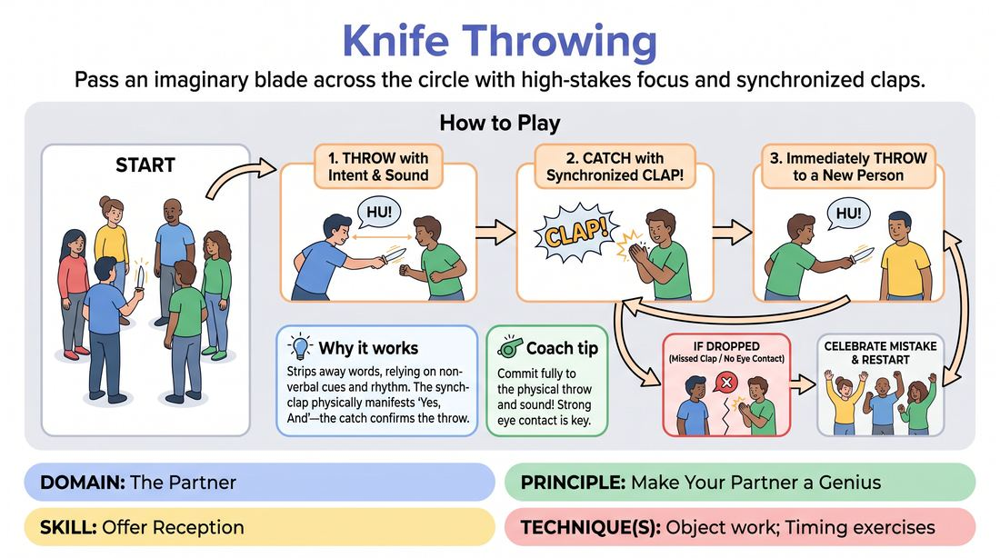

# Knife Throwing

{ .game-hero }

> Pass an imaginary blade across the circle with high-stakes focus and synchronized claps.

## Overview
A high-energy, fast-paced focus game where players stand in a circle and pass an imaginary knife to one another. The receiver must catch the knife with a perfectly timed clap, then immediately throw it to someone else with a vocalization and physical commitment. It builds intense eye contact, shared rhythm, and mutual support.

## What It Trains
- **Domain:** D2 — The Partner
- **Principle(s):** Make Your Partner a Genius; Yes, And; Group Mind; Commit 100%
- **Skill(s):** Offer Reception; Active Listening; Physicality & Space Work; Peripheral Awareness; Pacing & Rhythm
- **Technique(s):** Object work; Timing exercises
- **Focus:** connection

**Objective:** To develop hyper-focused offer reception, active listening, and peripheral awareness by making your partner look good through perfectly synchronized physical and vocal reactions.

## At a Glance
| Aspect | Detail |
|---|---|
| Players | 5+ (ideal 8-20) |
| Time | ~5 min |
| Complexity | 1/5 |
| Skill level | novice |
| Energy | high |
| Physicality | low |
| Modality | in_person |
| Space | minimal |
| Props | none |
| Audience | not required |

## Setup
Players stand in a circle with clear sightlines to everyone else. No props or special materials are required.

## How to Play
1. Form a standing circle with all players facing inward.
2. The facilitator introduces an imaginary, highly dangerous knife to the group.
3. The first player holds the imaginary knife, makes clear eye contact with another player across the circle, and throws it with a sharp physical thrust and a distinct sound like 'Whoosh!'.
4. The receiving player must track the trajectory of the knife and catch it by clapping their hands together precisely as it arrives, making a loud 'Clap!' sound.
5. The catcher immediately transforms their catch into a new throw, making eye contact with a different player and throwing it with another physical thrust and vocalization.
6. The game continues rapidly, maintaining a steady, high-energy rhythm of throw-catch-throw.
7. If a pass is dropped due to a missed clap or poor eye contact, the group briefly celebrates the mistake and immediately restarts the flow.

## Facilitation Notes
- Coaching cue: 'Make your partner look like a genius! Throw it at a speed they can catch, and catch it exactly when it arrives.'
- Pitfall: Players throwing without making eye contact first. Fix: Remind them that eye contact is the 'safety lock' before the throw.
- Coaching cue: 'Commit to the danger! Treat the imaginary knife as if it has real weight and stakes.'
- Pitfall: Hesitation or overthinking who to throw to. Fix: Encourage rapid, instinctive passing rather than planning ahead.

## Variations
- Multiple Objects: Introduce a second imaginary object, like a heavy bowling ball or a delicate egg, with different catching and throwing mechanics running simultaneously.
- Emotional Knife: The knife carries an emotional charge (e.g., anger, fear, joy) which the catcher must instantly adopt upon catching it.
- Sound Effects Only: Remove the physical clap and have the catch and throw be represented purely by distinct vocal sound effects.

## Debrief
- How did it feel when your partner made eye contact before throwing? How did that set you up for success?
- What did you have to do to make sure your partner looked great when receiving your throw?
- How does this level of focus and mutual support translate to starting an improv scene together?

## Safety & Inclusion
While low physicality, ensure players are mindful of physical boundaries. If clapping is difficult for any participant, they can use a vocal 'Snap!' or a distinct head nod as their catch mechanism.

## Why It Works
It strips away verbal complexity, forcing players to rely entirely on non-verbal cues, rhythm, and eye contact. By requiring a synchronized clap, it physically manifests the concept of 'Yes, And'—one player offers the throw, and the other instantly validates and receives it, making the exchange look seamless and magical.
