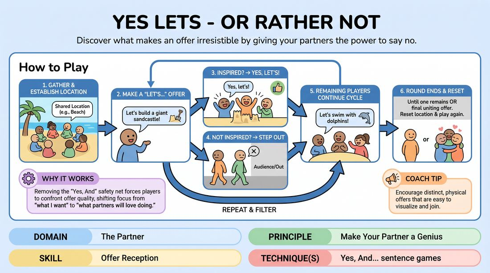

# Yes, Let's... Or Not

{ .game-hero }

> Discover what makes an offer irresistible by giving your partners the power to say no.

## Overview
In this twist on a classic warm-up, players gather in a shared imaginary environment and propose group actions. However, instead of mandatory agreement, participants only join in if the suggestion genuinely inspires them—otherwise, they step out. The game continues until only the most crowd-pleasing offer-maker remains, highlighting what makes an offer truly attractive.

## What It Trains
- **Domain:** D2 — The Partner
- **Principle(s):** Yes, And; Make Your Partner a Genius; Group Mind
- **Skill(s):** Offer Reception; Active Gifting; Peripheral Awareness
- **Technique(s):** Yes, And… sentence games
- **Focus:** skill_drill

**Objective:** To develop acute offer reception and active gifting by learning to pitch ideas that prioritize the group's joy and physical playability over individual cleverness.

## At a Glance
| Aspect | Detail |
|---|---|
| Players | 3+ (ideal 6-12) |
| Time | ~5 min |
| Complexity | 2/5 |
| Skill level | competent |
| Energy | medium |
| Physicality | medium |
| Modality | in_person |
| Space | moderate |
| Props | none |
| Audience | not required |

## Setup
An open, safe playing space where all players can stand in a loose circle. No props or materials are required. The facilitator establishes a single, broad location (e.g., an amusement park, a ski resort, a medieval castle) to ground the initial suggestions.

## How to Play
1. Gather all players in the center of the room and establish a shared location to set the scene.
2. Any player can initiate by calling out a physical action fitting the location, starting with 'Let's...!' (e.g., 'Let's build a giant sandcastle!').
3. Players who find the suggestion fun, clear, and inspiring must enthusiastically shout 'Yes, let's!' and immediately begin pantomiming the action together.
4. Any player who does not feel inspired by the offer, finds it physically awkward, or simply doesn't want to do it must quietly step out of the playing area and sit down.
5. The remaining active players continue to interact. Any of the remaining players can then make a new 'Let's...' suggestion to shift the group's activity.
6. Again, active players either enthusiastically join ('Yes, let's!') or step out to join the audience.
7. Repeat this cycle of proposing and filtering. The round ends when only one player remains active, or when a final suggestion successfully unites the remaining small group.
8. Reset the circle with a new location and run multiple rounds so different players can test their offer-gifting skills.

## Facilitation Notes
- Frame the 'rejection' positively: Stepping out is not a personal insult; it is valuable data helping the offer-maker learn what actually excites their partners.
- Side-coach players to make highly physical, active offers rather than passive or purely verbal ones (e.g., 'Let's look at the horizon' is less engaging than 'Let's ride the roller coaster').
- Pitfall: Players staying in out of polite obligation. Fix: Remind them that polite compliance ruins the diagnostic value of the game. They must be ruthlessly honest but joyful about stepping out.
- Pitfall: The offer-maker getting defensive. Fix: Encourage a spirit of playful failure. Celebrate the moments when an offer clears the room as a hilarious learning point.

## Variations
- The Silent Filter: Run the game entirely in gibberish or pantomime, where players must read the physical commitment of the offer-maker to decide if they stay or go.
- The Redemption Round: If a player makes an offer that causes everyone else to step out, they get one immediate follow-up offer to try and win the group back into the space.

## Debrief
- What characteristics made an offer instantly appealing to the entire group?
- How did it feel to step out, and how did it feel to watch your partners step out of your offer?
- How does this change how you think about 'making your partner a genius' during a standard scene?

## Safety & Inclusion
Ensure players understand they can step out for physical comfort or energy-level reasons without any social penalty. Encourage low-impact physical offers so players of all physical abilities can participate fully.

## Why It Works
By removing the safety net of mandatory agreement ('Yes, And'), this game forces players to confront the actual quality and playability of their offers. It shifts the focus from 'what do I want to do' to 'what will my partners love doing,' which is the core of making your partner a genius.
